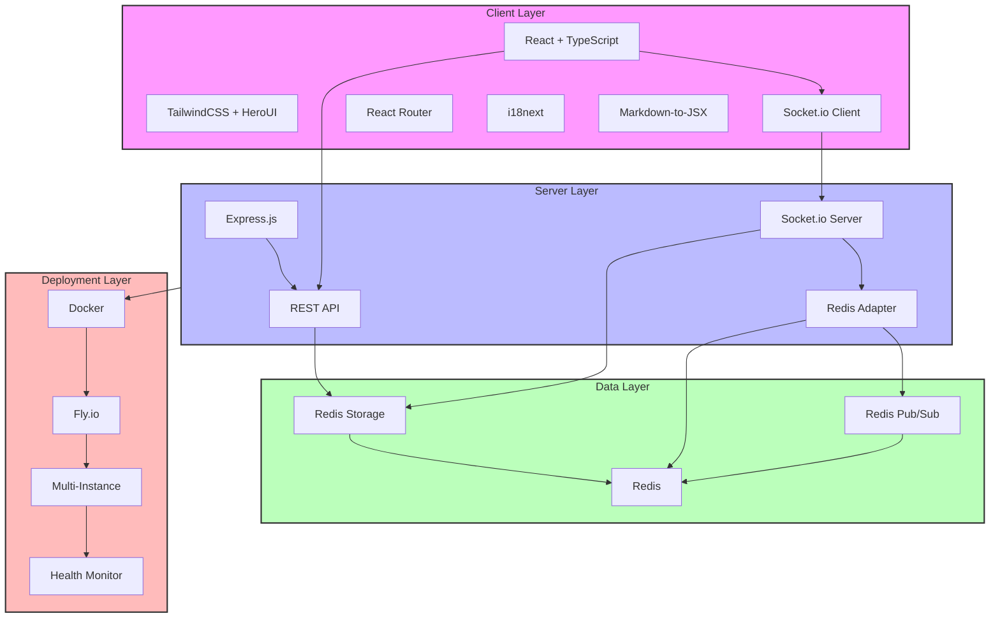

# RoomTalk

[中文版](./README.zh.md)

A modern, feature-rich real-time messaging system built with WebSocket and Redis. Supports Markdown formatting, image sharing, user avatars, and multi-instance deployment. Perfect for building chat applications, team collaboration tools, or any real-time communication platform.

**Current Version: 0.4** (Added Fly.io deployment and Markdown message display)

---

## 🚀 Tech Stack

### Client

- React + TypeScript + Vite
- Tailwind CSS + HeroUI Components
- React Router v6
- Socket.io Client
- i18next (Internationalization)
- Markdown-to-JSX (Rich Text Rendering)
- KaTeX (Math Formula Support)

### Server

- Node.js + Express
- Socket.io with Redis Adapter
- Redis (for persistence and pub/sub)
- UUID-based identity system
- Multi-instance support
- Docker containerization

### DevOps & Deployment

- Fly.io cloud platform
- Docker multi-stage builds
- Redis clustering
- Environment-based configuration
- Health monitoring endpoints

---

## 📐 System Architecture



--- 


---

## 🌟 Features

- ✅ Real-time message sending/receiving
- ✅ Join or create rooms
- ✅ Local saved rooms
- ✅ Persistent room/message storage via Redis
- ✅ Dark/light mode toggle
- ✅ Responsive UI
- ✅ Multi-language (English & Chinese)
- ✅ Image message support (added in v0.2)
  - Rich media messaging with up to 9 images per message
  - Intuitive image handling (clipboard paste, file upload)
  - Mixed content editing (text and images together)
- ✅ User identity system (added in v0.3)
  - Personalized avatars based on username
  - Username display in chat messages
  - Improved chat UI with better visual cues for message ownership
- ✅ Markdown message display (added in v0.4)
  - Supports rich text formatting in messages

---

## 🧪 Quick Start

### Requirements

- Node.js installed
- Redis installed and running locally (default on `localhost:6379`)

### Install Dependencies

```bash
# Server
cd server
npm install

# Client
cd ../client
npm install
```

### Start the System

Use the provided script:

```bash
./start.sh
```

Or start manually:

```bash
cd server
npm start

cd ../client
npm run dev
```

---

## 🧭 Usage

1. Visit [http://localhost:3011](http://localhost:3011)
2. A unique `clientId` will be assigned and saved in `localStorage`
3. Create or join a room and chat in real time

---

## 🔧 Technical Challenges

### WebSocket Reliability on Mobile Devices

One of the most significant challenges we faced was maintaining reliable WebSocket connections on mobile devices, particularly when apps transition between foreground and background states.

#### Problem
- When a mobile app moves to the background, browsers may suspend WebSocket connections
- Even when connections appear active, event listeners often become unresponsive
- Users can send messages (via HTTP fallback) but not receive them without refreshing
- Different browsers and mobile platforms handle background connections inconsistently

#### Our Solution
We implemented a multi-layered approach to ensure connection reliability:

1. **Enhanced Socket.io Configuration**
   - Configured automatic reconnection with optimized timeouts and delays
   - Implemented connection state tracking to detect "zombie" connections
   - Added transport fallback mechanisms (WebSocket → HTTP polling)

2. **Event Listener Management**
   - Created a system to detect and rebind event listeners when they become unresponsive
   - Implemented event reference tracking to prevent duplicate event bindings
   - Added message deduplication to prevent repeated messages after reconnection

3. **Visibility-Based Recovery**
   - Utilized the Page Visibility API to detect when apps return to the foreground
   - Implemented connection health checks when visibility changes
   - Automatically refresh message data when returning from background state

4. **Active Room Tracking**
   - Maintained client-side records of active room participation
   - Automatically rejoined rooms after connection reestablishment
   - Implemented server-side session recovery mechanisms

This comprehensive approach ensures message delivery reliability across different devices and network conditions, maintaining a seamless user experience even in challenging mobile environments.

---

## 🔌 API Overview

### HTTP Endpoints

| Path                                        | Method | Description                                                       |
|---------------------------------------------|--------|-------------------------------------------------------------------|
| `/api/rooms/:roomId/messages`               | `GET`  | Get messages for the specified room                               |
| `/api/clients/:clientId/rooms`              | `GET`  | Get rooms created by the specified client                         |
| `/api/clients/:clientId/rooms`              | `POST` | Create a new room for the specified client                        |
| `/api/clients/:clientId/rooms/:roomId`        | `GET`  | Get specific room details (only if owned by the client)             |
| `/api/rooms/:roomId/messages`               | `POST` | Send a message to the specified room                              |

### WebSocket Events

| Event             | Direction       | Description                                               |
|-------------------|-----------------|-----------------------------------------------------------|
| `register`        | Client → Server | Register user with clientId                               |
| `get_rooms`       | Client → Server | Request rooms created by the user                         |
| `create_room`     | Client → Server | Create a new room                                         |
| `join_room`       | Client → Server | Join an existing room                                     |
| `leave_room`      | Client → Server | Leave a room                                              |
| `send_message`    | Client → Server | Send a message to a room                                  |
| `get_room_by_id`  | Client → Server | Request room details via room ID                          |
| `message_history` | Server → Client | Deliver room message history                              |
| `new_room`        | Server → Client | Notify user of a new room created (scoped to client)      |
| `new_message`     | Server → Client | Broadcast new message to room participants                |

---

## ⚙️ Configuration

### Server `.env`

| Variable    | Default                   | Description   |
|-------------|---------------------------|---------------|
| `PORT`      | 3012                      | Server port   |
| `CLIENT_URL`| http://localhost:3011     | CORS origin   |

### Client `.env`

**.env.development:**

| Variable         | Default              | Description                  |
|------------------|----------------------|------------------------------|
| `VITE_SOCKET_URL`| http://localhost:3012| WebSocket base URL           |

**.env.production:**

| Variable         | Default | Description                                        |
|------------------|---------|----------------------------------------------------|
| `VITE_SOCKET_URL`| `/`     | Use relative path for same-origin deployment       |

---

## 📦 Redis Persistence

The system supports two Redis deployment options:

### Local Development
Uses standard Redis with **RDB snapshot** persistence by default. You may enable **AOF** or adjust save policies via `redis.conf`.

### Production (Upstash Redis)
For production environments, we recommend using Upstash Redis, which offers:

- **Instant Persistence**: Data is immediately saved to block storage alongside memory, making it reliable as a primary database
- **Multi-Region Replication**: Automatic data replication across regions for better availability
- **Serverless Architecture**: No Redis instance management needed, scales automatically
- **REST API Access**: Supports both Redis protocol and HTTP/REST API access

Configuration example:
```env
REDIS_URL=your-upstash-redis-url
REDIS_TOKEN=your-upstash-token
```

---

## 📄 License

MIT License

Copyright (c) 2024 RoomTalk

Permission is hereby granted, free of charge, to any person obtaining a copy
of this software and associated documentation files (the "Software"), to deal
in the Software without restriction, including without limitation the rights
to use, copy, modify, merge, publish, distribute, sublicense, and/or sell
copies of the Software, and to permit persons to whom the Software is
furnished to do so, subject to the following conditions:

The above copyright notice and this permission notice shall be included in all
copies or substantial portions of the Software.

THE SOFTWARE IS PROVIDED "AS IS", WITHOUT WARRANTY OF ANY KIND, EXPRESS OR
IMPLIED, INCLUDING BUT NOT LIMITED TO THE WARRANTIES OF MERCHANTABILITY,
FITNESS FOR A PARTICULAR PURPOSE AND NONINFRINGEMENT. IN NO EVENT SHALL THE
AUTHORS OR COPYRIGHT HOLDERS BE LIABLE FOR ANY CLAIM, DAMAGES OR OTHER
LIABILITY, WHETHER IN AN ACTION OF CONTRACT, TORT OR OTHERWISE, ARISING FROM,
OUT OF OR IN CONNECTION WITH THE SOFTWARE OR THE USE OR OTHER DEALINGS IN THE
SOFTWARE.

## 📝 Version History

### v0.4 - Fly.io Deployment & Markdown Message Display
- **Fly.io Deployment**: Added support for deploying the application on Fly.io with multi-instance capabilities
  - Updated deployment scripts and documentation for Fly.io
  - Implemented environment variable management for Fly.io
- **Markdown Message Display**: Enhanced message rendering to support Markdown formatting
  - Integrated Markdown parsing and rendering in the chat interface
  - Improved user experience with rich text message support

### v0.3 - User Identity System
- **Personalized Avatars**: Implemented username-based avatar generation with consistent colors
  - Developed intelligent avatar text extraction algorithm that handles both English initials and Chinese characters
  - Created hash-based color mapping for consistent user identification
  - Implemented fallback icon system for missing avatar information
- **Enhanced Chat Experience**: Added username display for each message to improve conversation clarity
  - Extended Message data structure with username and avatar fields
  - Modified socket communication to transmit user identity with each message
  - Persisted user identity data in Redis for message history consistency
- **Improved UI**: Redesigned chat interface with better indication of message ownership and streamlined room information display
  - Applied conditional styling based on message ownership
  - Optimized avatar display for various screen sizes
  - Implemented proper type validation for component properties
- **Localized Random Names**: Added cute random name generation in both English and Chinese based on language settings
  - Created separate adjective and noun libraries for English and Chinese
  - Implemented automatic language detection and name generation based on i18n settings
  - Used localStorage for username persistence across sessions

### v0.2 - Enhanced Messaging with Image Support
- **Comprehensive Image System**: Implemented a robust message type framework with Base64 encoding, supporting up to 9 images per message with optimized aspect ratio display and seamless viewing across devices
- **Advanced Content Editor**: Developed a sophisticated mixed-content editor with intuitive clipboard operations, intelligent cursor positioning, and natural editing experience similar to modern messaging platforms
- **Performance & Experience Enhancements**: Engineered throttling mechanisms and asynchronous processing to ensure smooth operation with large images, while maintaining responsive UI across all device types

### v0.1 - Initial Release
- **Core Messaging System**: Implemented real-time messaging with Socket.IO and Redis persistence
- **Room Management**: Created comprehensive room creation, joining, and access control systems
- **Foundation Features**: Established multi-language support, theme toggling, and responsive design principles
