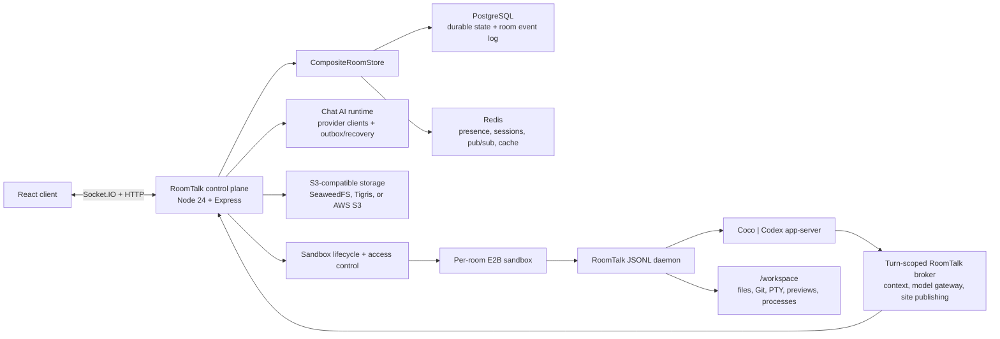
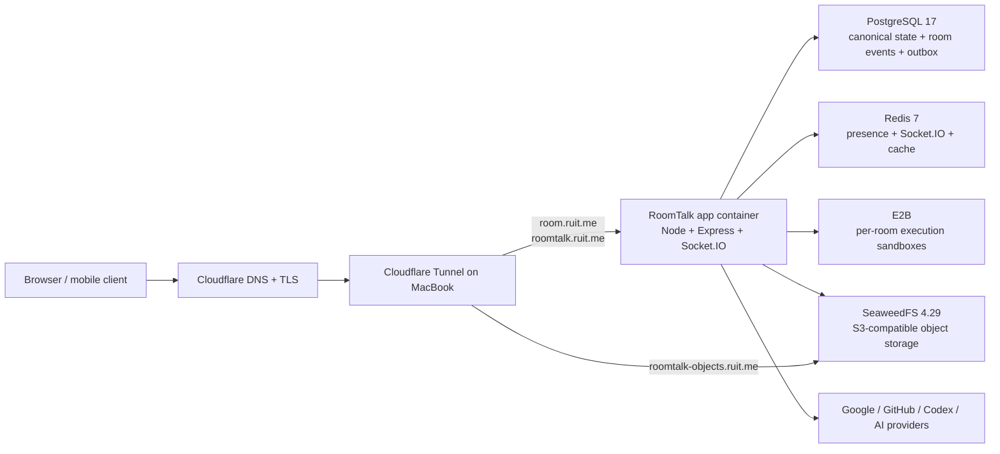
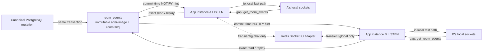

# RoomTalk

[Live app](https://room.ruit.me/) · [中文说明](./README.zh.md)

RoomTalk is a real-time AI collaboration platform built around shared rooms and persistent, sandboxed code-agent workspaces. Humans and multiple agent backends can work in the same room while RoomTalk owns identity, permissions, durable transcripts, workspace access, artifacts, and recovery.

The monorepo contains a React/Vite client, a Node/Express/Socket.IO control plane, and a Python JSONL runner packaged into pinned E2B sandbox artifacts.

## Highlights

### Shared AI collaboration

- Realtime rooms with invitations, passwords, member roles, admin controls, ownership transfer, posting schedules, saved rooms, and multi-client presence.
- Provider-neutral AI streaming across Anthropic, OpenAI, DeepSeek, and OpenRouter-compatible models, with role/context controls, usage and cost accounting, recovery of interrupted streams, and A2UI surfaces.
- Text, private media, stickers, replies, edits, reactions, transcription, web push, Google sign-in, and English/Chinese/Hindi/Japanese/Korean UI.
- Mobile recovery for reconnects, BFCache restores, keyboard viewport changes, cursor-based room-event replay, and read-your-write room updates.

### Sandboxed code-agent rooms

- One shared E2B workspace per code-agent room, supporting Coco (RoomTalk's self-built CLI coding agent) and Codex. The room owner can connect a Codex subscription and share that capability with members allowed to use the workspace.
- A reusable sandbox-local JSONL daemon that executes sequential turns, streams text/tool/model-step events, accepts interrupt and steer controls, and is reclaimed during sandbox or server shutdown.
- Four permission presets: Plan, Ask, Auto, and Full. They compose three Codex-aligned sandbox modes (`read-only`, `workspace-write`, and `danger-full-access`) with approval policy and reviewer selection; Auto keeps the workspace sandbox and sends only eligible escalation requests to Coco's native model reviewer.
- Turn-scoped model-gateway, room-context, and static-publish credentials. Provider keys and RoomTalk service secrets stay outside the browser and agent prompt.
- Room-aware agents can query bounded history, deltas, individual messages, search results, and published sites through the sandbox-local `roomtalk` CLI.
- Durable, correctly ordered AI/tool transcripts grouped by turn, including image inputs, model-step usage, queued prompts, live steering, interruption, retry, and approval events.

### Browser workspace

- File tree/search, source editing, image/Markdown/media previews, workspace asset access, and saved panel state.
- Git-aware changed-file trees, branch/base-ref selection, unified and split diffs, viewed state, and line-scoped review comments that can be attached to the next agent turn.
- Interactive PTY terminal over authenticated Socket.IO sessions, with resize handling, buffered input, local echo, and bounded output snapshots.
- Embedded browser previews for workspace files and detected dev servers, responsive viewport controls, screenshots, recordings, and preview-server status.
- Durable static-site publishing to RoomTalk object storage. Published artifacts remain available after an E2B sandbox pauses or is replaced and appear in the workspace Artifacts view.
- Idle/active sandbox TTLs, reconnect and stale-state recovery, per-user/global limits, Git baseline initialization, and archive-based workspace migration across pinned artifact upgrades.

## Selected Engineering Decisions

RoomTalk is also a study in building reliable realtime and AI systems beyond the happy path:

| Problem | Design |
| --- | --- |
| Shared untrusted execution | Split the trusted RoomTalk control plane from a per-room E2B execution plane, connected by a versioned JSONL protocol and short-lived scoped capabilities. |
| AI/tool event ordering | Preserve text and tool boundaries at the engine/runner source, then persist a monotonic server-side `position`; the client renders that order instead of reconstructing it from timestamps. |
| Multi-client consistency | Store a bounded immutable after-image changelog with the canonical PostgreSQL write, push the exact committed RoomEvent as a size-bounded Socket fast path, replay missing room sequences, and switch gaps over 500 events to a repeatable-read snapshot. |
| Mobile reconnect recovery | One `RoomSessionController` owns connect/register/join/retry. Epochs change only with room or socket identity; lifecycle signals coalesce into message resync without duplicate joins, and transient recovery preserves rendered messages/media. |
| Durable-store boundary | Require PostgreSQL for canonical business state and deterministic event replay; keep Redis rebuildable for presence, transient/global Socket.IO traffic, locks, and short-lived cache. |
| Cache correctness | Guard recent-message cache entries with the durable room-event head, double-check before write-back, invalidate after successful mutations, and degrade to PostgreSQL on cache failure. |
| Concurrent room writes | Serialize canonical writes in PostgreSQL and allocate contiguous room-event sequences in the same transaction; use Redis Lua only for ephemeral multi-socket presence coordination. |
| Product-grade mobile UI | Resolve overlapping media gestures with a locked gesture-state machine, batch transforms through `requestAnimationFrame`, layer Object URL/Cache API/network media caching, and guard IME composition and visual viewport changes. |
| Model portability and context limits | Normalize providers through a model registry and client factory, then select history with semantic truncation, message caps, and a conservative CJK-aware token budget. |

## Architecture


```mermaid
flowchart LR
  Browser["React client"] <-->|"Socket.IO + HTTP"| Control["RoomTalk control plane\nNode 24 + Express"]

  Control --> Store["CompositeRoomStore"]
  Store --> Durable["PostgreSQL\ndurable state + room event log"]
  Store --> Realtime["Redis\npresence, sessions, pub/sub, cache"]

  Control --> ChatAI["Chat AI runtime\nprovider clients + outbox/recovery"]
  Control --> Media["S3-compatible storage\nSeaweedFS, Tigris, or AWS S3"]

  Control --> Lifecycle["Sandbox lifecycle + access control"]
  Lifecycle --> E2B["Per-room E2B sandbox"]
  E2B --> Daemon["RoomTalk JSONL daemon"]
  Daemon --> Backends["Coco | Codex app-server"]
  Daemon --> Workspace["/workspace\nfiles, Git, PTY, previews, processes"]

  Backends --> Broker["Turn-scoped RoomTalk broker\ncontext, model gateway, site publishing"]
  Broker --> Control
```

The ownership boundary is deliberate:

- **RoomTalk control plane** owns rooms, membership, permissions, message/turn persistence, scoped credentials, sandbox lifecycle, object storage, and browser APIs.
- **E2B execution plane** owns untrusted files, processes, terminals, dev servers, and agent execution inside `/workspace`.
- **Agent backends** own reasoning and native tool loops. They consume RoomTalk capabilities through a narrow JSONL/CLI contract rather than receiving database or infrastructure credentials.

### Current production topology


```mermaid
flowchart LR
  Browser["Browser / mobile client"] --> Edge["Cloudflare DNS + TLS"]
  Edge --> Tunnel["Cloudflare Tunnel on MacBook"]
  Tunnel -->|"room.ruit.me<br/>roomtalk.ruit.me"| App["RoomTalk app container<br/>Node + Express + Socket.IO"]
  Tunnel -->|"roomtalk-objects.ruit.me"| Objects["SeaweedFS 4.29<br/>S3-compatible object storage"]

  App --> Postgres["PostgreSQL 17<br/>canonical state + room events + outbox"]
  App --> Redis["Redis 7<br/>presence + Socket.IO + cache"]
  App --> Objects
  App --> E2BProd["E2B<br/>per-room execution sandboxes"]
  App --> Providers["Google / GitHub / Codex / AI providers"]
```

The MacBook runs five long-lived Compose services: the app, PostgreSQL, Redis, SeaweedFS, and `cloudflared`. PostgreSQL uses a durable Docker volume, SeaweedFS persists under `runtime/object-storage`, and Redis is intentionally rebuildable. Browser media transfers use presigned URLs through the separate object hostname; server-side object operations stay on the private Compose network.

`room.ruit.me` is the primary hostname and `roomtalk.ruit.me` is a compatibility hostname. The runtime also allowlists `ai-chat.wenlin.dev`, but that hostname has a separately managed DNS cutover. The former Fly app is suspended; Supabase, Tigris, and Upstash remain only as temporary rollback resources and receive no production writes.

### Room-event fan-out topology


```mermaid
flowchart LR
  Write["Canonical PostgreSQL mutation"] -->|"same transaction"| Log["room_events\nimmutable after-image + room seq"]
  Log -->|"commit-time NOTIFY hint"| A["App instance A LISTEN"]
  Log -->|"commit-time NOTIFY hint"| B["App instance B LISTEN"]
  A -->|"io.local fast path"| CA["A's local sockets"]
  B -->|"io.local fast path"| CB["B's local sockets"]
  CA -->|"gap: get_room_events"| A
  CB -->|"gap: get_room_events"| B
  A -->|"exact read / replay"| Log
  B -->|"exact read / replay"| Log
  A <-.->|"transient/global only"| Redis["Redis Socket.IO adapter"]
  Redis <-.->|"transient/global only"| B
```

`room_events` stores schema-versioned, safe after-images rather than entity IDs that are hydrated from today's rows. PostgreSQL `NOTIFY` is only a post-commit wake-up hint: each app coalesces same-room watermarks in fixed per-room state, skips payload reads when it has no local subscribers, reads a committed contiguous range, and uses `io.local` so multiple listeners do not multiply the same Redis-adapter broadcast. Before a complete payload leaves an instance, the App resolves identity from Redis or authenticated server-owned `socket.data`, then checks PostgreSQL membership in one batch. Explicitly unauthorized sockets are removed; unresolved/conflicting identity or unavailable PostgreSQL authorization keeps sockets joined and degrades that delivery to a head-only hint.

A contiguous payload is applied immediately. Missing payloads replay from `lastAppliedSeq`; an expired cursor, an individually oversized event, or a retained gap above 500 events takes a repeatable-read snapshot. Deleted streams return their final `room.deleted` tombstone directly instead of paging through obsolete history toward a snapshot that can no longer exist. A per-room `idle/replay/replace/prepend` state machine gives live replay priority over pagination, rejects a stale `beforeMessageId` with `PAGINATION_BOUNDARY_EXPIRED`, and resnapshots a window that deletion emptied while older history remains. If a restored database returns `CURSOR_AHEAD`, it clears both the stale target head and prior gap target while preserving new notifications received during the snapshot. Listener reconnect uses an explicitly replaced generation and local `room_sync_required` anti-entropy. V1 payloads are decoded strictly: invalid stored data returns `EVENT_PAYLOAD_INVALID` and forces a canonical snapshot without acknowledging the bad sequence. The public member event is only `members.changed {}`; IDs and roles remain behind the privileged member API, while its durable replay still refreshes page permissions. A durable `room.deleted` or `ROOM_ACCESS_DENIED` exits the stale page through the same lifecycle path as the transient Socket notification.

This is a bounded state-transfer changelog, not Event Sourcing. Canonical tables remain authoritative and old event prefixes are pruned. There is no realtime delivery outbox and no `messageVersion`: retryable AI side effects use the separate worker outbox, while typing, presence, `ai_chunk`, voice levels, and WebRTC signalling remain transient and outside the durable room sequence. If a transient AI event beats its durable placeholder, the client buffers it by `messageId` with TTL/count/byte limits and drains it when the placeholder arrives. `ai_stream_error` declares whether its final state was persisted: `{ persisted: true, message }` carries the exact safe error after-image, while `{ persisted: false }` immediately terminalizes the local placeholder. The server then keeps retrying that terminal after-image with exponential backoff; database owner leases let another process recover the placeholder only after the original stream owner expires. PostgreSQL also rejects changing a message ID's room, preventing cross-room ghost projections.

Horizontal process ownership is lease-based. Each app heartbeat owns only its Redis socket/presence records, so a rolling replacement cleans an expired instance without erasing another live instance. Running Code Agent turns and sandboxes are recovered only after their fenced room lease expires. Recovery and retention tasks use PostgreSQL advisory locks, so one instance performs maintenance while the others keep serving. These boundaries are covered by two-instance presence tests and real PostgreSQL 17 lease/advisory-lock tests. The release that introduces AI owner leases must stop every pre-`0006` app first because old binaries do not heartbeat the new table. After that cutover, ECS/EKS can roll later compatible app releases as long as event and lease protocols remain backward compatible.

Runtime health has separate failure semantics. `/api/health/live` proves only that the Node process can answer. `/api/status` and `/api/health/ready` execute a real `rooms` table query, Redis `PING`, an object-storage bucket probe, and a Socket adapter check. Any unavailable dependency returns HTTP 503 with `status: "degraded"` and `rooms: null`; an infrastructure failure is never reported as zero rooms.

### How the difficult paths work

- **A code-agent turn** is authorized and persisted before execution, fenced by a durable room lease, then sent to the reusable sandbox daemon with turn-scoped model, context, publish, and the room owner's Codex and optional GitHub connections. Text, tool, approval, usage, and lifecycle events return through one ordered protocol and are persisted before broadcast.
- **Ordering is source-owned.** Coco/Codex adapters preserve native text/tool boundaries; RoomTalk assigns monotonic message positions and groups them by durable turn. The browser renders that order and never attempts to reconstruct execution from timestamps.
- **Recovery crosses process boundaries.** PostgreSQL holds durable turn/message state, owner leases, and the replay cursor; Redis coordinates instance-owned realtime clients; E2B owns the mutable workspace; and the Node process holds only replaceable live handles. Periodic singleton reconciliation recovers only expired owners and leases, rather than treating another live process's work as interrupted during startup.
- **Published work outlives execution.** Static files are validated in the sandbox, uploaded directly to object storage through presigned URLs, finalized into immutable versions and manifests, and served through RoomTalk after the source sandbox pauses or is replaced.

See [Room event sync and portable deployment](docs/room-event-sync-portable-deployment.md) and [Code-agent runtime architecture](docs/code-agent-runtime-architecture.md) for the full lifecycle and evidence.

## Repository Layout

```text
client-heroui/                    React + TypeScript + Vite client
server/src/                       Express/Socket.IO control plane
server/roomtalk_code_agent_runner Python runner, daemon, backends, and RoomTalk CLI
ops/code-agent-sandbox/           pinned E2B artifact definition and lock
scripts/code-agent/               artifact context preparation
docs/                             architecture, runbooks, plans, and postmortems
```

## Quick Start

Requirements:

- Node.js 24.18.0 or newer.
- PostgreSQL and Redis. PostgreSQL is the mandatory durable store; Redis is rebuildable realtime/cache state.
- Optional E2B credentials and pinned template settings for real code-agent rooms.

For the quickest full local runtime, copy `.env.compose.example` to `.env.compose`, generate the required PostgreSQL and S3 credentials, then run `docker compose --env-file .env.compose up -d --build`. PostgreSQL uses a persistent named volume, SeaweedFS uses the configured host directory, and Redis is disposable. The production Mac loads its real secrets from macOS Keychain with `node scripts/local-production.mjs --profile edge up -d --build`. For manual development, point `DATABASE_URL` and `REDIS_URL` in `server/.env` at local services.

Install dependencies and create local configuration:

```bash
cd server && npm install
cd ../client-heroui && npm install
cp ../server/.env.example ../server/.env
```

Start both applications:

```bash
./start.sh
```

The client runs at [http://localhost:3011](http://localhost:3011) and the server at `http://localhost:3012`.

Manual development:

```bash
cd server && npm run dev
cd client-heroui && npm run dev
```

## Common Commands

Server:

```bash
cd server
npm run build
npm test
npm run smoke:persistence
npm run smoke:code-agent:e2b
npm run smoke:codex:e2b
npm run migrate:redis-to-postgres
npm run migrate:media-to-object-storage
```

Client:

```bash
cd client-heroui
npm run lint
npm run check:i18n
npm test
npm run build
npm run test:e2e
npm run test:e2e:postgres
```

## Configuration

Use `server/.env.example` as the general backend starting point. Important groups include:

| Area | Examples |
| --- | --- |
| HTTP and origins | `PORT`, `CLIENT_URL`, `CLIENT_URLS`, `NODE_ENV` |
| Durable/realtime stores | `PERSISTENCE_STORE`, `DATABASE_URL`, `REDIS_URL`, PostgreSQL TLS, message-cache TTL |
| Chat AI | provider API keys, default model, OpenRouter routing metadata |
| Media and artifacts | `MEDIA_STORAGE_MODE`; S3-compatible bucket, endpoint, region, and credentials; filesystem mode remains a development fallback |
| Optional services | Google OAuth, AssemblyAI, Web Push VAPID |
| Code-agent control plane | backend allowlists, E2B template/artifact pins, TTL/limits, model-gateway and publish token secrets |

Only browser-safe values belong in `VITE_*` variables. Code-agent provider keys, model-gateway tokens, room-context tokens, and static-publish tokens must never be exposed to the client.

Production code-agent rooms use a pinned E2B artifact. Runner, tool, prompt, Dockerfile, or code-agent engine changes require an artifact version bump, a new E2B template, matching production pins, and an E2B smoke test. See [Code-agent sandbox artifact](docs/code-agent-sandbox-artifact.md).

## Persistence and Object Storage

`CompositeRoomStore` separates durable and realtime concerns:

- Runtime startup requires `PERSISTENCE_STORE=postgres` and `DATABASE_URL`. PostgreSQL stores canonical records and the bounded room-event replay log.
- Redis owns rebuildable presence, socket sessions, pub/sub, counters, and the short-TTL message cache; Redis is still required, but is never the durable authority.
- `migrate:redis-to-postgres` remains an idempotent, dry-run-capable importer for legacy Redis durable snapshots, not a supported serving mode or rollback target.
- Local Compose runs SeaweedFS 4.29 as a private S3-compatible service; Fly uses Tigris and AWS uses S3 through the same SDK/configuration boundary. The filesystem adapter remains available only as a development or recovery fallback.

Migration and rollout references:

- [Portable deployment and direct-cutover design](docs/room-event-sync-portable-deployment.md)
- [Legacy Redis-to-PostgreSQL import runbook](docs/postgres-rollout-runbook.md)
- [Media object-storage migration](docs/image-object-storage-migration-runbook.md)

## AWS Portability

The current deployment is intentionally portable, but migration is a controlled data cutover rather than a one-click host change. The app is a single container image, durable state is isolated in PostgreSQL, Redis is rebuildable, and all media uses the S3 API.

| Current boundary | AWS mapping | Migration contract |
| --- | --- | --- |
| App container + Cloudflare Tunnel | ECS Fargate behind an ALB; EKS is optional | Run the same root image and inject environment/secrets through ECS and Secrets Manager. Cloudflare can remain in front of the AWS origin, or Route 53/CloudFront can replace it. |
| PostgreSQL 17 | RDS PostgreSQL or Aurora PostgreSQL | Restore a `pg_dump` for a maintenance-window cutover; use logical replication or AWS DMS when the dataset requires a shorter write pause. |
| Redis 7 | ElastiCache for Valkey/Redis OSS | Start empty and warm naturally because no business state is authoritative in Redis. |
| SeaweedFS S3 | Amazon S3 | Preserve the bucket object keys and use the existing idempotent `migrate:s3-to-s3` tool to copy and verify bytes. |
| E2B sandboxes | E2B unchanged | Keep the pinned template/artifact and update only the RoomTalk control-plane origin and scoped callback URLs. |

A practical AWS cutover is:

1. provision ECS, RDS, ElastiCache, S3, Secrets Manager, health checks, logs, and the public edge as a shadow stack;
2. restore PostgreSQL, run the current schema migrations, and perform a dry-run plus verified copy of all S3 objects;
3. start RoomTalk against RDS/ElastiCache/S3 and run HTTP, Socket.IO, event-replay, presigned media, Google/GitHub/Codex, and E2B smokes;
4. take a short write gate, apply the final PostgreSQL and S3 delta, then switch DNS;
5. keep the Mac stack read-only for a rollback window, noting that DNS-only rollback is unsafe after AWS accepts new writes.

For the current deployment size, a maintenance-window move is operationally straightforward. A true zero-downtime move additionally needs PostgreSQL CDC/logical replication and an explicit write/rollback protocol; the room event log repairs client synchronization but is not a substitute for database replication.

## Testing

The repository uses layered verification:

- Node's test runner for services, protocols, stores, socket handlers, E2B adapters, lifecycle, model gateway, and static publishing.
- Vitest and Testing Library for client state, messages, workspace files/diffs/reviews, terminal behavior, browser previews, queue controls, and responsive views.
- GitHub CI provisions PostgreSQL 17 and supplies `ROOM_EVENT_TEST_DATABASE_URL`, so trigger, transaction, retention-clock, and cross-room message-invariant tests cannot silently skip.
- Playwright for desktop/mobile room flows, recovery, multi-client realtime behavior, media, AI, and PostgreSQL parity.
- Real E2B smoke tests for pinned artifact metadata, daemon health, Coco/Codex execution, permissions, context access, publishing, and workspace behavior.

Run focused tests next to changed code and expand to the affected production builds or boundary smokes when the change's risk requires them.

## Deployment

`master` remains the release branch. The event-sync, self-hosted runtime, domain cutover, and credential-hardening change set is committed and pushed to `origin/master`; the former scheduled Fly workflow is manually disabled so a source push does not restart Fly.

Production at `room.ruit.me` runs the root image on a MacBook through Docker Compose and Cloudflare Tunnel, with PostgreSQL 17, Redis 7, and SeaweedFS 4.29 S3-compatible storage. `roomtalk.ruit.me` remains a compatibility entry point, and E2B still provides per-room execution sandboxes. The former Fly app is suspended; Supabase, Tigris, and Upstash are retained only for the rollback window, not as live writers.

The infrastructure cutover completed on 2026-07-20. The immutable room-event boundary followed on 2026-07-21 in a separate maintenance window: a paired PostgreSQL/SeaweedFS backup was taken, every old app process was stopped, and migrations `0003` and `0004` were applied before traffic reopened. Public WSS verification covered committed-event fast path, snapshot, replay, and deletion tombstones.

## Selected Engineering References

Current architecture and historical records are both part of the engineering evidence:

- [Redis-to-PostgreSQL production migration](docs/postgres-migration-development-summary.zh.md): write-freeze cutover, provider response limits, idempotency, rollback boundaries, and what a true zero-downtime design would require.
- [Room reliability architecture](docs/room-reliability-architecture.md): the current end-to-end contract for session recovery, message/media continuity, event-cursor convergence, read-your-write acknowledgements, posting boundaries, and production diagnostics.
- [Code-agent tool ordering](docs/code-agent-tool-ordering-fix-plan.zh.md): preserving interleaved text/tool/model events from engine source through persistence and rendering.
- [A2UI streaming implementation](docs/a2ui-streaming-implementation.zh.md): structured UI streaming, persistence, repair, and provider-independent validation.
- [CI/CD build optimization](docs/ci-cd-build-optimization.zh.md): Docker build boundaries, cache behavior, release detection, and production verification.

## Documentation

- [Documentation index](docs/README.md): current architecture, runbooks, subsystem references, retrospectives, historical plans, reports, and language editions.
- [Portable deployment and cutover record](docs/room-event-sync-portable-deployment.md): the current Mac production runtime, event sync, storage edge, backup, and rollback boundary.
- [Production deployment guide](DeploymentGuide.md): the current MacBook/Compose release, verification, backup, rollback, and AWS handoff runbook.
- [Configuration reference](docs/configuration.md): environment groups, storage modes, secret boundaries, and production/development differences.
- [Security](SECURITY.md): identity, authorization, credential handling, scoped capabilities, media access, and sandbox trust boundaries.
- [Contributing](CONTRIBUTING.md): development, validation, artifact, commit, and release expectations.

Current documents carry an `Updated` or `Verified` date. Historical plans and retrospectives retain their original context and point to the current source of truth.

## License

MIT.
