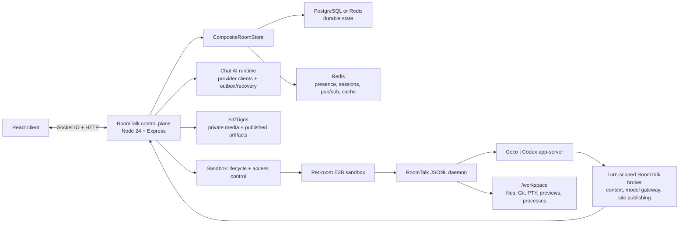

# RoomTalk

[Live app](https://room.ruit.me/) · [中文说明](./README.zh.md)

RoomTalk is a real-time AI collaboration platform built around shared rooms and persistent, sandboxed code-agent workspaces. Humans and multiple agent backends can work in the same room while RoomTalk owns identity, permissions, durable transcripts, workspace access, artifacts, and recovery.

The monorepo contains a React/Vite client, a Node/Express/Socket.IO control plane, and a Python JSONL runner packaged into pinned E2B sandbox artifacts.

## Highlights

### Shared AI collaboration

- Realtime rooms with invitations, passwords, member roles, admin controls, ownership transfer, posting schedules, saved rooms, and multi-client presence.
- Provider-neutral AI streaming across Anthropic, OpenAI, DeepSeek, and OpenRouter-compatible models, with role/context controls, usage and cost accounting, recovery of interrupted streams, and A2UI surfaces.
- Text, private media, stickers, replies, edits, reactions, transcription, web push, Google sign-in, and English/Chinese/Hindi/Japanese/Korean UI.
- Mobile recovery for reconnects, BFCache restores, keyboard viewport changes, room-version ordering, and read-your-write room updates.

### Sandboxed code-agent rooms

- One shared E2B workspace per code-agent room, supporting Coco (RoomTalk's self-built CLI coding agent) and Codex. Users can connect their own Codex subscription and run it in the shared room through Codex app-server.
- A reusable sandbox-local JSONL daemon that executes sequential turns, streams text/tool/model-step events, accepts interrupt and steer controls, and is reclaimed during sandbox or server shutdown.
- Four permission presets: Plan, Ask, Auto, and Full. They compose three Codex-aligned sandbox modes (`read-only`, `workspace-write`, and `danger-full-access`) with approval policy and reviewer selection; Auto keeps the workspace sandbox and sends only eligible escalation requests to Coco's native model reviewer.
- Turn-scoped model-gateway, room-context, and static-publish credentials. Provider keys and RoomTalk service secrets stay outside the browser and agent prompt.
- Room-aware agents can query bounded history, deltas, individual messages, search results, and published sites through the sandbox-local `roomtalk` CLI.
- Durable, correctly ordered AI/tool transcripts grouped by turn, including image inputs, model-step usage, queued prompts, live steering, interruption, retry, and approval events.

### Browser workspace

- File tree/search, source editing, image/Markdown/media previews, workspace asset access, and saved panel state.
- Git-aware changed-file trees, branch/base-ref selection, unified and split diffs, viewed state, and line-scoped review comments that can be attached to the next agent turn.
- Interactive PTY terminal over authenticated Socket.IO sessions, with resize handling, buffered input, local echo, and bounded output snapshots.
- Embedded browser previews for workspace files and detected dev servers, responsive viewport controls, screenshots, recordings, and preview-server status.
- Durable static-site publishing to RoomTalk object storage. Published artifacts remain available after an E2B sandbox pauses or is replaced and appear in the workspace Artifacts view.
- Idle/active sandbox TTLs, reconnect and stale-state recovery, per-user/global limits, Git baseline initialization, and archive-based workspace migration across pinned artifact upgrades.

## Selected Engineering Decisions

RoomTalk is also a study in building reliable realtime and AI systems beyond the happy path:

| Problem | Design |
| --- | --- |
| Shared untrusted execution | Split the trusted RoomTalk control plane from a per-room E2B execution plane, connected by a versioned JSONL protocol and short-lived scoped capabilities. |
| AI/tool event ordering | Preserve text and tool boundaries at the engine/runner source, then persist a monotonic server-side `position`; the client renders that order instead of reconstructing it from timestamps. |
| Multi-client consistency | Combine Socket.IO's Redis adapter with monotonic `roomVersion`, full-object replacement, and acknowledgment-based read-your-write updates. |
| Mobile reconnect recovery | Treat browser connection state as untrusted: foreground health checks, idempotent room rejoin, in-flight deduplication, and delayed recovery UI keep presence and rooms correct after backgrounding or network changes. |
| Durable-store migration | Run Redis and PostgreSQL behind one store contract and migrate every current durable Redis record with an idempotent dry-run-capable `R` to `R+P` tool; configuration-only rollback is limited to the frozen cutover window. |
| Cache correctness | Key recent-message cache entries by `messageVersion`, double-check the version before write-back, invalidate only after successful mutations, and degrade to PostgreSQL on cache failure. |
| Concurrent Redis writes | Use Lua scripts for atomic room versions, message deletion, and multi-socket member reference counting; run the same behavioral contract suite against both Redis and PostgreSQL implementations. |
| Product-grade mobile UI | Resolve overlapping media gestures with a locked gesture-state machine, batch transforms through `requestAnimationFrame`, layer Object URL/Cache API/network media caching, and guard IME composition and visual viewport changes. |
| Model portability and context limits | Normalize providers through a model registry and client factory, then select history with semantic truncation, message caps, and a conservative CJK-aware token budget. |

## Architecture


```mermaid
flowchart LR
  Browser["React client"] <-->|"Socket.IO + HTTP"| Control["RoomTalk control plane\nNode 24 + Express"]

  Control --> Store["CompositeRoomStore"]
  Store --> Durable["PostgreSQL or Redis\ndurable state"]
  Store --> Realtime["Redis\npresence, sessions, pub/sub, cache"]

  Control --> ChatAI["Chat AI runtime\nprovider clients + outbox/recovery"]
  Control --> Media["S3/Tigris\nprivate media + published artifacts"]

  Control --> Lifecycle["Sandbox lifecycle + access control"]
  Lifecycle --> E2B["Per-room E2B sandbox"]
  E2B --> Daemon["RoomTalk JSONL daemon"]
  Daemon --> Backends["Coco | Codex app-server"]
  Daemon --> Workspace["/workspace\nfiles, Git, PTY, previews, processes"]

  Backends --> Broker["Turn-scoped RoomTalk broker\ncontext, model gateway, site publishing"]
  Broker --> Control
```

The ownership boundary is deliberate:

- **RoomTalk control plane** owns rooms, membership, permissions, message/turn persistence, scoped credentials, sandbox lifecycle, object storage, and browser APIs.
- **E2B execution plane** owns untrusted files, processes, terminals, dev servers, and agent execution inside `/workspace`.
- **Agent backends** own reasoning and native tool loops. They consume RoomTalk capabilities through a narrow JSONL/CLI contract rather than receiving database or infrastructure credentials.

### How the difficult paths work

- **A code-agent turn** is authorized and persisted before execution, fenced by a durable room lease, then sent to the reusable sandbox daemon with turn-scoped model, context, publish, and user-owned connection capabilities. Text, tool, approval, usage, and lifecycle events return through one ordered protocol and are persisted before broadcast.
- **Ordering is source-owned.** Coco/Codex adapters preserve native text/tool boundaries; RoomTalk assigns monotonic message positions and groups them by durable turn. The browser renders that order and never attempts to reconstruct execution from timestamps.
- **Recovery crosses process boundaries.** PostgreSQL or Redis holds durable turn/message state, Redis coordinates realtime clients, E2B owns the mutable workspace, and the Node process holds only replaceable live handles. Startup recovery fails interrupted work explicitly, repairs stale sandbox state, and reacquires fenced leases rather than trusting memory.
- **Published work outlives execution.** Static files are validated in the sandbox, uploaded directly to object storage through presigned URLs, finalized into immutable versions and manifests, and served through RoomTalk after the source sandbox pauses or is replaced.

See [Code-agent runtime architecture](docs/code-agent-runtime-architecture.md) for the full lifecycle and evidence.

## Repository Layout

```text
client-heroui/                    React + TypeScript + Vite client
server/src/                       Express/Socket.IO control plane
server/roomtalk_code_agent_runner Python runner, daemon, backends, and RoomTalk CLI
ops/code-agent-sandbox/           pinned E2B artifact definition and lock
scripts/code-agent/               artifact context preparation
docs/                             architecture, runbooks, plans, and postmortems
```

## Quick Start

Requirements:

- Node.js 24.18.0 or newer.
- Redis at `localhost:6379`.
- Optional PostgreSQL test database for PostgreSQL-mode smoke/E2E.
- Optional E2B credentials and pinned template settings for real code-agent rooms.

Install dependencies and create local configuration:

```bash
cd server && npm install
cd ../client-heroui && npm install
cp ../server/.env.example ../server/.env
```

Start both applications:

```bash
./start.sh
```

The client runs at [http://localhost:3011](http://localhost:3011) and the server at `http://localhost:3012`.

Manual development:

```bash
cd server && npm run dev
cd client-heroui && npm run dev
```

## Common Commands

Server:

```bash
cd server
npm run build
npm test
npm run smoke:persistence
npm run smoke:code-agent:e2b
npm run smoke:codex:e2b
npm run migrate:redis-to-postgres
npm run migrate:media-to-object-storage
```

Client:

```bash
cd client-heroui
npm run lint
npm run check:i18n
npm test
npm run build
npm run test:e2e
npm run test:e2e:postgres
```

## Configuration

Use `server/.env.example` as the general backend starting point. Important groups include:

| Area | Examples |
| --- | --- |
| HTTP and origins | `PORT`, `CLIENT_URL`, `CLIENT_URLS`, `NODE_ENV` |
| Durable/realtime stores | `PERSISTENCE_STORE`, `DATABASE_URL`, `REDIS_URL`, PostgreSQL TLS, message-cache TTL |
| Chat AI | provider API keys, default model, OpenRouter routing metadata |
| Media and artifacts | S3/Tigris bucket, endpoint, region, and AWS-compatible credentials |
| Optional services | Google OAuth, AssemblyAI, Web Push VAPID |
| Code-agent control plane | backend allowlists, E2B template/artifact pins, TTL/limits, model-gateway and publish token secrets |

Only browser-safe values belong in `VITE_*` variables. Code-agent provider keys, model-gateway tokens, room-context tokens, and static-publish tokens must never be exposed to the client.

Production code-agent rooms use a pinned E2B artifact. Runner, tool, prompt, Dockerfile, or code-agent engine changes require an artifact version bump, a new E2B template, matching production pins, and an E2B smoke test. See [Code-agent sandbox artifact](docs/code-agent-sandbox-artifact.md).

## Persistence and Object Storage

`CompositeRoomStore` separates durable and realtime concerns:

- `PERSISTENCE_STORE=redis` is the `R` model: Redis stores both durable and realtime state.
- `PERSISTENCE_STORE=postgres` is the `R+P` model: PostgreSQL stores durable records while Redis owns presence, socket sessions, pub/sub, counters, and the short-TTL message cache.
- PostgreSQL-only (`P`) is not supported. `migrate:redis-to-postgres` is the idempotent, dry-run-capable `R` to `R+P` durable-data cutover tool.
- S3/Tigris-compatible storage holds private media and versioned static-site artifacts; development can use the local object-storage implementation.

Migration and rollout references:

- [PostgreSQL rollout runbook](docs/postgres-rollout-runbook.md)
- [Media object-storage migration](docs/image-object-storage-migration-runbook.md)

## Testing

The repository uses layered verification:

- Node's test runner for services, protocols, stores, socket handlers, E2B adapters, lifecycle, model gateway, and static publishing.
- Vitest and Testing Library for client state, messages, workspace files/diffs/reviews, terminal behavior, browser previews, queue controls, and responsive views.
- Playwright for desktop/mobile room flows, recovery, multi-client realtime behavior, media, AI, and PostgreSQL parity.
- Real E2B smoke tests for pinned artifact metadata, daemon health, Coco/Codex execution, permissions, context access, publishing, and workspace behavior.

Run focused tests next to changed code and expand to the affected production builds or boundary smokes when the change's risk requires them.

## Deployment

`master` is the release branch. `.github/workflows/fly-deploy.yml` runs on a schedule or through manual dispatch, checks whether `master` has changed since the latest successful run, builds both packages, validates translations and secrets, and deploys to Fly.io. Do not run `fly deploy` manually.

Production uses Fly.io for the Node control plane, Supabase PostgreSQL, Upstash Redis, Tigris object storage, and E2B for per-room execution sandboxes.

## Selected Engineering Retrospectives

The historical records are part of the engineering evidence, not obsolete product documentation:

- [Redis-to-PostgreSQL production migration](docs/postgres-migration-development-summary.zh.md): write-freeze cutover, provider response limits, idempotency, rollback boundaries, and what a true zero-downtime design would require.
- [Room reliability series](docs/room-reliability/README.zh.md): mobile restoration, whole-object room replacement, version ordering, read-your-write acknowledgements, and multi-client consistency.
- [Code-agent tool ordering](docs/code-agent-tool-ordering-fix-plan.zh.md): preserving interleaved text/tool/model events from engine source through persistence and rendering.
- [A2UI streaming implementation](docs/a2ui-streaming-implementation.zh.md): structured UI streaming, persistence, repair, and provider-independent validation.
- [CI/CD build optimization](docs/ci-cd-build-optimization.zh.md): Docker build boundaries, cache behavior, release detection, and production verification.

## Documentation

- [Documentation index](docs/README.md): current architecture, runbooks, subsystem references, retrospectives, historical plans, reports, and language editions.
- [Deployment guide](DeploymentGuide.md): the current GitHub Actions and Fly.io production workflow.
- [Configuration reference](docs/configuration.md): environment groups, storage modes, secret boundaries, and production/development differences.
- [Security](SECURITY.md): identity, authorization, credential handling, scoped capabilities, media access, and sandbox trust boundaries.
- [Contributing](CONTRIBUTING.md): development, validation, artifact, commit, and release expectations.

Current documents carry an `Updated` or `Verified` date. Historical plans and retrospectives retain their original context and point to the current source of truth.

## License

MIT.
