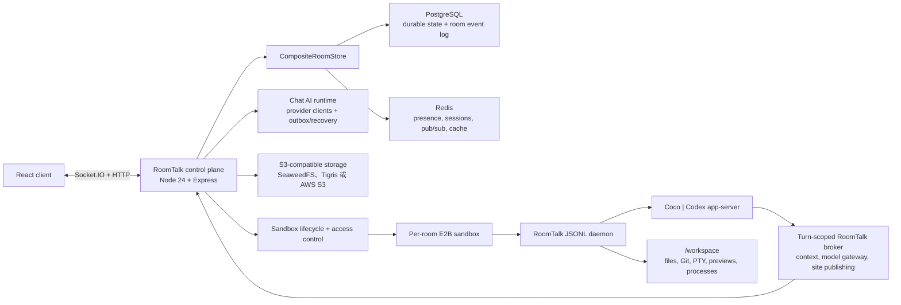

# RoomTalk

[在线应用](https://room.ruit.me/) · [English](./README.md)

RoomTalk 是一个以共享房间和可持续工作的沙盒化 Code Agent 工作区为核心的实时 AI 协作平台。人类和多种 Agent backend 可以在同一个房间中协作；RoomTalk 统一负责身份、权限、持久化 transcript、工作区访问、产物和故障恢复。

仓库包含 React/Vite 客户端、Node/Express/Socket.IO control plane，以及打包进固定 E2B sandbox artifact 的 Python JSONL runner。

## 核心能力

### 共享 AI 协作

- 实时房间、邀请链接、密码、成员角色、管理员、所有权转移、发言时间段、收藏房间和多客户端在线状态。
- 跨 Anthropic、OpenAI、DeepSeek 和 OpenRouter 兼容模型的 provider-neutral AI 流式运行时，支持角色/上下文控制、usage/cost 计费、中断流恢复和 A2UI 界面。
- 文本、私有媒体、贴纸、回复、编辑、reaction、语音转写、Web Push、Google 登录，以及中英印日韩五种 UI 语言。
- 针对移动端重连、BFCache 恢复、键盘 viewport、基于 cursor 的房间事件重放和 read-your-write 房间更新的可靠性保护。

### 沙盒化 Code Agent 房间

- 每个 Code Agent 房间拥有一个共享 E2B 工作区，支持 Coco（RoomTalk 自研 CLI coding agent）和 Codex；房主可以连接 Codex 订阅和 GitHub PAT，并把这些能力共享给获准使用工作区的成员。
- 沙盒内可复用的 JSONL daemon 顺序执行 turn、流式输出文本/工具/model-step 事件、接收 interrupt/steer 控制，并在沙盒或服务退出时回收。
- Plan、Ask、Auto、Full 四种权限预设。它们组合三种与 Codex 对齐的 sandbox mode（`read-only`、`workspace-write`、`danger-full-access`）、approval policy 和 reviewer 选择；Auto 保持 workspace sandbox，只把符合条件的提权请求交给 Coco 原生 model reviewer。
- 每个 turn 独立签发 model gateway、room context 和 static publish 凭据。Provider key 与 RoomTalk 服务端 secret 不进入浏览器和 Agent prompt。
- Agent 可通过沙盒内 `roomtalk` CLI 按需读取有界历史、增量、单条消息、搜索结果和已发布站点。
- AI/工具消息按真实执行顺序持久化并按 turn 分组，同时支持图片输入、model-step usage、排队 prompt、运行中 steer、interrupt、retry 和审批事件。

### 浏览器工作区

- 文件树与搜索、源码编辑、图片/Markdown/媒体预览、workspace asset 读取和 panel 状态保存。
- Git changed-files tree、branch/base-ref 选择、unified/split diff、viewed 状态，以及可附加到下一轮 Agent prompt 的行级 review comment。
- 基于认证 Socket.IO session 的交互式 PTY terminal，包含 resize、输入缓冲、本地 echo 和有界输出 snapshot。
- Workspace 文件和已探测 dev server 的内嵌浏览器预览、响应式 viewport、截图、录屏和 preview server 状态。
- 将静态站点持久发布到 RoomTalk 对象存储。E2B 暂停或替换后 URL 仍可访问，并显示在 workspace 的 Artifacts 视图中。
- Idle/active sandbox TTL、重连与 stale state 恢复、全局/用户级配额、Git baseline 初始化，以及固定 artifact 升级时的 archive workspace migration。

## 关键工程设计

RoomTalk 不只覆盖功能的 happy path，也系统处理了实时协作与 AI 系统中的可靠性问题：

| 问题 | 设计 |
| --- | --- |
| 共享的不可信代码执行 | 将可信的 RoomTalk control plane 与每房间 E2B execution plane 分离，通过版本化 JSONL 协议和短期 scoped capability 连接。 |
| AI 文本与工具事件顺序 | 在最早知道真实顺序的 engine/runner 层保留文本与工具边界，再持久化服务端单调递增的 `position`；客户端只展示顺序，不用 timestamp 猜测。 |
| 多客户端一致性 | Socket.IO 只负责唤醒，客户端按 PostgreSQL 每房间事件序列重放；snapshot 与 IndexedDB cursor 修复漏投递。 |
| 移动端断连恢复 | 由唯一 `RoomSessionController` 管理 connect/register/join/retry；epoch 只随房间或 socket identity 变化，lifecycle signal 合并成消息 resync 而不重复 join，暂态恢复保留已显示的消息和媒体。 |
| 持久层边界 | PostgreSQL 强制承载业务状态与事件重放；Redis 仅负责可重建的 presence、Socket.IO adapter、锁和短缓存。 |
| 缓存一致性 | 最近消息缓存以持久 room-event head 守卫，写回前再次校验，只在 mutation 成功后失效；缓存故障时降级直读 PostgreSQL。 |
| 房间并发写 | PostgreSQL 在同一事务串行 canonical 写入并分配连续 room-event 序列；Redis Lua 只协调临时多 socket presence。 |
| 产品级移动体验 | 用锁定模式的手势状态机解决媒体手势冲突，以 `requestAnimationFrame` 批量更新 transform，组合 Object URL/Cache API/network 媒体缓存，并处理 IME 与 Visual Viewport。 |
| 模型可移植性与上下文限制 | 通过 model registry + client factory 统一 provider，并用语义截断、消息条数上限和保守的 CJK-aware token budget 选择历史上下文。 |

## 架构



系统边界是刻意设计的：

- **RoomTalk control plane**：拥有房间、成员、权限、消息/turn 持久化、scoped credential、sandbox lifecycle、对象存储和浏览器 API。
- **E2B execution plane**：在 `/workspace` 中承载不可信文件、进程、terminal、dev server 和 Agent 执行。
- **Agent backend**：拥有推理和原生工具循环，通过窄 JSONL/CLI 合约使用 RoomTalk 能力，不接触数据库或基础设施凭据。

### 关键难点是怎么工作的

- **Code Agent turn** 会先授权并持久化，再用 durable fenced room lease 串行执行，随后把 turn-scoped model/context/publish capability 和用户自有 connection 交给可复用 sandbox daemon。文本、工具、审批、usage 和 lifecycle 事件经同一有序协议返回，先持久化再广播。
- **顺序由源头拥有。** Coco/Codex adapter 保留原生文本/工具边界；RoomTalk 分配单调 message position，并按 durable turn 分组。浏览器只展示这个顺序，不用 timestamp 猜执行过程。
- **恢复跨越多个进程边界。** PostgreSQL 保存 durable turn/message 与重放 cursor，Redis 协调实时客户端，E2B 拥有可变 workspace，Node 进程只保留可替换 live handle。启动恢复会显式结束中断工作、修复 stale sandbox state，并重新获取 fenced lease。
- **发布产物不依赖执行生命周期。** 静态文件在 sandbox 内校验，通过预签名 URL 直传对象存储，最终写入不可变版本和 manifest；源 sandbox 暂停或替换后仍由 RoomTalk 服务。

完整 lifecycle 和验证证据见[房间事件同步与可迁移部署](docs/room-event-sync-portable-deployment.zh.md)和 [Code Agent 运行时架构](docs/code-agent-runtime-architecture.md)。

## 仓库结构

```text
client-heroui/                    React + TypeScript + Vite 客户端
server/src/                       Express/Socket.IO control plane
server/roomtalk_code_agent_runner Python runner、daemon、backend 和 RoomTalk CLI
ops/code-agent-sandbox/           固定 E2B artifact 定义与 lock
scripts/code-agent/               artifact context 准备脚本
docs/                             架构、runbook、方案和复盘
```

## 快速开始

环境要求：

- Node.js 24.18.0 或更高版本。
- PostgreSQL 与 Redis。PostgreSQL 是强制 durable store；Redis 只保存可重建实时/缓存状态。
- 真实 Code Agent 房间还需要 E2B 凭据和固定 template 配置。

最快的完整本地运行方式是 `cp .env.compose.example .env.compose && docker compose --env-file .env.compose up -d --build`。PostgreSQL 与媒体使用持久 named volume，Redis 可丢弃。手动开发时，在 `server/.env` 中把 `DATABASE_URL` 与 `REDIS_URL` 指向本地服务。

安装依赖并创建本地配置：

```bash
cd server && npm install
cd ../client-heroui && npm install
cp ../server/.env.example ../server/.env
```

启动前后端：

```bash
./start.sh
```

客户端地址为 [http://localhost:3011](http://localhost:3011)，服务端地址为 `http://localhost:3012`。

手动开发：

```bash
cd server && npm run dev
cd client-heroui && npm run dev
```

## 常用命令

服务端：

```bash
cd server
npm run build
npm test
npm run smoke:persistence
npm run smoke:code-agent:e2b
npm run smoke:codex:e2b
npm run migrate:redis-to-postgres
npm run migrate:media-to-object-storage
```

客户端：

```bash
cd client-heroui
npm run lint
npm run check:i18n
npm test
npm run build
npm run test:e2e
npm run test:e2e:postgres
```

## 配置

通用后端配置以 `server/.env.example` 为起点。主要分组如下：

| 范围 | 示例 |
| --- | --- |
| HTTP 与 origin | `PORT`、`CLIENT_URL`、`CLIENT_URLS`、`NODE_ENV` |
| 持久/实时存储 | `PERSISTENCE_STORE`、`DATABASE_URL`、`REDIS_URL`、PostgreSQL TLS、message cache TTL |
| 普通 Chat AI | Provider API key、默认模型、OpenRouter 路由 metadata |
| 媒体与 artifact | `MEDIA_STORAGE_MODE`；S3-compatible bucket、endpoint、region 与凭据；文件系统模式只保留为开发 fallback |
| 可选服务 | Google OAuth、AssemblyAI、Web Push VAPID |
| Code Agent control plane | Backend allowlist、E2B template/artifact pin、TTL/配额、model gateway 与 publish token secret |

只有浏览器可公开的值才能放入 `VITE_*`。Code Agent provider key、model-gateway token、room-context token 和 static-publish token 都不能暴露给客户端。

生产 Code Agent 房间使用固定 E2B artifact。Runner、工具、prompt、Dockerfile 或 Code Agent engine 发生变化时，必须 bump artifact version、构建新 E2B template、同步生产 pin，并执行 E2B smoke。详见 [Code Agent sandbox artifact](docs/code-agent-sandbox-artifact.md)。

## 持久化与对象存储

`CompositeRoomStore` 分离持久与实时职责：

- Runtime 启动强制要求 `PERSISTENCE_STORE=postgres` 与 `DATABASE_URL`。PostgreSQL 保存 canonical record 和有界 room-event replay log。
- Redis 负责可重建的 presence、socket session、pub/sub、counter 和短 TTL message cache；Redis 仍必需，但不再是 durable authority。
- `migrate:redis-to-postgres` 只保留为旧 Redis durable snapshot 的可重复、支持 dry-run 的 importer，不是受支持 serving mode 或回滚目标。
- 本地 Compose 运行 SeaweedFS 4.29 作为私有 S3-compatible 服务；Fly 使用 Tigris、AWS 使用 S3，三者共用同一套 SDK/配置边界。文件系统 adapter 只保留为开发或恢复 fallback。

迁移和上线参考：

- [可迁移部署与直接切换设计](docs/room-event-sync-portable-deployment.zh.md)
- [旧 Redis 到 PostgreSQL 导入 runbook](docs/postgres-rollout-runbook.zh.md)
- [媒体对象存储迁移](docs/image-object-storage-migration-runbook.md)

## 测试

仓库采用分层验证：

- Node test runner 覆盖 service、protocol、store、socket handler、E2B adapter、lifecycle、model gateway 和 static publishing。
- Vitest + Testing Library 覆盖客户端状态、消息、workspace 文件/diff/review、terminal、browser preview、queue control 和响应式 view。
- Playwright 覆盖桌面/移动端房间流程、恢复、多客户端实时行为、媒体、AI 和 PostgreSQL parity。
- 真实 E2B smoke 覆盖固定 artifact metadata、daemon health、Coco/Codex 执行、权限、context access、发布和 workspace 行为。

修改后先运行同目录 focused test；再根据实际风险扩展到受影响的 production build 或跨边界 smoke test。

## 部署

`master` 仍是 release branch，但 2026-07-20 自托管切换后，定时 Fly workflow 已禁用。切换产生的本地 commit 按约定没有 push。

`roomtalk.ruit.me` 生产现在通过 Docker Compose 与 Cloudflare Tunnel 在 MacBook 上运行根镜像，使用 PostgreSQL 17、Redis 7 和 SeaweedFS 4.29 S3-compatible 存储；每房间 execution sandbox 仍由 E2B 提供。旧 Fly/Supabase/Tigris 只保留为回滚源，不再接受写入。

## 精选工程参考

当前架构与历史记录都是工程证据的一部分：

- [Redis 到 PostgreSQL 生产迁移](docs/postgres-migration-development-summary.zh.md)：写入冻结切换、provider 响应限制、幂等、回滚边界，以及真正零停机所需的设计。
- [房间可靠性架构](docs/room-reliability-architecture.zh.md)：当前 session recovery、消息/媒体连续性、event-cursor 收敛、read-your-write ack、posting boundary 与生产诊断的完整合约。
- [Code Agent 工具顺序](docs/code-agent-tool-ordering-fix-plan.zh.md)：从 engine 源头到持久化和渲染，保留文本/工具/model event 的交错顺序。
- [A2UI streaming 实现](docs/a2ui-streaming-implementation.zh.md)：结构化 UI streaming、持久化、修复和 provider-independent validation。
- [CI/CD 构建优化](docs/ci-cd-build-optimization.zh.md)：Docker build 边界、cache 行为、release detection 和生产验证。

## 文档

- [文档索引](docs/README.zh.md)：当前架构、runbook、子系统参考、复盘、历史方案、报告和语言版本。
- [可迁移部署与切换记录](docs/room-event-sync-portable-deployment.zh.md)：当前 Mac 生产 runtime、event sync、对象存储 edge、备份与回滚边界。
- [旧 Fly 部署指南](部署指南.md)：为回滚历史保留的、当前已禁用的 GitHub Actions/Fly.io 流程。
- [配置参考](docs/configuration.zh.md)：环境变量分组、存储模式、secret 边界和生产/开发差异。
- [安全](SECURITY.zh.md)：身份、授权、credential 处理、scoped capability、媒体访问和 sandbox trust boundary。
- [贡献指南](CONTRIBUTING.zh.md)：开发、验证、artifact、commit 和 release 要求。

当前文档标注 `Updated` 或 `Verified` 日期；历史方案和复盘保留原始语境，并指向当前事实源。

## 许可证

MIT。
