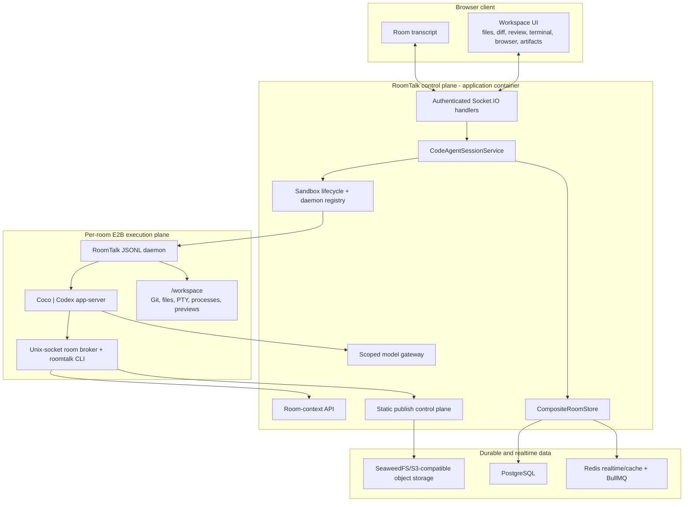
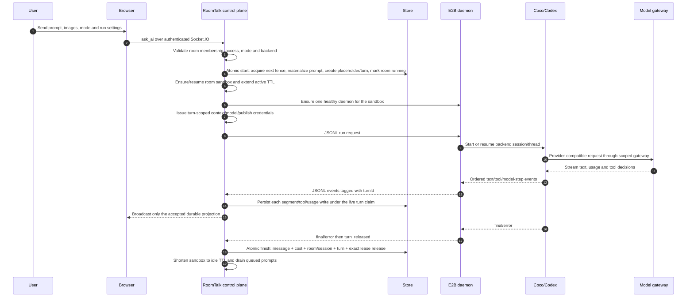

# RoomTalk Code-Agent Runtime Architecture

[中文](code-agent-runtime-architecture.zh.md)

Status: Current
Verified against `master`: 2026-07-24

This document describes the current implementation. Earlier files under `docs/` may describe individual phases, spikes, or migration plans; use this file as the concise architecture entry point and use source/tests as the final authority.

## Product Model

RoomTalk has two room types:

| Room type | Primary purpose | Execution environment |
| --- | --- | --- |
| Chat room | Human conversation, AI streaming, media, roles, realtime collaboration | RoomTalk Node process calls configured AI providers |
| Code-agent room | A shared conversation bound to a persistent development workspace | RoomTalk controls one E2B sandbox and a sandbox-local agent daemon |

A code-agent room is not a chat prompt wrapped around remote shell commands. It is a room-scoped control plane around an isolated execution plane:

- The room is the shared source of truth for membership, prompts, turns, tool events, permissions, and artifacts.
- The sandbox is mutable runtime state for files, Git, processes, terminals, and dev servers.
- Coco is RoomTalk's in-house CLI coding agent and engine; its reasoning/tool loop remains behind the runner contract.
- Codex is room-owner-provided: the room owner connects a Codex subscription through device authorization, and RoomTalk brokers that encrypted connection into E2B for turns started by members who are allowed to use the workspace.
- GitHub access is also room-owner-provided: the owner's optional encrypted personal access token is materialized as turn-scoped secret files for `gh` and Git, then removed after the run.
- The browser never receives E2B credentials, provider keys, database credentials, or raw RoomTalk service tokens.

## High-Level Architecture



## Ownership Boundaries

| Layer | Owns | Deliberately does not own |
| --- | --- | --- |
| Browser | User interaction, local panel state, streamed rendering, review drafts | Provider/E2B secrets, direct sandbox SDK access, persistence ordering |
| RoomTalk control plane | Identity, room access, permission resolution, turn orchestration, transcript persistence, usage/cost, scoped tokens, sandbox lifecycle, public artifacts | Executing untrusted user commands in the application process, agent reasoning internals |
| E2B execution plane | Workspace files, Git, PTY, commands, background processes, dev servers, agent backend process | Room membership, durable message truth, public object storage ownership |
| Agent backend | Reasoning, native tool loop, model-specific session/thread state | RoomTalk authorization, database access, public URL ownership |
| PostgreSQL/Redis/S3-compatible storage | Durable records and AI run facts, realtime coordination/BullMQ/cache, object bodies/manifests | Agent execution |

This split is the central security and reliability decision in the project: untrusted code runs in E2B, while every durable or externally visible action is mediated by RoomTalk.

## Turn Lifecycle



### Turn controls

Only one agent turn mutates a room workspace at a time. A durable PostgreSQL claim `{ roomId, turnId, ownerId, fence }` enforces that invariant across RoomTalk processes; the in-process active-turn map is only a fast local guard. Turn creation is not a chain of best-effort writes. One transaction locks the room, validates any queued input being claimed, increments the room lease fence, materializes the prompt, inserts the assistant placeholder and `room_agent_turn`, and marks the room running. The Socket acknowledgement is sent only after that transaction commits.

Every execution-produced phase, transcript, model-step, steering materialization, and terminal write rechecks the same claim against the unexpired room lease. Losing the lease therefore removes write authority, rather than merely changing an observability field. The winner can take a higher fence; delayed work from an older process cannot append a tool result, overwrite room state, settle cost, or release the winner's lease. Additional user prompts can be queued, edited, canceled, or promoted into steering input. Queued input stays visibly queued until it is claimed and materialized at a turn boundary. A running turn supports:

- `interrupt`: request a clean cancellation and bound the wait for release;
- `steer`: inject additional guidance into the active agent flow;
- approval responses for backends that ask before commands or file changes;
- retry with the original turn mode and backend settings preserved.

The room stores a `RoomAgentTurn` projection separately from rendered messages so UI grouping and recovery do not depend on heuristics over timestamps.

## Sandbox and Daemon

### One room, one execution workspace

Each code-agent room resolves to one E2B sandbox and `/workspace` directory. The sandbox service can:

- create/connect/destroy sandboxes;
- initialize a Git baseline without rewriting imported history;
- read/search/write/rename/delete workspace entries;
- read assets, Git refs, changed files, and branch/unstaged diffs;
- start PTY terminals and streamed commands;
- discover dev servers and resolve E2B preview URLs;
- export/import bounded workspace archives during artifact migration.

The current default idle TTL is two minutes and the default active TTL is one hour. With the default E2B policy, timeout pauses the sandbox, keeps memory, and enables provider auto-resume. RoomTalk reconnects paused sandboxes instead of treating the timeout as data loss. Production may set the same values explicitly through `CODE_AGENT_IDLE_SANDBOX_TTL_MS` and `CODE_AGENT_ACTIVE_SANDBOX_TTL_MS`.

### Reusable JSONL daemon

RoomTalk starts one `roomtalk_code_agent_runner.daemon` per sandbox and reuses it for sequential turns. The supported product paths are Coco (`code-agent`) and Codex app-server (`codex-app-server`). The daemon still accepts the deprecated `codex` adapter only for migration and compatibility; new behavior must target app-server. The protocol supports:

- `code-agent` (Coco, RoomTalk's self-built CLI agent and engine);
- `codex-app-server` (Codex app-server thread/session protocol using the room owner's connection);
- legacy `codex` CLI JSON events while compatibility data still requires them;
- health, run, interrupt, steer, approval, thread list/read, and shutdown requests;
- `daemon_ready`, structured runner events, `turn_released`, and shutdown events.

Each application process keeps an in-memory registry of daemon handles, but the daemon itself lives in E2B. Startup serializes daemon creation and removes stale daemon/Codex child processes before launching a replacement. SIGTERM/SIGINT shutdown reclaims all daemons owned by the process. A bounded turn-release wait prevents a lost `turn_released` signal from leaving a room permanently `running`; timed-out thread queries terminate and recycle the daemon instead of leaving its request channel wedged.

Codex and GitHub connection records remain keyed by RoomTalk client, but a code-agent room resolves both through its current `creatorId`. Settings starts OpenAI/Codex device authorization and optional GitHub PAT storage for the owner; RoomTalk encrypts the resulting auth material at rest and writes it to the E2B secret directory only for an authorized room turn. The requesting member remains the actor for prompt ownership, room authorization, observability, and approvals. A signed Codex refresh token binds both the actor and credential owner so an ownership transfer cannot silently switch accounts during a running turn.

For GitHub, RoomTalk resolves the room owner's encrypted PAT, writes the token plus an isolated Git config into turn-scoped secret files, and lets the sandbox wrappers expose them to `gh` and HTTPS Git without putting the token in the prompt or ordinary environment snapshot.

## Permissions and Scoped Capabilities

### Permission modes

The four user-facing choices are presets over three independent permission parameters; they are not four sandbox implementations.

| UI preset | `sandbox_mode` | `approval_policy` | `approvals_reviewer` | Behavior |
| --- | --- | --- | --- | --- |
| Plan (`plan`) | `read-only` | `on-request` | `user` | Inspect only; no writable tools or background jobs |
| Ask (`edit`) | `workspace-write` | `on-request` | `user` | Routine workspace work runs directly; eligible escalations ask the user |
| Auto (`approveForMe`) | `workspace-write` | `on-request` | `auto_review` | The native backend reviewer allows, denies, or escalates eligible requests to the user |
| Full (`fullAccess`) | `danger-full-access` | `never` | `user` | No backend approval prompts inside the isolated E2B sandbox |

Plan mode is not implemented with a fragile shell-command allowlist. Coco uses a bubblewrap-backed read-only shell, while Codex backends use a matching read-only permission profile. `Write`, `Edit`, and `BackgroundShell` are absent in Plan.

For Coco, this policy lives in Coco core. Built-in tools declare whether an invocation crosses the current permission boundary: routine workspace edits and tests do not prompt, while protected metadata, Git mutations, system-level access, and side-effecting `gh` operations enter the Ask/Auto path. Auto decisions use Coco's current model through its native reviewer; RoomTalk does not duplicate those decision rules. The RoomTalk runner only transports a remaining user approval request as JSONL/WebSocket events and routes the response back to Coco.

The resolved mode is persisted on the turn/message as an execution fact. Room defaults and per-user model/context preferences remain separate from what actually ran.

### Model gateway

RoomTalk issues a short-lived token bound to room, client, turn, provider, and model. The gateway:

- routes only to the selected provider/model;
- applies request and USD budget limits;
- parses streaming/non-streaming usage;
- records per-step and aggregate cost;
- keeps provider keys out of E2B environment history and the browser.

### Room-context broker

Room history is not dumped into every system prompt. A turn-scoped Unix socket exposes the `roomtalk` CLI inside the sandbox:

```text
roomtalk room history
roomtalk room delta
roomtalk room search
roomtalk room message
roomtalk site list
```

The runner holds the upstream URL/token and brokers bounded requests. Responses project only agent-safe message fields and omit internal recovery, billing, storage, and streaming metadata. This gives Coco and Codex the same on-demand room awareness without adding a separate MCP lifecycle.

### Static publishing

Writable modes receive a separate turn-scoped publish token. `roomtalk site publish` uses a two-phase pipeline:

1. validate paths, sizes, entry file, mode, room ownership, and slug;
2. request presigned object uploads from RoomTalk;
3. upload static bytes directly from E2B to the configured S3-compatible store;
4. finalize after the server verifies object sizes;
5. atomically replace the manifest for `/p/:slug/`.

Published sites are room-owned durable artifacts. They survive sandbox pause/replacement, can be listed or unpublished through the CLI, appear in the workspace Artifacts tab, and are deleted with the owning room.

## Workspace UI

The workspace is a browser IDE surface attached to the room rather than a separate editor product.

### Transcript and activity

- AI text, tool calls, and tool results are persisted in true execution order.
- Text is split into separate assistant segments around tool boundaries.
- Messages are grouped by durable turn metadata.
- Tool state, model-step usage, errors, approvals, queued prompts, and run controls remain visible after refresh.

### File and review surfaces

- searchable file tree with create, rename, delete, and editable source views;
- Markdown, image, video, audio, and workspace-asset previews;
- branch and base-ref selection plus branch/unstaged diff scopes;
- changed-file statistics, unified/split diff rendering, viewed state, whitespace controls;
- line-scoped review comments stored as room-local drafts and attached as structured context to the next prompt.

### Terminal and browser surfaces

- a real E2B PTY streamed through authenticated socket handlers;
- room-level `owner` / `admin` / `member` workspace access policy rechecked for every workspace operation;
- buffered input and local echo to avoid a network round trip per keystroke;
- bounded snapshots and delta events so terminal output does not rebroadcast a large tail on every chunk;
- browser tabs for files, public artifacts, and detected preview servers;
- responsive viewport presets, navigation/refresh, screenshots, recordings, and preview annotations.

Desktop uses resizable chat/workspace/right-panel regions. Mobile exposes the same capabilities through compact tabs and sheets while avoiding desktop-scale diff or toolbar layouts.

## State and Recovery

### Durable state

RoomTalk persists:

- room identity, access policy, default mode/backend, sandbox identity/status/artifact metadata;
- prompt, image references, assistant segments, tool calls/results, usage/cost, and turn status;
- backend session/thread ID for resume;
- published-site manifests and room index;
- workspace-independent media and artifacts.

### Runtime state

E2B owns the live filesystem, Git worktree, processes, terminals, and preview servers. Redis owns presence, socket sessions, pub/sub, model-gateway counters, caches, and the separate ordinary-chat BullMQ queue. Code Agent turns deliberately do not use that queue: they are interactive, room-bound sessions attached to one mutable sandbox and daemon, with steer, interrupt, approval, terminal, and preview controls. Their scheduling and ownership unit is the fenced room turn in PostgreSQL. The Node process owns only replaceable local active-turn, preview/terminal-session, and daemon-handle maps.

### Recovery paths

- A singleton periodic recovery pass, not startup alone, locks candidate room/turn rows and marks interrupted work only after rechecking that no matching live fenced lease exists.
- `starting` or `steering` queue entries abandoned before materialization return to `queued` after `CODE_AGENT_QUEUE_STALE_MS` (two minutes by default), again only without a live room lease. The same pass drains ready queued prompts, so a one-time startup miss does not strand them.
- A stale `creating` or `running` room/sandbox state is converted to error only under the same locked no-live-lease check.
- Paused E2B sandboxes auto-resume with memory/files preserved.
- An incompatible pinned artifact triggers bounded archive export, replacement sandbox creation, import, Git initialization, atomic room swap, and old-sandbox cleanup.
- Daemon startup removes stale local agent processes; server shutdown stops tracked daemons.
- Static artifacts remain independent of sandbox lifetime.
- A completed Codex app-server turn stores its pre-turn thread ID and `lastTurnId`, its post-turn backend turn ID, and a selective workspace checkpoint descriptor. The archive contains only changed regular-file before/after blobs. It is written to S3-compatible object storage; PostgreSQL owns the manifest, context boundary, and restore audit.

Normal completion and failure also converge transactionally. The terminal transaction checks the exact turn claim, conditionally finalizes the still-owned streaming message, removes unused placeholders, settles the applicable turn cost, updates room and backend-session state, marks the turn terminal, and deletes only the matching lease. If any statement fails, PostgreSQL rolls back the whole projection. If the message was deleted or the fence was superseded, the old execution is obsolete and cannot recreate or overwrite state.

### Agent-owned workspace revision DAG

Checkpoint files remain selective, but their history is no longer modeled as a one-off undo. At turn start, the sandbox creates an isolated bare Git object database and index below `/tmp/roomtalk-checkpoints`; the user's `.git`, branch, index and commit history are never changed. At completion, tree comparison packages only changed regular-file before/after blobs, capped at 8 MiB per file and 64 MiB of logical data per turn. Secret-like files, dependency/build/cache directories, symlinks and unsupported types are excluded. PostgreSQL then commits a `turn` revision whose parent is the room head captured when the fenced turn began. A room starts at a deterministic `root:<roomId>` revision.

`code_agent_workspace_revisions` stores three node kinds:

- `root` anchors a room and has no file delta;
- `turn` names one reversible before/after checkpoint edge and its post-turn Codex boundary;
- `restore` creates a new branch at the selected target. Its `parent_revision_id` is the target state, while `restored_from_revision_id` keeps the abandoned source head reachable for audit and later branch traversal.

The current revision is a pointer on `rooms`. Each completed turn exposes two explicit targets: `before` selects the turn's parent and pre-turn Codex boundary, while `after` selects the turn revision and post-turn boundary. The second target is essential for returning to an abandoned branch tip when no later turn exists. The planner walks current and target ancestors, finds their lowest common ancestor, emits `before` steps for source-branch turn revisions, then `after` steps for the target branch. Restore nodes carry no file step because their parent already names the state they represent. This makes repeated backward and forward restores coherent: an old branch is retained instead of being rewritten, and every completed turn boundary remains addressable.

The live workspace may also contain edits that RoomTalk did not create. Those edits are overlays, not DAG nodes. Every step therefore compares the current SHA-256 with the side it is leaving: undo requires the turn's after-image; redo requires its before-image. A mismatch, missing archive or non-restorable path aborts the entire plan. Previously applied steps are reversed in the opposite order, the Codex fork is not started, and the room head remains unchanged. This is intentionally stricter than partial restore: the product never presents a workspace from one branch with hidden Codex context from another.

The operation owns and renews the fenced PostgreSQL room lease for its full duration, blocking Agent turns, browser mutations and terminal input across App instances. Each in-sandbox file batch has its own rollback journal. Once every edge has applied, the runner calls Codex app-server `thread/fork(threadId, lastTurnId)` at the selected before/after boundary. One final transaction locks the room, proves the same live lease and unchanged source head, inserts the `restore` revision and audit row including `target_boundary`, switches the room's backend session/cursor and revision head, then releases the lease. If the fork or commit fails, inverse checkpoint steps restore the original branch. A fork created before a failed commit is merely orphaned because no room points to it.

Migration `0013_code_agent_workspace_revision_dag` backfills historical Codex turns in timestamp order. An old restore is marked traversable only when it exactly undid the then-current turn and recorded no conflict or unavailable path; legacy hybrid restores and incomplete/running turns become explicit non-traversable barriers rather than invented history. Room-history clear and room deletion remove checkpoint objects after the durable delete commits.

This is a persistent DAG for Agent-owned file changes and exact Codex context, not a full filesystem time machine or a general revision browser. Unrecorded user edits remain protected overlays. Live Git diff still describes the current sandbox, and external effects such as push, deployment, email or third-party API calls are not reversible. Coco has no exact hidden-context fork, so DAG restore is exposed only for completed Codex app-server turns.

## Persistence Model

`CompositeRoomStore` separates data by behavior:

| Store | Responsibilities |
| --- | --- |
| PostgreSQL durable store | Rooms, messages, room events, members, auth, media metadata, `assistant_runs`/dispatch intent, code-agent turns, workspace revision DAG/restore audit, fenced room leases, sandbox metadata |
| Redis realtime and queue store | Presence, socket sessions, pub/sub, locks/counters, optional short-TTL message cache, and BullMQ operational jobs for ordinary chat AI |
| S3-compatible object storage | Private media, published-site versions/manifests, selective Code Agent checkpoint blobs, migration/object payloads; SeaweedFS in current production |

Server-assigned message positions order canonical history, while the PostgreSQL-owned per-room event sequence is the synchronization authority. `updatedAt` is only a complete-room last-write guard. Browser timestamps are display metadata, not the consistency mechanism.

## Verification Strategy

Changes are tested at the contract boundary where they can fail:

- Python runner tests for Coco/Codex mapping, daemon sequencing, permissions, broker/CLI behavior, controls, and image input.
- Node tests for protocol parsing, atomic turn start/rollback, fenced transcript and terminal writes, stale-fence takeover, abandoned queue recovery, terminal projection rollback/idempotency, session orchestration, transcript ordering, lifecycle migration, daemon registry, model gateway, socket authorization, workspace access, and static publishing.
- Client tests for turn rendering, queue controls, files/diffs/reviews, terminal local echo/input batching, browser tabs, artifacts, and responsive behavior.
- Playwright for end-to-end room, mobile recovery, multi-client, media, and persistence flows.
- E2B smoke for the exact pinned artifact, daemon/backend startup, permissions, context, image input, toolchain, and public artifact behavior.

## Release Contract

There are two independently deployed layers:

1. The RoomTalk application image, currently deployed through Docker Compose on the production Mac and portable to ECS/EKS.
2. The pinned E2B template containing the runner, daemon, tools, prompts, and agent engine source.

Any runner/tool/prompt/Dockerfile/context or agent-engine change is incomplete until:

1. source changes are committed;
2. `ops/code-agent-sandbox/artifact.lock.json` and Dockerfile version are updated;
3. a new E2B template is built;
4. E2B smoke passes against that template;
5. production template/artifact/source pins match;
6. the E2B pins are applied to the production application environment and real room behavior is verified.

App-only UI, store, or socket changes do not require an E2B rebuild unless they change the sandbox contract. Their validation should follow the actual affected boundary: focused tests plus the affected build, expanding to both builds or external smoke only when the risk crosses those boundaries.

## Interview Summary

The strongest way to describe this subsystem is:

> I built a shared cloud code-agent room, not a remote shell widget. RoomTalk acts as the control plane for identity, permissions, fenced room execution, durable turns, scoped model/context/publish access, and sandbox lifecycle. A turn starts and finishes through PostgreSQL transactions, and every intermediate write proves the same room-lease fence, so a crashed or superseded process cannot leave half a turn or overwrite its replacement. Each room gets an isolated E2B execution plane with a reusable daemon that runs Coco, our self-built CLI agent, or Codex app-server through the room owner's connected subscription for authorized members. The browser exposes files, Git diffs and review comments, a PTY terminal, dev-server previews, and durable artifacts, while periodic recovery returns abandoned queue claims and recovers only work whose lease has actually expired.
