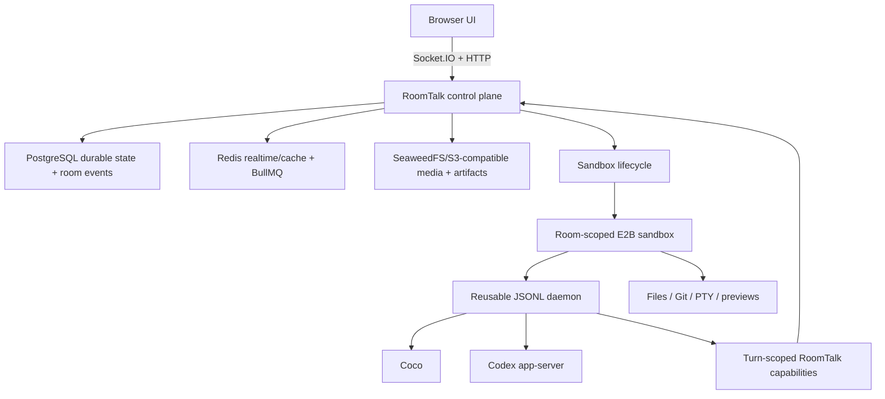

# RoomTalk Code Agent 运行时架构

[English](code-agent-runtime-architecture.md)

状态：当前
已按 `master` 核对：2026-07-20

本文描述当前实现。`docs/` 中的早期 phase、spike 和 migration plan 保留了演进证据；当前简明入口以本文为准，最终事实源仍是源码和测试。

## 产品模型

| 房间 | 主要用途 | 执行环境 |
| --- | --- | --- |
| Chat room | 人类对话、普通 AI streaming、媒体、角色和实时协作 | RoomTalk Node 进程调用配置 provider |
| Code Agent room | 共享对话绑定一个可持续开发 workspace | RoomTalk 控制每房间一个 E2B sandbox 和 sandbox-local daemon |

Code Agent room 不是给 remote shell 包一层 chat prompt，而是一个 room-scoped control plane：

- Room 是 membership、prompt、turn、tool event、permission 和 artifact 的共享事实源。
- Sandbox 是 file、Git、process、terminal 和 dev server 的可变 runtime state。
- Coco 是 RoomTalk 自研 CLI coding agent/engine，其 reasoning/tool loop 位于 runner contract 之后。
- Codex 由房主提供：房主连接自己的 Codex subscription，RoomTalk 加密存储，并为获准使用工作区的成员 turn 物化房主连接。
- GitHub 也是用户自有 connection：加密 PAT 只以 turn-scoped secret file 形式供 `gh`/Git 使用，轮次后删除。
- Browser 永远不获得 E2B、provider、database 或 RoomTalk service secret。

## 高层架构

## 职责边界

| 组件 | 拥有 | 不拥有 |
| --- | --- | --- |
| Browser | UI state、用户输入、本地 view preference | 服务 secret、基础设施凭据、权威 turn state |
| RoomTalk control plane | Identity、membership、authorization、durable turn/transcript、scoped credential、sandbox lifecycle、object metadata | Agent reasoning、workspace process |
| E2B execution plane | Workspace file、Git、process、PTY、preview server、Agent execution | Room authorization、database credential、public URL ownership |
| Agent backend | Reasoning、原生 tool loop、backend session/thread state | RoomTalk auth、database access、sandbox lifecycle |
| PostgreSQL/Redis/S3-compatible storage | Durable fact 与 AI run、realtime coordination/BullMQ/cache、object body/manifest | Agent execution |

## Turn 生命周期

1. Socket 已注册用户提交 `ask_ai` 或 send-and-ask。
2. RoomTalk 校验 room type、membership、Code Agent access、mode、backend 和 rollout control。
3. 用户 prompt 先以 durable message 保存，创建 preparing turn 并返回 ack。
4. Scheduler 获取 durable fenced room lease，将边界上的 queued input 物化为下一个 turn。
5. Lifecycle service 连接或创建固定 E2B sandbox，验证 artifact/source-ref，必要时迁移 workspace archive。
6. Session service 发放 turn-scoped model/context/publish/asset credential，并注入房主的 Codex 与可选 GitHub secret。
7. 可复用 daemon 串行执行 backend turn，同时接受 steer、interrupt 和 approval response。
8. Text/tool/status/model-step/final event 被映射为 RoomTalk event，按真实顺序持久化后再广播。
9. Finalization 关闭 pending tool call，保存 usage/cost/backend session ID，释放 lease，将 sandbox 回到 idle TTL。

Turn control 不会绕过 durable scheduler：Queue 保存下一个 prompt；Steer 只在 backend 确认插入后消费；Interrupt 先停止 owned runner，再完成持久状态。Retry/edit-and-ask 保留原 turn mode/backend 且按 durable history 截断。

## Sandbox 与 Daemon

每个 Code Agent room 绑定一个可持续 `/workspace`。Idle TTL 与 active TTL 分离；正在执行的 turn 会续租 active TTL，完成后回到 idle TTL。Sandbox 暂停/超时后可恢复；artifact 不匹配时可用 archive 迁移到 replacement sandbox。

Daemon 是 sandbox-local JSONL process，不是 RoomTalk 权威状态存储。它复用 backend process/session，串行 turn/control/query，并发出版本化 event。RoomTalk 为 thread query 和 turn release 设置有界等待；丢失 release、query timeout 或 control connection 失败会使 daemon handle 中毒并重建，而不是永久卡住 room。

PTY terminal、browser preview、dev server 和 file API 是独立 sandbox service，不属于 daemon protocol state。

Codex 与 GitHub connection record 仍以 RoomTalk client 为存储键，但 Code Agent room 始终通过当前 `creatorId` 解析两类凭据。发起成员继续作为 prompt ownership、room authorization、observability 和 approval 的主体；房主提供 Codex subscription 与可选 GitHub PAT。签名 Codex refresh token 同时绑定发起成员与凭据房主，房间所有权在 turn 中途变化时不会静默切换账号。

## 权限与 Scoped Capability

| UI 模式 | 内部模式 | Workspace | Approval |
| --- | --- | --- | --- |
| Plan | `plan` | Read-only | 不发放 write/shell |
| Ask | `acceptEdits` | Workspace write | 符合条件的操作请求人类审批 |
| Auto | `approveForMe` | Workspace write | 符合条件的 escalation 交 Coco 原生 model reviewer |
| Full | `fullAccess` | Danger-full-access | 只对明确允许的用户/mode 开放 |

Mode 不仅是 prompt 提示，它决定 runner 工具、sandbox policy、approval 路由和可发放 capability。

- Model gateway token 绑定 client/room/turn/model/provider/budget，且 provider key 保留在 Node。
- Room-context token 只允许读取有界 history/delta/search/message/site，每次请求重新检查 room access。
- Static-publish token 绑定 client/room/turn/mode，只在可写模式发放。
- Workspace asset token 绑定 sandbox/path/room 边界并有限时。

## Browser Workspace

Workspace UI 是 RoomTalk 对 sandbox 能力的授权视图：

- transcript 按 durable turn 分组，展示 text/tool/approval/usage/lifecycle；
- file tree/search/editing、asset preview、Markdown/media preview；
- Git changed-file tree、ref/base selection、unified/split diff、viewed state、line review comment；
- authenticated PTY terminal，带 bounded session/output/input；
- workspace file preview 和 dev-server browser preview，带 viewport/screenshot/recording；
- 已发布 artifact 的 durable list。

每个 read/mutation/session 都要重新检查 room access policy，并对 path、payload、file size、archive 和 runtime session 设上限。

## 状态与恢复

Durable state 包括 room/config/membership、message/position、agent turn、queue、backend session ID、usage/cost、sandbox metadata、artifact manifest、用户 connection 和 fenced room lease。

Runtime state 包括 socket presence/session、Redis pub/sub/cache/counter、普通 Chat AI 的 BullMQ job、Node 内存 active-turn/daemon/terminal/preview handle，以及 E2B 内的 process。BullMQ 任务是可恢复的运维状态，但不解释业务结果；durable PostgreSQL state 用来解释并收敛。

恢复路径包括：

- startup 将中断 streaming message 和 running turn 显式标记 error；
- 修复 stale `creating`/`running` sandbox status；
- reconnect/resume timed-out sandbox，缺失时 recreate；
- artifact 不匹配时 archive migration，CAS 竞争失败时销毁 replacement 但保留 old sandbox；
- daemon control/query/release 失败时丢弃 handle 并重建；
- browser 重连时重新读 durable room/workspace snapshot，而不信任 local stale object。

## 持久化模型

| Store | 职责 |
| --- | --- |
| PostgreSQL durable store | Room、message、room event、member、auth、media metadata、`assistant_runs`/dispatch intent、Code Agent turn/lease/sandbox metadata |
| Redis realtime 与 queue store | Presence、socket session、pub/sub、counter/lock、可选最近消息 cache，以及普通 Chat AI 的 BullMQ operational job |
| S3-compatible storage | 私有媒体 body、versioned static file/manifest；当前生产使用 SeaweedFS |
| E2B | 可变 workspace 和进程，不是 durable application database |

Runtime 强制使用 PostgreSQL 保存 durable business state，同时仍需 Redis 协调 realtime 与 BullMQ 调度；Redis 不是业务 authority，但 active queue 通过 AOF 保存。

## 验证与发布

验证从变更风险出发：protocol/store/auth/ordering 用 focused contract/service test；client state 用 Vitest；跨 browser 流程用 Playwright；真实 sandbox/backend/artifact 边界用 E2B smoke。

RoomTalk 应用镜像发布和 E2B artifact 发布是两条不同链路。修改 runner、tool、prompt、sandbox Dockerfile/dependency 或 code-agent-engine source ref 时，必须更新 lock/version、构建新 template、同步生产 pin 并完成真实验证。只推送 Node 源码不会更新已存 sandbox artifact。
