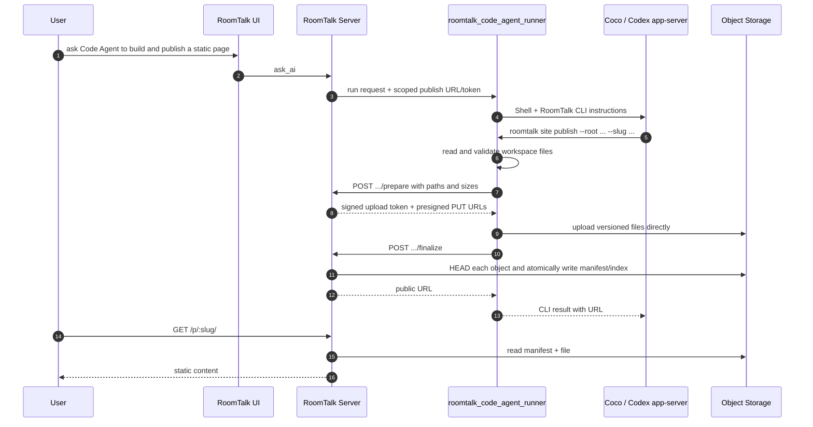

# Code Agent Static Publish Implementation

[中文](code-agent-static-publish-implementation.zh.md)

Status: Current
Verified against `master`: 2026-07-12

## Architecture



## Components

### 1. `PublishedStaticSiteService`

Implemented in `server/src/services/publishedStaticSite.ts`.

Responsibilities:

- Issue and verify HMAC-signed scoped publish tokens.
- Validate publish payloads.
- Sanitize and reserve slugs.
- Write files to `MediaObjectStorage`.
- Write a manifest at `published-sites/<slug>/manifest.json`.
- Read a manifest and resolve request paths for serving.

Object layout:

```text
published-sites/
  <slug>/
    manifest.json
    versions.json
    version-manifests/
      <versionId>.json
    versions/
      <versionId>/
        index.html
        assets/app.js
        assets/style.css
```

`manifest.json` is the mutable pointer used by the stable site URL. Every publish also writes an immutable manifest under `version-manifests/`; `versions.json` records the ordered version history. The room index lives at `published-sites/by-room/<base64url-room-id>/index.json`; it tracks the slugs and all version object keys owned by a room so unpublish and room deletion can clean them without listing the bucket. Existing sites without a version index are rebuilt from their retained room-index object keys on the first version-history read, without uploading file bodies again.

Manifest shape:

```json
{
  "schemaVersion": 1,
  "slug": "roomtalk-demo",
  "roomId": "room-1",
  "clientId": "client-1",
  "turnId": "turn-1",
  "title": "RoomTalk Demo",
  "entry": "index.html",
  "versionId": "20260630T120000Z_abcd1234",
  "fileCount": 3,
  "totalBytes": 12345,
  "createdAt": "2026-06-30T12:00:00.000Z",
  "updatedAt": "2026-06-30T12:00:00.000Z",
  "files": [
    {
      "path": "index.html",
      "mimeType": "text/html; charset=utf-8",
      "byteSize": 5120,
      "objectKey": "published-sites/roomtalk-demo/versions/.../index.html"
    }
  ]
}
```

### 2. Publish Routes

Implemented in `server/src/routes/publishedStaticSiteRoutes.ts`.

Routes:

- `POST /api/code-agent/publish-static-site/prepare`
  - Accepts only file paths and byte sizes, validates the 100-file / 100 MB limits, and returns short-lived presigned upload URLs.
  - Production sandboxes upload file bytes directly to Tigris; static file bodies do not pass through Fly.

- `POST /api/code-agent/publish-static-site/finalize`
  - Accepts the signed upload token returned by `prepare`.
  - Verifies every object exists in Tigris with the declared byte size before atomically publishing the new manifest.

- `POST /api/code-agent/publish-static-site/activate`
  - Accepts `{ slug, versionId }` with the same active-turn write authorization as publishing.
  - Points the stable site URL at an immutable retained version without copying its files.

- `POST /api/code-agent/publish-static-site`
  - Protected by `Authorization: Bearer <scoped token>`.
  - Retained as a compatibility route for older sandbox artifacts that send Base64 JSON payloads.
  - Returns `{ url, slug, entry, versionId, fileCount, totalBytes }`.

- `DELETE /api/code-agent/publish-static-site`
  - Uses the same scoped turn token and accepts `{ slug }`.
  - Verifies that the slug belongs to the token's room, removes every stored version, and updates the room index.
  - Returns `{ url, slug, objectCount }`; the returned URL is the address that was taken offline.

- `GET /api/code-agent/room-context/sites`
  - Uses the read-only room-context token and rechecks current room access.
  - Returns the sites owned by the current room for `roomtalk site list --json`.

- `GET /p/:slug`
- `GET /p/:slug/*`
  - Reads manifest and serves the requested file.
  - No path means the manifest entry file.
  - Directory paths fall back to `<dir>/index.html`, then manifest entry for SPA-style routes.
  - The route confirms the owning room still exists before serving, emits `nosniff`/no-referrer/cache headers, and allows credentialless CORS because the built-in browser loads public sites in an iframe with an opaque origin.

- `GET /p/:slug/__versions/:versionId/*`
  - Reads the immutable manifest for one published version.
  - Relative HTML/CSS/JS assets remain inside the same version URL, so an old preview never mixes files from the latest publish.

Workspace Artifacts include the ordered version list. Selecting a version changes only that user's preview URL; the stable `/p/:slug/` URL continues to follow the latest successful publish.

### 3. Media Object Storage

`MediaObjectStorage` supplies local and S3-compatible reads/writes, presigned PUTs, `HEAD`, and deletion. File bodies bypass Fly on the direct-upload path; Fly still proxies public reads so it can resolve manifests, SPA fallbacks, MIME types, and room ownership consistently.

### 4. Code Agent Session Env

`CodeAgentSessionService` issues a per-turn publish token and passes these environment variables only in the runner/daemon run environment:

```text
ROOMTALK_CODE_AGENT_ENABLE_STATIC_PUBLISH=true
ROOMTALK_STATIC_PUBLISH_URL=https://room.ruit.me/api/code-agent/publish-static-site
ROOMTALK_STATIC_PUBLISH_TOKEN=<scoped token>
ROOMTALK_STATIC_PUBLISH_PUBLIC_BASE_URL=https://room.ruit.me
```

The token is not stored in messages and is not sent to the browser.

The RoomTalk CLI exposes the capability symmetrically:

```bash
roomtalk site publish --root dist --entry index.html --slug roomtalk-demo
roomtalk site versions --slug roomtalk-demo --json
roomtalk site activate --slug roomtalk-demo --version 20260630T120000Z_abcd1234
roomtalk site unpublish --slug roomtalk-demo
```

`--slug` is required for publishing. Reusing the same slug creates a new version of that stable site; choosing another slug creates a separate site. `roomtalk publish-static-site` remains as a compatibility alias for `roomtalk site publish` and follows the same required-slug rule.

### 5. RoomTalk CLI

The runner exposes static-site management only through the shared `roomtalk` CLI. The previous native `PublishStaticSite` engine tool is removed so Coco and Codex app-server use one contract. The legacy Codex CLI adapter retains the same CLI only for compatibility.

`roomtalk site list --json` is read-only and uses the room-context broker, so it is available in every mode without exposing a publish token. `site publish` and `site unpublish` require all of:

- Mode is Ask (`edit`), Auto (`approveForMe`), or Full (`fullAccess`); `acceptEdits` remains a legacy alias for `edit`.
- `ROOMTALK_CODE_AGENT_ENABLE_STATIC_PUBLISH=true`.
- Publish URL and token are present.

Publish input:

```json
{
  "root": "dist",
  "entry": "index.html",
  "slug": "roomtalk-demo",
  "title": "RoomTalk Demo"
}
```

The publish command:

1. Resolves `root` inside the current workspace.
2. Walks files recursively.
3. Filters unsafe directories and file names.
4. Enforces file count and byte limits.
5. Sends file metadata to the `prepare` control-plane endpoint.
6. Streams each file directly from the sandbox to its Tigris presigned PUT URL.
7. Calls `finalize`; Fly verifies object sizes and writes the durable manifest.
8. Returns a concise JSON or human-readable result with the durable URL.

The current limits are 100 files, 100 MB per file, and 100 MB total per published version. Because the total cap is also 100 MB, a single file may consume the complete version budget.

The unpublish command sends `DELETE /api/code-agent/publish-static-site` with the scoped token. The server verifies room ownership, removes every stored version for the slug, and updates or deletes the room index. It never deletes workspace files.

### 6. System Prompt

The runner system prompt describes the CLI only when the matching read or write capability is available:

```text
roomtalk site list --json
roomtalk site publish --root dist --entry index.html --slug roomtalk-demo
roomtalk site unpublish --slug roomtalk-demo
```

## Tests

### Server

- Token issue/verify accepts valid tokens and rejects expired/tampered tokens.
- Publish stores files and manifest.
- Publish rejects missing entry, bad path traversal, unsupported MIME/type, oversized payload, and slug ownership conflict.
- Routes serve `index.html`, assets, directory index, and SPA fallback.
- Unpublish rejects cross-room and Plan-mode tokens, removes all stored versions, and keeps the room index consistent.
- Routes return 404 for missing slugs and unsafe paths.

### Runner

- Plan mode can run `site list`, but rejects `site publish` and `site unpublish`.
- Writable modes expose publish credentials to the CLI.
- The native `PublishStaticSite` engine tool is absent.
- System prompts list only the CLI commands available in the current mode.
- Tool posts valid payloads and returns the URL.
- CLI supports `site publish` and `site unpublish`; both reject Plan-mode access.
- Tool rejects traversal, missing entry, oversized files, and secret-like files before making an HTTP request.

### Integration

- `CodeAgentSessionService` passes the scoped publish env only to the JSONL/daemon run request, never the browser or durable transcript.
- The publish env includes room, client, turn, and mode-bound token claims.

## Deployment

Required production settings:

```text
MEDIA_BUCKET_NAME=...
MEDIA_STORAGE_ENDPOINT=...
MEDIA_STORAGE_REGION=...
CODE_AGENT_STATIC_PUBLISH_PUBLIC_URL=https://room.ruit.me
CODE_AGENT_STATIC_PUBLISH_TOKEN_SECRET=...
```
