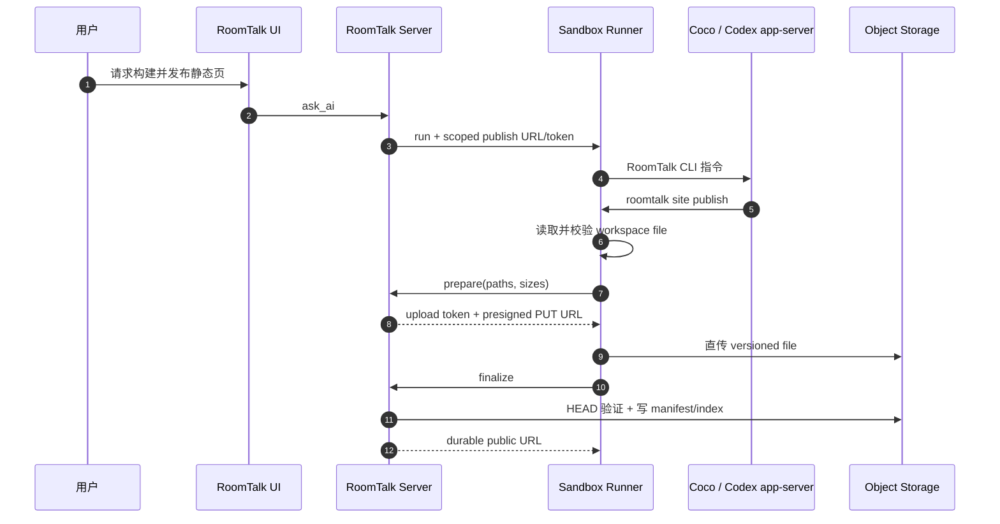

# Code Agent 静态发布实现

[English](code-agent-static-publish-implementation.md)

状态：当前
已按 `master` 核对：2026-07-20

## 架构



静态发布不将 sandbox 本身当作 hosting origin。文件被持久化到 object storage，所以 E2B pause、timeout 或 replacement 后 URL 仍可用。

## 数据模型

每个发布使用：

- `roomId`：所有权与删除边界；
- `slug`：公开路由稳定名；
- `versionId`：每次 finalize 产生不可变版本；
- current manifest：稳定 URL 当前指向的版本；
- immutable version manifest：每个版本独立保存 entry、file metadata、MIME、size、存储位置和时间；
- version index：按发布时间记录完整版本历史；
- room index：记录 room 的 slug 和全部版本 object key，用于 Artifacts UI、room-context CLI 与完整清理。

Object key 按 slug/version/path 分层，使旧版本与新版本不相互覆盖。Finalize 只在所有 object 通过 `HEAD` 校验后更新 manifest/index；房间索引提交失败时恢复上一版 current/version index。旧站点若还没有 version index，首次读取版本历史时会从 room index 保留的旧 object key 分组并 HEAD 元数据，自动重建每版 manifest，不重新上传文件内容。

## `PublishedStaticSiteService`

Service 负责：

- 签发/验证 client/room/turn/mode-scoped token；
- 标准化 slug 和 relative path；
- 限制 file count、single-file size 和 total bytes；
- 拒绝 absolute path、traversal、secret basename、`.git`、`node_modules` 等目录；
- 准备 direct upload 和签发短期 presigned PUT；
- finalize 前验证 object existence/size；
- 持久化 manifest 和 room index；
- 按 room 或 slug 删除全部相关 object；
- 列出 room artifact 并生成公开 URL；
- 在发布路由上解析 file、directory index 和 SPA fallback。

Token 不是通用 RoomTalk session，不能用于其他 room/turn。Plan mode 不获得 publish capability。

## HTTP 路由

`/api/code-agent/publish-static-site` 下的受权路由支持：

- prepare：只接收 path 和 byte size，返回 upload token/presigned URLs；
- finalize：核对已上传 object，写入 manifest/index 并返回 URL；
- activate：接收 slug/versionId，把稳定 URL 指向指定保留版本，不复制文件；
- compatibility publish：小 payload 可由 Node 代为写 object，新 CLI 优先直传；
- unpublish：删除指定 slug 的所有 version/object 并更新 index。

Public `/p/:slug/*` 路由不需发布 token，但会确认 owning room 仍存在、解析 manifest/path/MIME，并设置 `nosniff`、no-referrer 和 cache header。`/p/:slug/__versions/:versionId/*` 使用不可变版本 manifest，保证旧版 HTML 及其相对资源始终来自同一版本。Credentialless CORS 用于内置 browser iframe 加载公开 site。

Workspace Artifacts 会返回有序版本列表。用户选择版本只切换自己的预览 URL；稳定 `/p/:slug/` 仍始终跟随最新一次成功发布。

## Object Storage

`MediaObjectStorage` 同时提供 local 和 S3-compatible 实现，支持 get/put/head/delete 和 presigned PUT。Direct upload 路径上 file body 不经过 RoomTalk app container；public read 仍经过 RoomTalk，用于 manifest、SPA fallback、MIME 和 room ownership 的一致解析。当前生产使用 SeaweedFS，保留的回滚目标使用 Tigris，AWS 映射到 S3。

## Code Agent Session Env

可写 mode 且 publisher 已配置时，`CodeAgentSessionService` 只向当前 runner request 注入：

```text
ROOMTALK_CODE_AGENT_ENABLE_STATIC_PUBLISH=true
ROOMTALK_STATIC_PUBLISH_URL=https://room.ruit.me/api/code-agent/publish-static-site
ROOMTALK_STATIC_PUBLISH_TOKEN=<turn token>
ROOMTALK_STATIC_PUBLISH_PUBLIC_BASE_URL=https://room.ruit.me
```

这些值不进入 browser bundle 或 durable transcript。

## RoomTalk CLI

Sandbox 内的 `roomtalk site` 命令提供：

```bash
roomtalk site publish --root dist --slug my-site --title "My Site"
roomtalk site list --json
roomtalk site versions --slug my-site --json
roomtalk site activate --slug my-site --version 20260630T120000Z_abcd1234
roomtalk site unpublish --slug my-site
```

Publish 的 `--slug` 是必填项。复用同一个 slug 表示给同一稳定 URL 发布新版本；换 slug 会创建另一个独立站点。

Publish 流程：

1. 确认 capability/token 存在。
2. 解析 `--root`，禁止 workspace 外 path。
3. 遍历 file，跳过不允许目录/文件。
4. 严格校验数量/大小/path。
5. Prepare 并获取 presigned URL。
6. 从 sandbox 直接流式上传每个 file。
7. Finalize。
8. 返回简洁 JSON 或人类可读 durable URL。

## Prompt 合约

Runner system prompt 只在 capability 存在时向 Agent 说明 `roomtalk site publish`。Agent 不应自己伪造 public URL、读取 token 或绕过 CLI 直接访问 object storage。

## 测试

Server 覆盖 token、path/slug、prepare/finalize、object mismatch、manifest/index、public route、SPA fallback、room delete 和 unpublish。Runner 覆盖 workspace boundary、secret filtering、file limits、presigned upload、finalize 和 CLI output。Session integration 覆盖 mode 与 scoped env 注入。

## 部署

生产需要 object storage、publish public URL 和 token secret。

Runner/CLI/prompt/dependency 改动属于 E2B artifact release contract，需重建 template 并完成真实 publish smoke。
