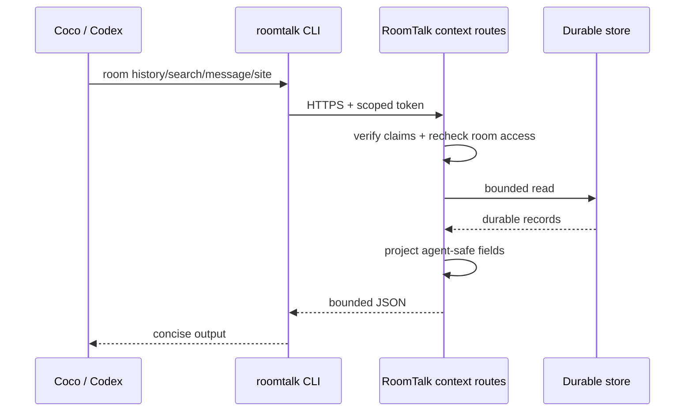

# Coco / Codex Room-Context CLI and Restricted Shell Design

[中文](codex-room-context-cli-design.zh.md)

Status: Current implementation
Verified against `master`: 2026-07-12

## Status

- Decision: CLI-first; do not add a separate MCP server.
- Scope: Coco and Codex app-server in RoomTalk Workspace rooms. The Codex CLI path remains only for explicit compatibility/migration work.
- Data owner: RoomTalk. A Codex thread contains only the conversation seen by that Codex session and is not authoritative room history.

## Problem

RoomTalk already sends the latest user message and persists a backend session ID, but RoomTalk history is broader than any one backend thread:

- a new Codex thread cannot see discussions that happened before it started;
- messages from other people or agents between Codex turns do not automatically enter that thread;
- copying all room history into every prompt wastes context and does not naturally support paging or search;
- raw durable records contain billing, recovery, storage, streaming, and internal authorization metadata that agents should not receive.

## Decision

Expose bounded room awareness through a composable sandbox-local CLI:

```bash
roomtalk room history --limit 20 --json
roomtalk room history --before <message-id> --limit 20 --json
roomtalk room delta --since <message-id> --limit 50 --json
roomtalk room search --query "keyword" --limit 20 --json
roomtalk room message --id <message-id> --json
roomtalk site list --json
```

The CLI talks to a RoomTalk broker with a short-lived room/client/turn-scoped token. It does not connect to PostgreSQL/Redis directly and does not expose general RoomTalk HTTP/socket credentials.

## Architecture



RoomTalk owns token signing, authorization, limits, projection, ordering, and backend-independent semantics. The sandbox runner owns only token/URL injection and the CLI executable. The agent decides when a query is useful.

## Turn Environment

Each run receives minimal per-turn values:

```text
ROOMTALK_ROOM_CONTEXT_URL=<broker base>
ROOMTALK_ROOM_CONTEXT_TOKEN=<short-lived token>
```

They are passed only to the current runner request. They are not written to the workspace, durable transcript, browser state, or prompt text. The CLI reads them from process environment and emits no token material.

## Token Contract

Claims bind at least:

- schema version and token ID;
- `roomId`, `clientId`, and `turnId`;
- issued/expiry time;
- read-only context scope.

The broker verifies signature/expiry/scope and then rechecks current room membership/access. A valid but stale token cannot bypass a later member removal or room deletion.

Default token lifetime is bounded (currently 30 minutes) and requests have bounded result/message/byte limits. The token is not reusable for model gateway, workspace assets, static publishing, Codex refresh, room mutation, or socket registration.

## Restricted Shell

Plan mode may run the explicitly exposed read-only RoomTalk CLI without receiving arbitrary write tools. Writable modes can use the same context commands, but their write/shell capability comes from the selected run mode, not from the context token.

This keeps two decisions independent:

- Can the agent inspect bounded RoomTalk context?
- Can the agent modify the workspace or run broader shell commands?

Room history access never implies workspace write or room mutation.

## Message Projection

Broker responses include only agent-useful fields such as:

- stable message ID, room ID, position, timestamp, message type, status;
- human/assistant display role and bounded content/preview;
- turn and tool relationships needed to understand execution;
- reply references and safe media descriptors when relevant.

They omit internal client identifiers where not required, auth material, object keys/signatures, recovery ownership, encrypted connections, prompt-sensitive billing fields, raw provider request data, socket metadata, and unbounded tool payloads.

Streaming placeholders and incomplete/dangling tool structures are filtered or normalized so provider history stays valid.

## API Operations

### Recent history

Returns the newest bounded messages in durable room order. `before` pages toward older history. Response metadata tells the CLI whether more history exists.

### Delta

Returns messages after a stable message/position cursor. This lets a long-lived backend discover what other participants added since its last observed point without replaying the whole room.

### Search

The first implementation performs bounded case-insensitive text matching over recent durable history, ordered newest first. PostgreSQL full-text search can replace the implementation later without changing the CLI contract.

### Exact message

Looks up one authorized room message by stable ID for replies, review references, or truncated search results.

### Published sites

Returns room-owned durable published artifacts so agents can inspect existing slugs, titles, versions, entries, and URLs before publishing or updating a site.

## Why Not MCP

An MCP server would add another process/lifecycle/configuration boundary and would not remove the need for RoomTalk-scoped auth, projection, paging, and policy checks. Both Coco and Codex already have a sandbox shell/tool surface, so a small CLI gives:

- one backend-independent contract;
- ordinary composability with JSON and shell pipelines;
- no extra long-lived server in each sandbox;
- explicit capability injection per turn;
- simple testing through HTTP routes and CLI fixtures.

MCP can be reconsidered if a future backend cannot use the CLI or if structured tool discovery provides a concrete benefit greater than its lifecycle cost.

## Release and Rollback

Changes span the Node broker/routes, token/projection contract, runner environment, `roomtalk` CLI, prompts, and E2B artifact. Runner/CLI/prompt/dependency changes require a new pinned artifact and real E2B verification.

Rollback can disable capability injection or return to a previous artifact without changing durable room data. The broker remains read-only; failure must degrade to an explicit CLI error rather than silently inventing or omitting room history.
