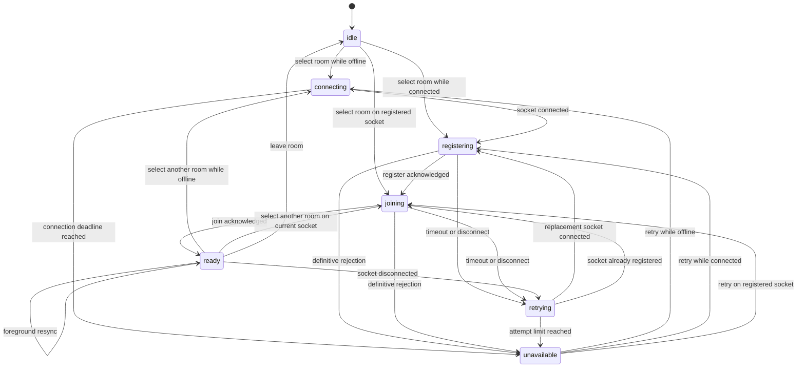

# Room reliability architecture

[中文](room-reliability-architecture.zh.md)

Status: current architecture. Updated: 2026-07-13.

This document describes the current room recovery and consistency model across the browser, Socket.IO, React, the message cache, and durable storage. It is the main design reference for this part of RoomTalk. Source code and tests remain the final authority when the document and implementation differ.

## What room readiness means

A room is ready when the current Socket.IO connection has been registered and the server has acknowledged membership in the room selected by the current session epoch. React may show a stored room shell and cached messages before that point, but member-only actions stay locked until the controller reports `ready` for the same room ID.

Four authorities cooperate during recovery:

| Concern | Authority |
| --- | --- |
| Connection, registration, and room membership | `RoomSessionController` in the browser tab |
| Room metadata | The canonical server `Room`, ordered by `roomVersion` |
| Message history | Durable message storage, ordered by `historyVersion` |
| Permission to perform an action | Server authorization at the time of the action |

Each authority has its own clock. `sessionEpoch`, `resyncRevision`, `roomVersion`, and `historyVersion` solve different ordering problems and must remain independent.

## Runtime ownership

The recovery path is intentionally concentrated in a few modules:

| Responsibility | Implementation |
| --- | --- |
| Session state machine | [`roomSessionController.ts`](../client-heroui/src/utils/roomSessionController.ts) |
| Socket transport, registration payload, API helpers, and session diagnostics | [`socket.ts`](../client-heroui/src/utils/socket.ts) |
| React projection, stored-room restore, lifecycle events, and room convergence | [`MessagePage.tsx`](../client-heroui/src/pages/MessagePage.tsx) |
| React subscription to controller snapshots | [`useRoomSession.ts`](../client-heroui/src/hooks/useRoomSession.ts) |
| Message listeners and history reconciliation | [`useRoomMessageEvents.ts`](../client-heroui/src/hooks/useRoomMessageEvents.ts) |
| Message rendering and privileged interaction boundary | [`MessageList.tsx`](../client-heroui/src/components/MessageList.tsx) |
| Inline media loading and full-screen viewer lifecycle | [`MessageItem.tsx`](../client-heroui/src/components/MessageItem.tsx), [`useCachedMedia.ts`](../client-heroui/src/hooks/useCachedMedia.ts), and [`MediaViewerModal.tsx`](../client-heroui/src/components/MediaViewerModal.tsx) |
| Message and media caches | [`messageHistoryCache.ts`](../client-heroui/src/utils/messageHistoryCache.ts) and [`mediaCache.ts`](../client-heroui/src/utils/mediaCache.ts) |
| Room ordering | [`roomState.ts`](../client-heroui/src/utils/roomState.ts) |
| Posting boundary timer | [`postingSchedule.ts`](../client-heroui/src/utils/postingSchedule.ts) |
| Registration, join, leave, and membership ordering | [`roomHandlers.ts`](../server/src/socket/roomHandlers.ts) |
| Message authorization and mutation | [`messageHandlers.ts`](../server/src/socket/messageHandlers.ts) and [`roomAuthorization.ts`](../server/src/socket/roomAuthorization.ts) |
| Media authorization | [`apiRoutes.ts`](../server/src/routes/apiRoutes.ts) |
| Durable room and message versions | [`postgresStore.ts`](../server/src/repositories/postgresStore.ts) and [`redisStore.ts`](../server/src/repositories/redisStore.ts) |

`MessagePage` submits room intent and renders controller state. All join scheduling stays in the controller. Lifecycle handlers call `resume`, socket helpers await controller registration, and message code reacts to `resyncRevision` after the session becomes ready.

## Room session lifecycle

`RoomSessionController` owns one desired room for the tab. It connects the transport, registers the current socket ID, joins the desired room, retries transient failures, and publishes an immutable snapshot.



The snapshot contains the current `phase`, desired `roomId`, `socketId`, `sessionEpoch`, `resyncRevision`, last verified result, initiating source, current attempt, and terminal error. The verified result may include the canonical room, current permissions, and member count returned by the join acknowledgement.

### Epoch and revision rules

| Value | Changes when | Purpose |
| --- | --- | --- |
| `sessionEpoch` | The desired room changes, the room is left, or a different socket ID connects while a room is desired | Rejects membership work that belongs to an older room or socket binding |
| `resyncRevision` | An epoch first becomes ready, or a ready session receives a coalesced foreground resume | Requests a fresh message history comparison without creating another join |
| `roomVersion` | The server commits a canonical room write, including room-affecting message mutations | Orders complete room objects for one room |
| `historyVersion` | Durable message history changes | Orders message windows and detects stale history responses |

A registration acknowledgement and a join acknowledgement leave `sessionEpoch` unchanged. Retries also stay in the same epoch. A successful join advances `resyncRevision` once when that epoch first reaches `ready`.

When the session is already ready, `visibilitychange`, BFCache `pageshow`, and `online` are coalesced for 150 ms into one resync revision. The controller keeps the existing membership and sends no new `join_room`. During initial page load, `MessagePage` ignores the ordinary non-BFCache `pageshow` event.

### Coalescing and supersession

Registration is shared per socket ID through one promise. Any socket operation that needs registration waits for that promise instead of emitting its own `register` request.

Selecting the same room while registration or join is pending returns the existing completion promise. Selecting the same room after readiness returns the verified result immediately. Selecting a different room advances the epoch and supersedes the old completion. If the old room later reports a successful join, the controller sends a defensive `leave_room` and keeps the new room as the desired target.

A replacement socket ID advances the epoch because registration and membership belong to the old transport. The pending user intent is carried into the new epoch, so callers continue waiting for recovery instead of receiving a false navigation failure.

The production defaults allow 45 seconds for a connection, 15 seconds for each registration or join acknowledgement, and up to three registration and three join attempts. Retry delays are 0, 250, and 1000 ms. A timeout remains inside the current epoch. Exhausting the budget moves the snapshot to `unavailable`.

## Server membership commit

The server serializes registration, join, leave, re-registration, and disconnect cleanup for each socket. This queue prevents an earlier asynchronous operation from committing after a later one on the same socket. Access-changing membership operations also use a per-room queue so a join cannot commit from a stale room or membership snapshot while another socket removes access or deletes the room.

A join performs the following commit sequence:

1. Read the registered client identity and target room.
2. Check rollout rules, password requirements, and durable membership.
3. Create durable membership when the join is allowed and the member does not exist.
4. Provisionally join the Socket.IO room and update client and browser presence.
5. Re-read the durable room and membership at the commit boundary.
6. Remove the provisional presence if access disappeared; otherwise leave previous healthy rooms and acknowledge the target room.

The acknowledgement carries the canonical `Room`, current `RoomPermissions`, and member count. Rejoining the same room is idempotent. Registration is acknowledged before eager room-list reads finish, so a slow list query cannot cause a client registration timeout.

Durable membership and live presence have separate lifetimes. `leave_room` and disconnect cleanup remove socket presence while preserving the durable room role. Presence uses socket sets under both `clientId` and `browserInstanceId`, which makes multiple tabs or sockets for one identity safe to add and remove independently.

### Client and browser identity

The browser creates `clientId` and `browserInstanceId` independently and stores both in localStorage. Google login links an account to a client ID, while the browser instance ID remains local to the available storage partition. Chrome, an installed web app, or another browser surface will share that value only when the platform gives them the same origin storage partition.

The server counts online room members by unique client ID and tracks active browser instances separately. Two sockets that present the same client or browser ID are retained in per-identity socket sets, so closing one socket does not remove the other socket's presence.

## Restore and reconnect

On a cold restore, `MessagePage` reads the stored room object and saved view from localStorage. It renders that object as a shell, selects the room in the controller with source `storage`, and keeps privileged controls disabled. At the same time, the message layer reads its in-memory window or IndexedDB cache.

The controller then connects, registers, and joins. A successful join supplies a canonical room and permissions, moves the session to `ready`, and advances `resyncRevision`. The message layer uses that revision to request an authoritative page from durable history. The stored shell is replaced only by an accepted canonical room object.

Transport loss keeps the desired room, current room shell, messages, scroll position, and already loaded media. New privileged work is locked while the controller registers and joins the replacement socket. The reconnect indicator has a 400 ms grace period to avoid flashing during a fast recovery; it only reflects controller state and never starts recovery itself.

`visibilitychange`, BFCache restore, and network recovery all enter through `resume`. A ready session schedules history reconciliation. A session that is still connecting, registering, joining, or retrying shares the active drive. This keeps lifecycle events from duplicating registration or join work.

## Message reconciliation

Message subscriptions are keyed by `roomId` and remain mounted while session readiness changes. Reopening a room paints the in-memory window synchronously. A cold tab hydrates the latest window from IndexedDB. The cache stores up to 100 recent messages per room. A per-room generation guards clear and replacement races, while a persistent tombstone prevents an inaccessible or deleted room from being revived by a late cache read in this tab or another tab.

The history request is a separate effect. It runs only when the room session is ready and either `resyncRevision` or the reconciliation retry nonce changes. The request sends the local `historyVersion` as `baseHistoryVersion` and asks for the latest 80-message page.

Live events update the visible window and its local history boundary. When a history response arrives, the client checks the echoed `requestedHistoryVersion` against the current local value and also rejects a server `historyVersion` below the current value. Either condition means the window changed while the request was in flight. The client keeps the displayed data and schedules another comparison, with a limit of three reconciliation retries.

An accepted replacement keeps server position order. If its message IDs, update stamps, and statuses match the displayed window, the client updates cache metadata without replacing the rendered list or forcing another scroll. Older-page responses prepend messages by ID and cannot overwrite a window invalidated by a later mutation.

## Media continuity

Media access follows the same readiness boundary as other privileged reads. A message can request a signed download URL only while the room session is verified. The server checks the client auth token, current durable room access, room ID, and the asset's room association each time it issues a URL.

During temporary recovery, a displayed media URL remains attached to the element. `useCachedMedia` pauses cache and network work while access is unverified and retains its current object URL or signed URL. Media state resets when the asset identity changes or the user retries a failed load. Clicking an image opens the viewer from the URL that is actually rendered, including a cached blob URL.

The viewer marks the application root inert only after the dialog and its source are ready. This keeps an unresolved media source from freezing the whole application before the viewer can render or close.

## Room object convergence

Server room payloads are complete values. Applying one replaces the previous `Room` instead of merging fields. This matters when the server clears an optional value such as `postingSchedule` or `hasPassword`; absence in the new object must remove the old field.

For two payloads with the same room ID, [`isNewerRoom`](../client-heroui/src/utils/roomState.ts) uses this rule:

```text
both roomVersion values are present:
  incoming >= current  -> accept
  incoming < current   -> ignore

either roomVersion is missing:
  compare updatedAt
  accept when either timestamp is missing or invalid
```

Equal versions represent duplicate delivery of the same canonical write and are safe to accept. The permissive legacy fallback prevents an old or corrupted localStorage timestamp from permanently blocking good server data. Versions from different room IDs are never compared.

`MessagePage` advances `currentRoomRef` synchronously before it queues the guarded React state update. An acknowledgement and a broadcast that arrive within the same React commit window therefore see the same latest room. Incremental room updates pass through the same guard for the active room, owned-room list, and saved-room list. Full room-list responses currently replace their corresponding lists as snapshots.

PostgreSQL increments `roomVersion` at the canonical row mutation boundary. Redis uses Lua scripts that read the stored record and write the next version atomically. Message mutations increment both `messageVersion` and `roomVersion`; room metadata mutations increment `roomVersion`. `updatedAt` remains available for display and migration compatibility.

## Mutation acknowledgements and broadcasts

Room metadata mutations that keep the room active, including rename and settings updates, return the canonical saved room in their acknowledgement. The initiating client applies that room immediately, which provides read-your-write behavior even when it does not receive its own broadcast. Other clients receive `room_updated` where the operation requires fan-out. Both paths use full-object replacement and the same version guard.

The server broadcasts only after persistence succeeds. A failed write cannot publish a room state that durable storage does not contain. Duplicate acknowledgement and broadcast delivery converges because equal `roomVersion` values are idempotent.

Permission payloads have their own request generation. A newer `room_permissions` event invalidates an older fetch, and permission responses for a room that is no longer active are ignored.

## Posting boundaries and operation authorization

The server evaluates permissions when an operation is attempted. This covers message posting, media upload initialization and completion, message edits and deletes, room management, and code-agent access. A previously received permission snapshot cannot authorize a later operation by itself.

Posting schedules create time-based changes without a socket event. The client computes the next opening or closing boundary in the room timezone and schedules a permission refresh just after that instant. The server evaluates the current clock, and its response supplies the new `canPost` value.

Client and server tests share the same schedule scenarios: inclusive starts, exclusive ends, overnight windows, room timezones, disabled schedules, empty schedules, and exact boundary instants.

## Failure handling

Disconnects, transport changes, and acknowledgement timeouts are treated as recoverable until their retry budget is exhausted. The room shell and cached content stay visible while controls remain locked. `unavailable` exposes a retry action without discarding the desired room.

Access rejection, a missing room, a rejected password, and disabled code-agent access end the current attempt. When a switch to another room fails, `MessagePage` selects the previous verified room again and can reopen password entry for the rejected target. The previous room is not abandoned until the server commits the new join.

`room_removed` and confirmed access removal invalidate the persistent room cache, clear the active shell when applicable, remove the URL room parameter, and return the user to the room list. A late acknowledgement for the removed target cannot revive it.

Some definitive failures are still recognized by matching server error text. Shared machine-readable room error codes remain useful protocol work because they would remove string classification from recovery decisions.

## Production diagnostics

Production browser logs keep room recovery observable without recording passwords, auth tokens, or message content.

- `[room-session]` covers transport events, registration, join, phase changes, retries, epochs, readiness, and resync requests.
- `[room-messages]` covers memory and persistent cache hydration, history requests, history responses, version decisions, reconciliation retries, and live messages.

For one investigation, correlate `roomId`, `socketId`, `sessionEpoch`, `resyncRevision`, `requestedHistoryVersion`, and `historyVersion`. A normal stored-room restore usually follows this order:

```text
room-selected
connection-waiting
transport-connected / socket-connected
registration-attempt / registration-ready
join-attempt / join-acknowledged / room-ready
history-request / history-response
```

The following checks narrow common failures quickly:

| Symptom | What to inspect |
| --- | --- |
| `Timed out while registering client` | Confirm a transport connection, compare socket IDs around `registration-emitted`, and look for a late acknowledgement or socket replacement |
| `Failed to reconnect to the previously joined room` | Follow the epoch from disconnect through registration and join; check the terminal join error and whether a newer room intent superseded it |
| Room shell recovers but new messages are missing | Compare `resyncRevision`, `baseHistoryVersion`, `requestedHistoryVersion`, and the response decision in `[room-messages]` |
| Media stays on `Loading media` | Confirm session readiness, signed URL authorization, the asset and room IDs, and whether an existing cached URL was retained |
| Foregrounding causes another join | A ready resume should log `resync-requested` without `join-attempt`; repeated join events indicate that readiness or socket identity changed |
| A stale room setting reappears | Compare `roomVersion` on the acknowledgement, broadcast, stored shell, and active room commit |

Within one epoch, the first successful membership commit should produce one `room-ready`. Foreground resync may produce another history request. A different socket ID starts a new epoch and repeats registration and join.

## Change and verification contract

Recovery changes should be made at the layer that owns the affected state. A new lifecycle source belongs in the controller input path. A message race belongs in versioned reconciliation. A metadata race belongs in full-room convergence. Component-local join generations, repair timers, or parallel membership state reintroduce competing authorities.

The main automated contracts are:

- [`roomSessionController.test.ts`](../client-heroui/src/utils/roomSessionController.test.ts) covers state transitions, same-room coalescing, socket replacement, retries, supersession, resync, and late acknowledgement cleanup.
- [`MessagePage.test.tsx`](../client-heroui/src/pages/MessagePage.test.tsx) covers restore, URL and manual room races, lifecycle resume, reconnect locking, rollback, whole-object replacement, room versions, acknowledgement convergence, and posting refresh.
- [`useRoomMessageEvents.test.tsx`](../client-heroui/src/hooks/useRoomMessageEvents.test.tsx) and [`MessageList.test.tsx`](../client-heroui/src/components/MessageList.test.tsx) cover cache hydration, live/history races, pagination, preserved content, and interaction locking.
- [`roomState.test.ts`](../client-heroui/src/utils/roomState.test.ts) covers `roomVersion` ordering and legacy timestamp fallback.
- [`postingSchedule.test.ts`](../client-heroui/src/utils/postingSchedule.test.ts) and [`roomAuthorization.test.ts`](../server/src/socket/roomAuthorization.test.ts) keep client boundary timing aligned with server authorization.
- [`roomHandlers.test.ts`](../server/src/socket/roomHandlers.test.ts) covers early registration acknowledgement, overlapping membership mutations, idempotent rejoin, access revocation, deletion, and disconnect cleanup.
- [`messageHandlers.test.ts`](../server/src/socket/messageHandlers.test.ts) covers history authorization and message mutation acknowledgement and broadcast behavior.
- [`storeContract.test.ts`](../server/src/repositories/storeContract.test.ts) and [`redisStore.test.ts`](../server/src/repositories/redisStore.test.ts) cover monotonic room and message versions, membership persistence, presence, cache validity, and media history.

Any fix for a new race should add an event-sequence or convergence test at the owning layer. The test should reproduce the ordering that caused the failure, including late acknowledgements or lifecycle events when they are part of the path.
