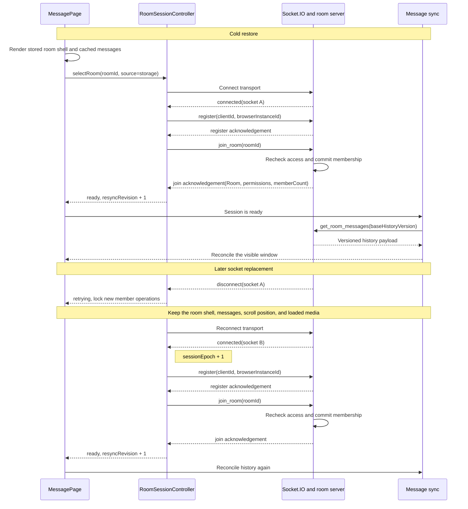

# Room reliability architecture

[中文](room-reliability-architecture.zh.md)

Status: current architecture. Updated: 2026-07-13.

This document describes the current room recovery and consistency model across the browser, Socket.IO, React, the message cache, and durable storage. It is the main design reference for this part of RoomTalk. Source code and tests remain the final authority when the document and implementation differ.

## What room readiness means

A room is ready when the current Socket.IO connection has been registered and the server has acknowledged membership in the room selected by the current session epoch. React may show a stored room shell and cached messages before that point, but member-only actions stay locked until the controller reports `ready` for the same room ID.

Four authorities cooperate during recovery:

| Concern | Authority |
| --- | --- |
| Connection, registration, and room membership | `RoomSessionController` in the browser tab |
| Room metadata | The canonical server `Room`, ordered by `roomVersion` |
| Message history | Durable message storage, ordered by `historyVersion` |
| Permission to perform an action | Server authorization at the time of the action |

Each authority has its own clock. `sessionEpoch`, `resyncRevision`, `roomVersion`, and `historyVersion` solve different ordering problems and must remain independent.

Their numbers are expected to look unrelated. A healthy page might show `sessionEpoch: 2`, `resyncRevision: 7`, `roomVersion: 418`, and `historyVersion: 3462`. The socket may have been replaced twice, the tab may have requested several foreground comparisons, and the room may have accumulated thousands of message mutations. Equality across those values would have no useful meaning.

## Runtime ownership

The recovery path is intentionally concentrated in a few modules:

| Responsibility | Implementation |
| --- | --- |
| Session state machine | [`roomSessionController.ts`](../client-heroui/src/utils/roomSessionController.ts) |
| Socket transport, registration payload, API helpers, and session diagnostics | [`socket.ts`](../client-heroui/src/utils/socket.ts) |
| React projection, stored-room restore, lifecycle events, and room convergence | [`MessagePage.tsx`](../client-heroui/src/pages/MessagePage.tsx) |
| React subscription to controller snapshots | [`useRoomSession.ts`](../client-heroui/src/hooks/useRoomSession.ts) |
| Message listeners and history reconciliation | [`useRoomMessageEvents.ts`](../client-heroui/src/hooks/useRoomMessageEvents.ts) |
| Message rendering and privileged interaction boundary | [`MessageList.tsx`](../client-heroui/src/components/MessageList.tsx) |
| Inline media loading and full-screen viewer lifecycle | [`MessageItem.tsx`](../client-heroui/src/components/MessageItem.tsx), [`useCachedMedia.ts`](../client-heroui/src/hooks/useCachedMedia.ts), and [`MediaViewerModal.tsx`](../client-heroui/src/components/MediaViewerModal.tsx) |
| Message and media caches | [`messageHistoryCache.ts`](../client-heroui/src/utils/messageHistoryCache.ts) and [`mediaCache.ts`](../client-heroui/src/utils/mediaCache.ts) |
| Room ordering | [`roomState.ts`](../client-heroui/src/utils/roomState.ts) |
| Posting boundary timer | [`postingSchedule.ts`](../client-heroui/src/utils/postingSchedule.ts) |
| Registration, join, leave, and membership ordering | [`roomHandlers.ts`](../server/src/socket/roomHandlers.ts) |
| Message authorization and mutation | [`messageHandlers.ts`](../server/src/socket/messageHandlers.ts) and [`roomAuthorization.ts`](../server/src/socket/roomAuthorization.ts) |
| Media authorization | [`apiRoutes.ts`](../server/src/routes/apiRoutes.ts) |
| Durable room and message versions | [`postgresStore.ts`](../server/src/repositories/postgresStore.ts) and [`redisStore.ts`](../server/src/repositories/redisStore.ts) |

`MessagePage` submits room intent and renders controller state. All join scheduling stays in the controller. Lifecycle handlers call `resume`, socket helpers await controller registration, and message code reacts to `resyncRevision` after the session becomes ready.

Events therefore move through one direction. For example, `visibilitychange` reaches `MessagePage`, which calls `roomSessionController.resume("visibility")`. The controller either returns the active room completion or publishes a new resync revision. React observes the snapshot, and the message hook decides whether a history request is due. The lifecycle handler never emits `register`, `join_room`, or `get_room_messages` itself.

## Room session lifecycle

`RoomSessionController` owns one desired room for the tab. The easiest way to understand its job is to follow one restore from the first React render to the first authoritative history response.

### 1. The page paints a room shell

Suppose the user last viewed room `nZDcDhQEcu`, closes the app, and opens it again later. `MessagePage` reads the saved `Room` and view from localStorage. It can immediately draw the room name, header, and message area. `useRoomMessageEvents` also starts looking for the room's in-memory or IndexedDB message window.

At this point the browser has presentation data, not verified membership on the current socket. The stored room may also be older than the server copy. The page therefore keeps sending, editing, settings, workspace reads, and new media requests locked. Showing the shell early removes a blank loading screen without granting access from stale local state.

### 2. The page records one room intent

The page calls `selectRoom({ roomId, source: "storage" })`. The controller stores that room as the tab's desired room and creates a completion promise for the request. If the desired room changed, it advances `sessionEpoch`. That epoch now identifies every registration and join result that may complete this request.

Lifecycle events can arrive almost immediately after mount. A visible page, a BFCache restore, and an `online` event may all ask for recovery while the first request is still running. They call `resume`, which returns the same completion promise for the same room. The original drive keeps ownership of the request.

### 3. The current socket is registered

If Socket.IO is disconnected, the controller starts the transport and waits for a socket ID. Socket IDs are temporary. A reconnect produces a new one even though the browser still has the same `clientId` and `browserInstanceId`.

Registration binds those persistent browser identities to the current socket. Every operation that requires registration waits on the controller's shared registration promise. The server acknowledges registration before it loads room lists, so a slow list query cannot hold the acknowledgement open and trigger `Timed out while registering client`.

### 4. The server commits the join

After registration, the controller emits `join_room`. The server checks the room, password or durable membership, current role, and rollout restrictions. It adds provisional Socket.IO presence, then checks the durable room and membership again at the commit boundary. Only a successful target commit allows the socket to leave its previous healthy room.

That last ordering matters during a room switch. If the target password is wrong, access was removed, or the room was deleted during the request, the old room remains usable. A provisional target join is cleaned up before the server returns the error.

### 5. The acknowledgement makes the page ready

A successful join acknowledgement contains the canonical `Room`, current `RoomPermissions`, and member count. The controller verifies that the acknowledgement still belongs to the desired room, epoch, and socket. It then publishes `phase: "ready"`, stores the result, and advances `resyncRevision`.

`MessagePage` consumes each result object once. It applies the canonical room through the `roomVersion` guard, installs the returned permissions, updates the member count, and unlocks member operations. The stored room shell has now become a verified room session.

### 6. Message history is reconciled

Readiness does not replace the message window by itself. The message hook waits for cache hydration, reads the current local `historyVersion`, and emits `get_room_messages`. The server returns a versioned page from durable storage. The client accepts it only if no newer live mutation changed the local window while the request was in flight.

This separation is why a join acknowledgement advances `resyncRevision` instead of pretending to be a message version. Membership is ready first. Message history then performs its own comparison.

### 7. A later disconnect repeats only the necessary work

If socket A disconnects, the controller moves to `retrying`. The page locks new member operations but keeps the room shell, messages, scroll position, and loaded media. When socket B connects, the controller advances `sessionEpoch`, registers socket B, rejoins the same desired room, and advances `resyncRevision` after the new join succeeds.

The sequence diagram is a compact index of those two paths. Retry budgets, supersession, and foreground-only resync are covered in the sections that follow.



The phase names describe protocol progress, while the page decides how to present each phase:

| Phase | Controller meaning | Page behavior |
| --- | --- | --- |
| `idle` | No desired room is being driven | Show a non-room view or wait for room intent |
| `connecting` | A room is desired and no usable socket ID exists | Keep any room shell visible and lock member operations |
| `registering` | The transport is connected and identity binding is pending | Keep the shell and cached content visible; wait for register ack |
| `joining` | The socket is registered and target membership is pending | Keep the target shell locked until the join commits |
| `ready` | The current socket has verified membership in the desired room | Apply permissions and allow the operations they authorize |
| `retrying` | A recoverable timeout, disconnect, or transport change interrupted the drive | Preserve rendered content, lock new privileged work, and continue recovery |
| `unavailable` | A definitive rejection occurred or the retry budget ended | Offer retry or run the room-removal/password handling for that error |

The snapshot contains the current `phase`, desired `roomId`, `socketId`, `sessionEpoch`, `resyncRevision`, last verified result, initiating source, current attempt, and terminal error. The verified result may include the canonical room, current permissions, and member count returned by the join acknowledgement.

### Epoch and revision rules

| Value | Changes when | Purpose |
| --- | --- | --- |
| `sessionEpoch` | The desired room changes, the room is left, or a different socket ID connects while a room is desired | Rejects membership work that belongs to an older room or socket binding |
| `resyncRevision` | An epoch first becomes ready, or a ready session receives a coalesced foreground resume | Requests a fresh message history comparison without creating another join |
| `roomVersion` | The server commits a canonical room write, including room-affecting message mutations | Orders complete room objects for one room |
| `historyVersion` | Durable message history changes | Orders message windows and detects stale history responses |

A registration acknowledgement and a join acknowledgement leave `sessionEpoch` unchanged. Retries also stay in the same epoch. A successful join advances `resyncRevision` once when that epoch first reaches `ready`.

When the session is already ready, `visibilitychange`, BFCache `pageshow`, and `online` are coalesced for 150 ms into one resync revision. The controller keeps the existing membership and sends no new `join_room`. During initial page load, `MessagePage` ignores the ordinary non-BFCache `pageshow` event.

### Coalescing and supersession

Registration is shared per socket ID through one promise. Any socket operation that needs registration waits for that promise instead of emitting its own `register` request.

Selecting the same room while registration or join is pending returns the existing completion promise. Selecting the same room after readiness returns the verified result immediately. Selecting a different room advances the epoch and supersedes the old completion. If the old room later reports a successful join, the controller sends a defensive `leave_room` and keeps the new room as the desired target.

A replacement socket ID advances the epoch because registration and membership belong to the old transport. The pending user intent is carried into the new epoch, so callers continue waiting for recovery instead of receiving a false navigation failure.

The production defaults allow 45 seconds for a connection, 15 seconds for each registration or join acknowledgement, and up to three registration and three join attempts. Retry delays are 0, 250, and 1000 ms. A timeout remains inside the current epoch. Exhausting the budget moves the snapshot to `unavailable`.

## Server membership commit

Registration and room membership are separate server decisions. Registration associates a persistent client identity with one temporary socket and joins that socket to its private client channel. It grants no room access. `join_room` performs the room-specific checks and creates live presence.

The server serializes registration, join, leave, re-registration, and disconnect cleanup for each socket. This queue prevents an earlier asynchronous operation from committing after a later one on the same socket. Access-changing membership operations also use a per-room queue so a join cannot commit from a stale room or membership snapshot while another socket removes access or deletes the room.

Without the socket queue, a slow join for room A could finish after a later join for room B and make A the server's final membership by accident. The queue makes the final state follow request order. The room queue handles a different race: an administrator can remove a member while that member is joining on another socket. The join rechecks membership after provisional presence, so removal wins before the acknowledgement is sent.

A join performs the following commit sequence:

1. Read the registered client identity and target room.
2. Check rollout rules, password requirements, and durable membership.
3. Create durable membership when the join is allowed and the member does not exist.
4. Provisionally join the Socket.IO room and update client and browser presence.
5. Re-read the durable room and membership at the commit boundary.
6. Remove the provisional presence if access disappeared; otherwise leave previous healthy rooms and acknowledge the target room.

The acknowledgement carries the canonical `Room`, current `RoomPermissions`, and member count. Rejoining the same room is idempotent. Registration is acknowledged before eager room-list reads finish, so a slow list query cannot cause a client registration timeout.

Durable membership and live presence have separate lifetimes. `leave_room` and disconnect cleanup remove socket presence while preserving the durable room role. Presence uses socket sets under both `clientId` and `browserInstanceId`, which makes multiple tabs or sockets for one identity safe to add and remove independently.

### Client and browser identity

The browser creates `clientId` and `browserInstanceId` independently and stores both in localStorage. Google login links an account to a client ID, while the browser instance ID remains local to the available storage partition. Chrome, an installed web app, or another browser surface will share that value only when the platform gives them the same origin storage partition.

The server counts online room members by unique client ID and tracks active browser instances separately. Two sockets that present the same client or browser ID are retained in per-identity socket sets, so closing one socket does not remove the other socket's presence.

## What the page preserves during recovery

The controller owns the recovery protocol, while `MessagePage` decides what the user can see and do during each phase. A stored room can be rendered as a shell during `connecting`, `registering`, and `joining`. The page derives readiness by checking that the controller is `ready` for the exact room currently on screen.

The successful join result replaces the shell with an accepted canonical room and supplies current permissions. If the controller instead reports `unavailable`, the shell remains visible with its operations locked and a retry action. A confirmed missing room or access removal follows the room-removal path and clears the shell.

Transport loss keeps the desired room, current room shell, messages, scroll position, and already loaded media. New privileged work is locked while the controller registers and joins the replacement socket. The reconnect indicator has a 400 ms grace period to avoid flashing during a fast recovery; it only reflects controller state and never starts recovery itself.

`visibilitychange`, BFCache restore, and network recovery all enter through `resume`. A ready session schedules history reconciliation. A session that is still connecting, registering, joining, or retrying shares the active drive. This keeps lifecycle events from duplicating registration or join work.

These two resume cases often look similar in the UI but produce different logs. Returning to a tab with the same ready socket only advances `resyncRevision`. Returning after the mobile OS suspended the socket produces a new socket ID, a new epoch, registration, and join. The 400 ms reconnect indicator appears only when the second path lasts long enough to be visible.

## Message reconciliation

Message subscriptions are keyed by `roomId` and remain mounted while session readiness changes. Reopening a room paints the in-memory window synchronously. A cold tab hydrates the latest window from IndexedDB. The cache stores up to 100 recent messages per room. A per-room generation guards clear and replacement races, while a persistent tombstone prevents an inaccessible or deleted room from being revived by a late cache read in this tab or another tab.

The history request is a separate effect. It runs only when the room session is ready and either `resyncRevision` or the reconciliation retry nonce changes. The request sends the local `historyVersion` as `baseHistoryVersion` and asks for the latest 80-message page.

Consider the race that originally made a restored room look healthy while new messages disappeared. The client sends a history request with local version 3462. Before the response returns, `new_message` arrives and advances the visible window. The delayed response still describes the window requested at 3462. Replacing the page with that payload would erase the live message that just appeared.

Live events update the visible window and its local history boundary. When a history response arrives, the client checks the echoed `requestedHistoryVersion` against the current local value and also rejects a server `historyVersion` below the current value. Either condition means the window changed while the request was in flight. The client keeps the displayed data and schedules another comparison, with a limit of three reconciliation retries.

In the example, `[room-messages] history-response` records `requestedHistoryVersion: 3462`, the newer current version, and `decision: "ignored"`. The retry uses the new local version as its base. Once a response describes the same boundary the client is displaying, it can safely replace or confirm the window.

An accepted replacement keeps server position order. If its message IDs, update stamps, and statuses match the displayed window, the client updates cache metadata without replacing the rendered list or forcing another scroll. Older-page responses prepend messages by ID and cannot overwrite a window invalidated by a later mutation.

Cache hydration has a similar ordering guard. A slow IndexedDB read can finish after server history has already loaded. The hook marks that cache result as skipped. When a room is cleared, deleted, or loses access, its cache generation advances or its tombstone is persisted before later callbacks can write. A successful verified rejoin can reactivate the room for new writes, while work started under the old generation remains stale.

## Media continuity

Media access follows the same readiness boundary as other privileged reads. A message can request a signed download URL only while the room session is verified. The server checks the client auth token, current durable room access, room ID, and the asset's room association each time it issues a URL.

During temporary recovery, a displayed media URL remains attached to the element. `useCachedMedia` pauses cache and network work while access is unverified and retains its current object URL or signed URL. Media state resets when the asset identity changes or the user retries a failed load. Clicking an image opens the viewer from the URL that is actually rendered, including a cached blob URL.

For example, an image may already be visible from an IndexedDB-backed blob URL when the socket disconnects. The session becomes unready, so the component stops asking for a fresh signed URL. The blob URL stays on the image, and clicking it passes that same URL to the viewer. The user can keep reading the room while membership is repaired.

If the message has no usable local or signed URL yet, it may remain in a loading state until the session is ready. At that point the component asks the server for a new 15-minute read URL. A 403 here means durable room access failed at request time; repeated join attempts in the UI would not make the media endpoint authorize the request.

The viewer marks the application root inert only after the dialog and its source are ready. This keeps an unresolved media source from freezing the whole application before the viewer can render or close.

The inert boundary fixes a specific failure mode. An earlier viewer path could disable the application before it had a renderable source. If source preparation then stalled, no visible dialog existed and the rest of the app was already unclickable. Waiting for `isDialogReady` keeps the close path available.

## Room object convergence

Server room payloads are complete values. Applying one replaces the previous `Room` instead of merging fields. This matters when the server clears an optional value such as `postingSchedule` or `hasPassword`; absence in the new object must remove the old field.

Take a room with an active posting schedule. The local object contains `postingSchedule`. An owner disables the schedule, and the saved room returned by the server omits that property. `{ ...oldRoom, ...newRoom }` would keep the old property because there is no new key to overwrite it. Whole-object replacement removes it immediately.

For two payloads with the same room ID, [`isNewerRoom`](../client-heroui/src/utils/roomState.ts) uses this rule:

```text
both roomVersion values are present:
  incoming >= current  -> accept
  incoming < current   -> ignore

either roomVersion is missing:
  compare updatedAt
  accept when either timestamp is missing or invalid
```

Equal versions represent duplicate delivery of the same canonical write and are safe to accept. The permissive legacy fallback prevents an old or corrupted localStorage timestamp from permanently blocking good server data. Versions from different room IDs are never compared.

`MessagePage` advances `currentRoomRef` synchronously before it queues the guarded React state update. An acknowledgement and a broadcast that arrive within the same React commit window therefore see the same latest room. Incremental room updates pass through the same guard for the active room, owned-room list, and saved-room list. Full room-list responses currently replace their corresponding lists as snapshots.

The synchronous ref closes a small but important React timing gap. Suppose `room_updated` with version 52 arrives, followed immediately by an older join acknowledgement with version 51. React may not have committed the first state update yet. `currentRoomRef` already holds version 52, so the second payload is rejected before it can be queued. Reading only React state would let both callbacks compare against version 50.

PostgreSQL increments `roomVersion` at the canonical row mutation boundary. Redis uses Lua scripts that read the stored record and write the next version atomically. Message mutations increment both `messageVersion` and `roomVersion`; room metadata mutations increment `roomVersion`. `updatedAt` remains available for display and migration compatibility.

Message changes also affect room metadata such as `lastActivityAt`, which is why they advance `roomVersion` as well as the message-specific version. The room list can then order activity from a canonical room object while the message layer continues to reconcile its own window with `historyVersion`.

## Mutation acknowledgements and broadcasts

Room metadata mutations that keep the room active, including rename and settings updates, return the canonical saved room in their acknowledgement. The initiating client applies that room immediately, which provides read-your-write behavior even when it does not receive its own broadcast. Other clients receive `room_updated` where the operation requires fan-out. Both paths use full-object replacement and the same version guard.

For a rename, the initiating client might receive an acknowledgement carrying `roomVersion: 61` and update its header at once. A `room_updated` event with the same version can arrive later through the broadcast path. Accepting an equal version is safe because both payloads describe the same durable write. Another client that still has version 60 accepts the broadcast and reaches the same room object.

The server broadcasts only after persistence succeeds. A failed write cannot publish a room state that durable storage does not contain. Duplicate acknowledgement and broadcast delivery converges because equal `roomVersion` values are idempotent.

The acknowledgement also removes a hidden dependency on Socket.IO fan-out. The initiating socket no longer has to hear its own broadcast before the UI reflects a successful change. If persistence fails, the handler returns an error and has no canonical room to acknowledge or broadcast.

Permission payloads have their own request generation. A newer `room_permissions` event invalidates an older fetch, and permission responses for a room that is no longer active are ignored.

## Posting boundaries and operation authorization

The server evaluates permissions when an operation is attempted. This covers message posting, media upload initialization and completion, message edits and deletes, room management, and code-agent access. A previously received permission snapshot cannot authorize a later operation by itself.

Posting schedules create time-based changes without a socket event. The client computes the next opening or closing boundary in the room timezone and schedules a permission refresh just after that instant. The server evaluates the current clock, and its response supplies the new `canPost` value.

Suppose a room allows posting on Monday from 09:00 through 17:00. At 08:59, the UI may correctly show posting as closed. The client schedules a refresh just after 09:00. It asks the server for permissions again and enables the composer only from that response. At 17:00, the same process closes it. If a sleeping tab runs the timer late, the server still evaluates the actual current time.

There is a second check at the posting boundary itself: `message.post` authorization runs when the message reaches the server. A stale open composer can therefore show an optimistic action briefly, but the server rejects the write after the window closes. Media upload initialization and completion perform the same current access and posting checks.

Client and server tests share the same schedule scenarios: inclusive starts, exclusive ends, overnight windows, room timezones, disabled schedules, empty schedules, and exact boundary instants.

## Failure handling

Disconnects, transport changes, and acknowledgement timeouts are treated as recoverable until their retry budget is exhausted. The room shell and cached content stay visible while controls remain locked. `unavailable` exposes a retry action without discarding the desired room.

A registration timeout and a join rejection lead to different recovery paths. A timeout may belong to a slow acknowledgement or a socket that changed mid-request, so the controller retries within its budget. A wrong password or confirmed access removal will not improve with another automatic attempt. That request becomes unavailable immediately and the page can ask the user for a password or navigate away.

Access rejection, a missing room, a rejected password, and disabled code-agent access end the current attempt. When a switch to another room fails, `MessagePage` selects the previous verified room again and can reopen password entry for the rejected target. The previous room is not abandoned until the server commits the new join.

Late results are handled by the same ownership rules. If room A is joining and the user selects room B, room A's completion is superseded. A later successful acknowledgement for A cannot change the controller snapshot. The controller sends `leave_room(A)` to clean any presence that the server may have committed, then continues waiting for B.

`room_removed` and confirmed access removal invalidate the persistent room cache, clear the active shell when applicable, remove the URL room parameter, and return the user to the room list. A late acknowledgement for the removed target cannot revive it.

The invalidation happens before navigation completes. This ordering prevents a delayed IndexedDB read, history payload, or join callback from repainting the removed room after the list view is already visible.

Some definitive failures are still recognized by matching server error text. Shared machine-readable room error codes remain useful protocol work because they would remove string classification from recovery decisions.

## Production diagnostics

Production browser logs keep room recovery observable without recording passwords, auth tokens, or message content.

- `[room-session]` covers transport events, registration, join, phase changes, retries, epochs, readiness, and resync requests.
- `[room-messages]` covers memory and persistent cache hydration, history requests, history responses, version decisions, reconciliation retries, and live messages.

For one investigation, correlate `roomId`, `socketId`, `sessionEpoch`, `resyncRevision`, `requestedHistoryVersion`, and `historyVersion`. A normal stored-room restore usually follows this order:

```text
room-selected
connection-waiting
transport-connected / socket-connected
registration-attempt / registration-ready
join-attempt / join-acknowledged / room-ready
history-request / history-response
```

The following checks narrow common failures quickly:

| Symptom | What to inspect |
| --- | --- |
| `Timed out while registering client` | Confirm a transport connection, compare socket IDs around `registration-emitted`, and look for a late acknowledgement or socket replacement |
| `Failed to reconnect to the previously joined room` | Follow the epoch from disconnect through registration and join; check the terminal join error and whether a newer room intent superseded it |
| Room shell recovers but new messages are missing | Compare `resyncRevision`, `baseHistoryVersion`, `requestedHistoryVersion`, and the response decision in `[room-messages]` |
| Media stays on `Loading media` | Confirm session readiness, signed URL authorization, the asset and room IDs, and whether an existing cached URL was retained |
| Foregrounding causes another join | A ready resume should log `resync-requested` without `join-attempt`; repeated join events indicate that readiness or socket identity changed |
| A stale room setting reappears | Compare `roomVersion` on the acknowledgement, broadcast, stored shell, and active room commit |

Within one epoch, the first successful membership commit should produce one `room-ready`. Foreground resync may produce another history request. A different socket ID starts a new epoch and repeats registration and join.

Read the log as one story rather than as independent lines. `room-selected` identifies the desired room and epoch. `transport-connected` supplies the socket ID. `registration-ready` proves that identity is bound to that socket. `room-ready` proves that membership committed. The following `history-response` explains whether durable messages were accepted or rejected because the local window moved.

For example, a normal foreground resume on an already-ready socket changes `resyncRevision` and produces another `history-request`. It should retain the same `sessionEpoch` and socket ID, with no `registration-attempt` or `join-attempt`. A join in that trace means the controller no longer considered the old membership valid, usually because the socket ID changed or the previous session had never reached ready.

## Change and verification contract

Recovery changes should be made at the layer that owns the affected state. A new lifecycle source belongs in the controller input path. A message race belongs in versioned reconciliation. A metadata race belongs in full-room convergence. Component-local join generations, repair timers, or parallel membership state reintroduce competing authorities.

The main automated contracts are:

- [`roomSessionController.test.ts`](../client-heroui/src/utils/roomSessionController.test.ts) covers state transitions, same-room coalescing, socket replacement, retries, supersession, resync, and late acknowledgement cleanup.
- [`MessagePage.test.tsx`](../client-heroui/src/pages/MessagePage.test.tsx) covers restore, URL and manual room races, lifecycle resume, reconnect locking, rollback, whole-object replacement, room versions, acknowledgement convergence, and posting refresh.
- [`useRoomMessageEvents.test.tsx`](../client-heroui/src/hooks/useRoomMessageEvents.test.tsx) and [`MessageList.test.tsx`](../client-heroui/src/components/MessageList.test.tsx) cover cache hydration, live/history races, pagination, preserved content, and interaction locking.
- [`roomState.test.ts`](../client-heroui/src/utils/roomState.test.ts) covers `roomVersion` ordering and legacy timestamp fallback.
- [`postingSchedule.test.ts`](../client-heroui/src/utils/postingSchedule.test.ts) and [`roomAuthorization.test.ts`](../server/src/socket/roomAuthorization.test.ts) keep client boundary timing aligned with server authorization.
- [`roomHandlers.test.ts`](../server/src/socket/roomHandlers.test.ts) covers early registration acknowledgement, overlapping membership mutations, idempotent rejoin, access revocation, deletion, and disconnect cleanup.
- [`messageHandlers.test.ts`](../server/src/socket/messageHandlers.test.ts) covers history authorization and message mutation acknowledgement and broadcast behavior.
- [`storeContract.test.ts`](../server/src/repositories/storeContract.test.ts) and [`redisStore.test.ts`](../server/src/repositories/redisStore.test.ts) cover monotonic room and message versions, membership persistence, presence, cache validity, and media history.

Any fix for a new race should add an event-sequence or convergence test at the owning layer. The test should reproduce the ordering that caused the failure, including late acknowledgements or lifecycle events when they are part of the path.
