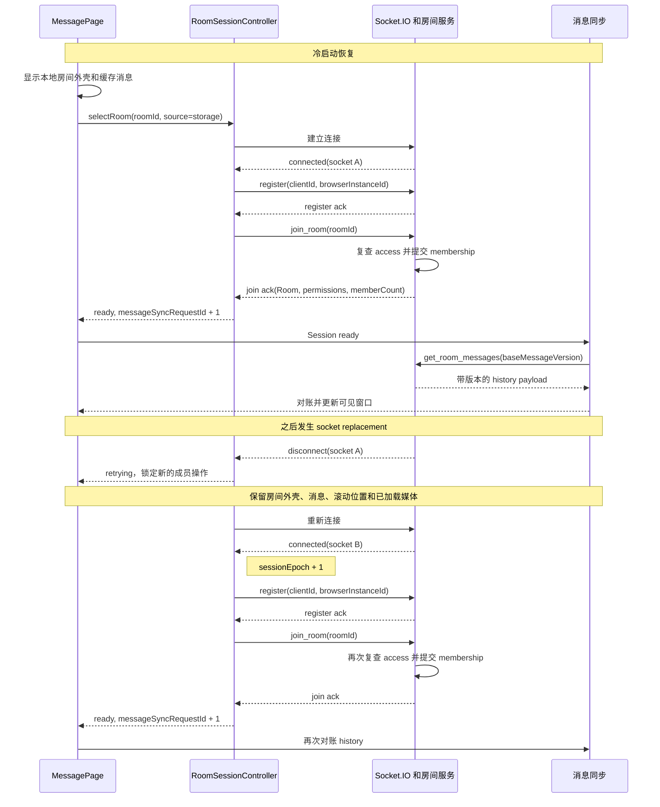

# 房间可靠性架构

[English](room-reliability-architecture.md)

状态：当前架构。更新日期：2026-07-14。

本文描述 RoomTalk 目前的房间恢复与一致性机制，范围包括浏览器、Socket.IO、React、消息缓存和持久化存储。之后调整这条链路时，应以本文作为主要设计入口；文档与实现不一致时，以源码和测试为准。

## 房间何时可用

当前 Socket.IO 连接完成注册，并且服务端已经确认当前 session epoch 所选择房间的 membership 后，房间才进入 `ready`。在此之前，React 可以先显示本地保存的房间外壳和缓存消息，但发送、编辑、媒体读取等成员操作仍处于锁定状态。

恢复过程由四个事实源共同完成：

| 范围 | 事实源 |
| --- | --- |
| 连接、注册与房间 membership | 当前浏览器标签页中的 `RoomSessionController` |
| 房间元数据 | 服务端返回的完整 `Room`，使用 `roomVersion` 排序 |
| 消息历史 | 持久化消息存储，使用 `messageVersion` 排序 |
| 操作权限 | 操作发生时的服务端授权结果 |

代码里会看到四个递增数字。数据版本有两个：`roomVersion` 排序房间对象，`messageVersion` 排序消息历史。`sessionEpoch` 和 `messageSyncRequestId` 是当前标签页内部的控制标记。前者判断异步结果是否还属于当前 socket 会话，后者只负责唤醒消息同步 effect。

排查数据新旧时只比较同名版本。`roomVersion` 不会和 `messageVersion` 比较，控制标记也不会写入持久化数据。这样可以先回答一个具体问题，再找对应的数字，不必记住四套平行的 version。

## 运行时职责

房间恢复集中在以下模块中：

| 职责 | 实现 |
| --- | --- |
| 房间会话状态机 | [`roomSessionController.ts`](../client-heroui/src/utils/roomSessionController.ts) |
| Socket transport、注册载荷、API helper 和会话日志 | [`socket.ts`](../client-heroui/src/utils/socket.ts) |
| React 状态投影、本地房间恢复、浏览器 lifecycle 和房间收敛 | [`MessagePage.tsx`](../client-heroui/src/pages/MessagePage.tsx) |
| 订阅 controller snapshot | [`useRoomSession.ts`](../client-heroui/src/hooks/useRoomSession.ts) |
| 消息监听与 history reconciliation | [`useRoomMessageEvents.ts`](../client-heroui/src/hooks/useRoomMessageEvents.ts) |
| 消息渲染和成员操作锁定 | [`MessageList.tsx`](../client-heroui/src/components/MessageList.tsx) |
| 行内媒体加载与全屏查看器 lifecycle | [`MessageItem.tsx`](../client-heroui/src/components/MessageItem.tsx)、[`useCachedMedia.ts`](../client-heroui/src/hooks/useCachedMedia.ts) 和 [`MediaViewerModal.tsx`](../client-heroui/src/components/MediaViewerModal.tsx) |
| 消息与媒体缓存 | [`messageHistoryCache.ts`](../client-heroui/src/utils/messageHistoryCache.ts) 和 [`mediaCache.ts`](../client-heroui/src/utils/mediaCache.ts) |
| 房间对象排序 | [`roomState.ts`](../client-heroui/src/utils/roomState.ts) |
| Posting boundary 计时 | [`postingSchedule.ts`](../client-heroui/src/utils/postingSchedule.ts) |
| 注册、加入、离开与 membership 顺序 | [`roomHandlers.ts`](../server/src/socket/roomHandlers.ts) |
| 消息授权与 mutation | [`messageHandlers.ts`](../server/src/socket/messageHandlers.ts) 和 [`roomAuthorization.ts`](../server/src/socket/roomAuthorization.ts) |
| 媒体授权 | [`apiRoutes.ts`](../server/src/routes/apiRoutes.ts) |
| 持久化房间与消息版本 | [`postgresStore.ts`](../server/src/repositories/postgresStore.ts) 和 [`redisStore.ts`](../server/src/repositories/redisStore.ts) |

`MessagePage` 负责提交房间意图，并把 controller 状态投影到页面。所有 join 调度都留在 controller。Lifecycle handler 统一调用 `resume`，普通 socket 操作等待 controller 完成注册，消息层在 session ready 后根据 `messageSyncRequestId` 发起同步。

事件沿着固定方向传递。以 `visibilitychange` 为例，它先到 `MessagePage`，页面调用 `roomSessionController.resume("visibility")`。Controller 返回正在执行的 room completion，或者安排一次消息同步。React 观察 snapshot，消息 hook 再判断是否需要请求 history。Lifecycle handler 自己不会发送 `register`、`join_room` 或 `get_room_messages`。

## 房间会话生命周期

`RoomSessionController` 在一个标签页内只维护一个目标房间。理解它最直接的方式，是跟着一次恢复从 React 首次渲染走到服务端 history response。

### 1. 页面先显示房间外壳

假设用户上次停在房间 `nZDcDhQEcu`，关闭应用后又重新打开。`MessagePage` 会从 localStorage 读出保存的 `Room` 和 view，立即画出房间名称、header 和消息区域。`useRoomMessageEvents` 同时开始读取这个房间的内存窗口或 IndexedDB 缓存。

此时浏览器只有可用于展示的数据，当前 socket 上的 membership 还没有经过验证，本地房间对象也可能落后于服务端。因此发送、编辑、设置、workspace 读取和新的媒体请求都会保持锁定。页面先显示 shell 是为了消除空白等待，不会把本地缓存当成 access 凭证。

### 2. 页面只提交一个房间意图

页面调用 `selectRoom({ roomId, source: "storage" })`。Controller 把该房间保存为当前标签页的 desired room，并为这次请求创建 completion promise。如果 desired room 发生变化，它会推进 `sessionEpoch`。之后能够完成这次请求的 register 和 join 结果，都必须属于这个 epoch。

页面刚挂载时，多个 lifecycle event 可能紧接着到达。页面可见、BFCache 恢复和 `online` 都可能在第一条请求尚未结束时要求恢复。它们统一调用 `resume`，同一房间会拿到相同的 completion promise，最先开始的 drive 继续负责整个请求。

### 3. 当前 socket 完成注册

Socket.IO 尚未连接时，controller 会启动 transport 并等待 socket ID。Socket ID 是临时身份。即使浏览器仍然使用相同的 `clientId` 和 `browserInstanceId`，重连后也会得到一个新的 socket ID。

Register 的作用是把这些持久浏览器身份绑定到当前 socket。任何要求已注册状态的操作都会等待 controller 中共享的 registration promise。服务端先返回 register ack，再主动读取 room list，因此慢速列表查询不会占住 ack，最后变成 `Timed out while registering client`。

### 4. 服务端提交 join

注册完成后，controller 发送 `join_room`。服务端检查房间、密码或持久 membership、当前角色和 rollout 限制，随后加入临时 Socket.IO presence，并在提交边界重新读取持久房间与 membership。目标房间确认提交成功以后，socket 才会离开之前的健康房间。

这个顺序决定了切房失败时的行为。目标密码错误、access 被移除，或者房间在请求期间被删除，旧房间都还能继续使用。服务端会先清理目标房间的临时 presence，再返回错误。

### 5. Join ack 让页面进入 ready

成功的 join ack 包含完整 `Room`、当前 `RoomPermissions` 和成员数。Controller 会确认这个 ack 仍属于当前 desired room、epoch 和 socket，然后发布 `phase: "ready"`，保存结果，并推进 `messageSyncRequestId`。

`MessagePage` 对每个 result object 只消费一次。它通过 `roomVersion` 守卫应用完整房间，安装返回的权限，更新成员数，并解锁成员操作。此时，本地显示的房间 shell 才真正成为经过验证的 room session。

### 6. 消息层单独完成 history 对账

Session ready 本身不会替换消息窗口。消息 hook 会先等缓存 hydration 结束，读取当前本地 `messageVersion`，再发送 `get_room_messages`。服务端从持久化存储返回带版本的消息页。请求在途期间如果有新的实时 mutation 改变了本地窗口，客户端会拒绝这份旧 response 并再次对账。

这也是 join ack 推进 `messageSyncRequestId` 的原因。Membership 先进入 ready，消息历史随后使用自己的 version 完成比较，二者没有共用同一个数据版本。

### 7. 后续断线只重做必要步骤

Socket A 断线后，controller 进入 `retrying`。页面会锁住新的成员操作，同时保留房间外壳、消息、滚动位置和已经加载的媒体。Socket B 连接后，controller 推进 `sessionEpoch`，注册 socket B，重新加入相同 desired room，并在新 join 成功后推进 `messageSyncRequestId`。

下面的时序图是这两条链路的索引。重试预算、supersession 和仅发生 history reconciliation 的前台恢复，会在后续章节继续说明。



这些 phase 表示协议进度，页面再决定每个 phase 应该如何展示：

| Phase | Controller 中的含义 | 页面行为 |
| --- | --- | --- |
| `idle` | 当前没有正在驱动的 desired room | 显示非房间 view，或者等待新的房间意图 |
| `connecting` | 已经有 desired room，但还没有可用 socket ID | 保留已有 room shell，锁定成员操作 |
| `registering` | Transport 已连接，当前 socket 的 identity binding 尚未完成 | 保留 shell 和缓存内容，等待 register ack |
| `joining` | Socket 已注册，目标 membership 尚未提交 | 保持目标房间锁定，直到 join commit |
| `ready` | 当前 socket 已验证 desired room 的 membership | 应用权限，并开放权限允许的操作 |
| `retrying` | 可恢复 timeout、disconnect 或 transport change 中断了 drive | 保留已渲染内容，锁住新的 privileged work，并继续恢复 |
| `unavailable` | 收到明确拒绝，或者重试预算耗尽 | 提供 retry，或者根据错误进入 room removal 或密码处理 |

Snapshot 包含 `phase`、目标 `roomId`、`socketId`、`sessionEpoch`、`messageSyncRequestId`、最近一次验证成功的结果、触发来源、当前 attempt 和终止错误。Join ack 返回的完整房间、权限与成员数会保存在验证结果中。

### 两个控制标记与两个数据版本

| 类型 | 值 | 何时变化 | 回答的问题 |
| --- | --- | --- | --- |
| 会话控制 | `sessionEpoch` | 目标房间变化、离开房间，或房间仍为目标时连接了不同的 socket ID | 这个异步结果还属于当前房间会话吗？ |
| 同步控制 | `messageSyncRequestId` | 当前 epoch 首次 ready，或 ready 状态收到合并后的前台恢复事件 | 消息同步 effect 是否需要再执行一次？ |
| 数据版本 | `roomVersion` | 服务端提交一次完整房间写入，包括会影响房间的消息 mutation | 两个完整 `Room` 对象中哪个更新？ |
| 数据版本 | `messageVersion` | 持久化消息历史发生变化 | 两个消息窗口中哪个更新？ |

Register ack、join ack 和同一目标内的重试都会保持 `sessionEpoch` 不变。某个 epoch 第一次成功进入 `ready` 时，`messageSyncRequestId` 推进一步。

Session 已经 ready 时，`visibilitychange`、BFCache `pageshow` 和 `online` 会在 150 ms 内合并成一次消息同步请求。Controller 沿用现有 membership，不再发送新的 `join_room`。页面初次加载时触发的普通非 BFCache `pageshow` 会被 `MessagePage` 忽略。

### 请求合并与旧结果清理

同一个 socket ID 的注册请求共享一个 promise。任何需要注册的 socket 操作都会等待这个 promise，避免各自发送 `register`。

注册或 join 尚未结束时再次选择同一个房间，会返回已有 completion promise。房间已经 ready 时再次选择它，会立即返回最近一次验证结果。切换到另一个房间会推进 epoch，并使旧 completion 失效。如果旧房间随后才返回成功 join，controller 会补发 `leave_room`，当前目标仍保持为新房间。

连接到新的 socket ID 后，旧 transport 上的注册和 membership 已经失效，因此 controller 会推进 epoch。用户原本的房间意图会继续等待新 socket 恢复，不会被当成一次导航失败。

生产默认值为：连接等待上限 45 秒，每次 register 或 join ack 等待 15 秒，register 与 join 各最多尝试三次，延迟依次为 0、250 和 1000 ms。超时重试留在当前 epoch；重试耗尽后进入 `unavailable`。

## 服务端 membership 提交

Register 与 room membership 是服务端的两个独立判断。Register 只把持久 client identity 关联到一个临时 socket，并让该 socket 加入自己的 private client channel。它不会授予任何 room access。房间级检查和在线 presence 都发生在 `join_room` 中。

服务端为每个 socket 串行执行注册、join、leave、重新注册和 disconnect cleanup。这样可以保证同一 socket 上较早开始的异步操作不会在较晚操作之后提交。会改变 access 的 membership 操作还会经过 room 级队列，避免另一条 socket 正在删除房间或移除成员时，join 仍依据旧快照成功提交。

如果没有 socket queue，房间 A 的慢 join 可能在之后发出的房间 B join 后面才完成，最后反而让 A 成为服务端记录的 membership。Queue 让最终状态遵守请求顺序。Room queue 解决另一种竞态：管理员在成员的另一个 socket 正在 join 时移除该成员。Join 添加临时 presence 后会重新检查 membership，因此 removal 会在 ack 返回前生效。

一次 join 按以下顺序提交：

1. 读取已经注册的 client identity 和目标房间。
2. 检查 rollout、密码要求和持久 membership。
3. 条件满足且成员尚不存在时创建持久 membership。
4. 临时加入 Socket.IO room，并更新 client 与 browser presence。
5. 在提交边界重新读取持久房间和 membership。
6. Access 已失效时清理临时 presence；确认有效后再离开旧的健康房间，并对目标房间返回 ack。

Join ack 包含完整 `Room`、当前 `RoomPermissions` 和成员数。重复加入当前房间是幂等操作。注册 ack 会先于主动加载 room list 返回，因此慢速列表查询不会拖到客户端注册超时。

持久 membership 与在线 presence 生命周期分开。`leave_room` 和 disconnect cleanup 只移除 socket presence，房间角色仍保留在持久存储中。Presence 在 `clientId` 和 `browserInstanceId` 两个维度都使用 socket set，因此同一身份打开多个标签页或 socket 时，可以独立加入和退出。

### Client 与 browser identity

浏览器分别生成 `clientId` 和 `browserInstanceId`，并将它们写入 localStorage。Google 登录把账号关联到 client ID，browser instance ID 仍由当前可用的 storage partition 独立保存。Chrome、已安装网页 App 或其他浏览器表面只有在共享同一个 origin storage partition 时，才会读到相同的值。

服务端使用唯一 client ID 统计在线成员，同时单独记录活跃 browser instance。同一 client 或 browser ID 下的多个 socket 都保存在各自的 socket set 中，关闭其中一个 socket 不会误删另一个 socket 的 presence。

## 恢复期间页面保留什么

Controller 负责恢复协议，`MessagePage` 决定每个 phase 中用户能看到什么、能做什么。保存的房间在 `connecting`、`registering` 和 `joining` 期间都可以作为 shell 显示。页面判断 readiness 时，会同时检查 controller 是否为 `ready`，以及 snapshot 中的 room ID 是否正是屏幕上的当前房间。

Join 成功后，页面用通过版本检查的 canonical room 替换 shell，并安装当前权限。如果 controller 进入 `unavailable`，shell 仍然显示，操作保持锁定，同时提供 retry。确认房间不存在或 access 已被移除时，则进入 room removal 路径并清除 shell。

Transport 断线时，目标房间、当前外壳、消息、滚动位置和已经加载的媒体都会保留。Controller 为新 socket 重新注册和 join 期间，新的成员操作会保持锁定。重连提示有 400 ms 的宽限时间，快速恢复时不会闪烁；这个计时器只负责 UI 展示，不参与恢复调度。

页面回到前台、BFCache 恢复和网络恢复都会进入 `resume`。Session 已 ready 时，它们安排一次 history reconciliation。Session 仍处于连接、注册、join 或 retry 时，它们共享正在执行的 drive，因而不会重复创建 register 或 join 请求。

这两种 resume 在 UI 上可能很相似，但日志完全不同。回到仍使用同一个 ready socket 的标签页，只会推进 `messageSyncRequestId`。如果手机系统已经挂起 socket，恢复时会出现新 socket ID、新 epoch、register 和 join。400 ms reconnect indicator 只会在第二条路径持续到足够明显时出现。

## 消息历史对账

消息订阅以 `roomId` 为 key，在 session readiness 变化时保持挂载。再次进入房间会同步显示内存窗口；新标签页则从 IndexedDB 读取最近窗口。缓存每个房间最多保存 100 条近期消息。Room generation 负责防止 clear 或 replacement 期间的旧读写回踩，持久 tombstone 则阻止已失去 access 或已删除的房间被当前标签页或其他标签页的延迟缓存读取复活。

消息缓存不承担持久化职责。缓存结构变化时，客户端使用新的数据库名称并删除旧库，然后从服务端重新读取消息。当前消息窗口保存在 `roomtalk-message-cache-v3`。

History request 由独立 effect 发出。只有房间 session ready，并且 `messageSyncRequestId` 或 reconciliation retry nonce 变化时才会执行。请求携带本地 `messageVersion` 作为 `baseMessageVersion`，并读取最近 80 条消息。

可以用之前出现过的"房间恢复了，但新消息不显示"来理解这里的竞态。客户端带着本地 version 3462 发出 history request。Response 尚未回来时，页面先收到一条 `new_message`，可见窗口已经向前推进。延迟 response 仍然描述 3462 时刻请求的窗口。如果客户端直接用它 replace 当前列表，刚收到的实时消息就会被擦掉。

实时事件会推进可见窗口及其本地 history boundary。History response 到达后，客户端先比较服务端回传的 `requestedMessageVersion` 与当前本地值，再检查服务端 `messageVersion` 是否落后。任一条件成立，都说明请求期间本地窗口已经变化。客户端会保留当前内容并重新对账，最多重试三次。

在这个例子里，`[room-messages] history-response` 会记录 `requestedMessageVersion: 3462`、已经更新的 current version，以及 `decision: "ignored"`。下一次请求使用新的本地 version 作为 base。等 response 描述的 boundary 与页面当前窗口一致后，客户端才能安全地确认或替换它。

被接受的 replace response 保持服务端 position 顺序。如果消息 ID、更新时间和 status 与页面中已经显示的窗口一致，客户端只更新缓存元数据，不替换列表，也不会再次强制滚动。更早的分页结果按 ID 去重后 prepend，并受到 cache generation 保护。

缓存 hydration 也有相同类型的顺序保护。IndexedDB 读取很慢时，可能等服务端 history 已经加载完才返回，hook 会把这份 cache result 标记为 skipped。房间被 clear、删除或失去 access 时，cache generation 或持久 tombstone 会先更新，之后到达的 callback 无法继续写入。验证成功的 rejoin 可以恢复新的缓存写入，但旧 generation 下已经启动的工作仍然失效。

## 媒体连续性

媒体读取遵守与其他成员操作相同的 readiness 边界。房间 session 验证成功后，消息才能申请新的签名下载 URL。服务端每次签发都会检查 client auth token、当前持久 room access、room ID 与 asset 归属。

短暂恢复期间，页面已经显示的媒体 URL 会继续附着在元素上。`useCachedMedia` 在 access 未验证时暂停缓存和网络操作，同时保留已有 object URL 或 signed URL。只有 asset identity 变化或用户重试失败加载时才会重置媒体状态。点击图片时，查看器直接使用当前实际渲染的 URL，其中也包括缓存得到的 blob URL。

例如，一张图片可能已经通过 IndexedDB 中的 blob URL 显示出来，此时 socket 突然断线。Session 进入 unready 后，组件停止申请新的 signed URL，但图片上的 blob URL 会继续保留。用户点击图片时，viewer 收到的也是这条实际显示中的 URL，因此 membership 修复期间仍然可以阅读已经加载的内容。

如果消息还没有任何可用的本地 URL 或 signed URL，它会保持 loading，直到 session 再次 ready。随后组件向服务端申请一条新的 15 分钟 read URL。这里返回 403 表示请求当下的持久 room access 校验失败，页面多发一次 join 也不会让媒体接口绕过授权。

查看器会等到 dialog 和媒体 source 都准备好以后，才把应用根节点设为 inert。媒体 source 尚未解析时，整个应用仍可操作，不会出现查看器没有显示却无法点击页面的状态。

这个 inert boundary 对应一个真实故障。旧路径可能在 viewer 还没有可渲染 source 时就禁用应用。如果 source preparation 随后卡住，页面上既没有可关闭的 dialog，其他区域也已经无法点击。现在只有 `isDialogReady` 后才设置 inert，关闭路径始终可用。

## 房间对象收敛

服务端发送的 room payload 是完整对象。客户端接受后会整体替换旧 `Room`，不会通过 spread 合并字段。关闭 `postingSchedule` 或清除 `hasPassword` 时，新对象中缺少对应字段，整体替换才能真正删除旧值。

以启用了 posting schedule 的房间为例，本地对象中存在 `postingSchedule`。Owner 关闭 schedule 后，服务端返回的已保存房间会省略这个字段。使用 `{ ...oldRoom, ...newRoom }` 时，新对象里没有同名 key，旧 schedule 仍会残留。整体替换可以立即把它删掉。

同一 room ID 的两个 payload 通过 [`isNewerRoom`](../client-heroui/src/utils/roomState.ts) 按以下规则比较：

```text
两边都有 roomVersion：
  incoming >= current  -> 接受
  incoming < current   -> 忽略

任一侧缺少 roomVersion：
  比较 updatedAt
  任一时间戳缺失或无效时放行
```

相等版本表示同一次服务端写入被重复送达，接受它是幂等的。Legacy fallback 保持宽松，可以避免损坏的 localStorage 时间戳永久阻止后续正常载荷。不同 room ID 之间不比较版本。

`MessagePage` 会先同步推进 `currentRoomRef`，再把带版本守卫的 React state update 入队。Ack 和 broadcast 即使在同一次 React commit 前相继到达，也能看到同一个最新房间。增量房间更新对 active room、owned room list 和 saved room list 使用同一守卫；完整 room list response 目前会作为 snapshot 直接替换对应列表。

这个同步 ref 解决的是一个很小但真实的 React 时序窗口。假设 version 52 的 `room_updated` 先到，紧接着旧 join ack 带着 version 51 到达。React 可能还没有 commit 第一条 state update，但 `currentRoomRef` 已经是 52，因此第二条载荷会在入队前被拒绝。如果两个 callback 都只读取 React state，它们看到的可能仍然是 version 50。

PostgreSQL 在房间行的权威 mutation 边界推进 `roomVersion`。Redis 使用 Lua script，从已保存记录计算下一版本并原子写入。消息 mutation 会同时推进 `messageVersion` 和 `roomVersion`，房间元数据 mutation 推进 `roomVersion`。`updatedAt` 继续用于展示和迁移兼容。

消息变化也会更新 `lastActivityAt` 等房间元数据，因此它们需要同时推进 room 和 message 两个版本。房间列表用完整 room object 排序活动时间，消息层则继续使用 `messageVersion` 对账自己的窗口。

## Mutation ack 与 broadcast

`rename`、settings update 等不会删除房间的元数据 mutation，会在 ack 中返回持久化后的完整房间。发起操作的客户端立即应用这份对象，因此即使没有收到自己的 broadcast，也能做到 read-your-write。需要通知其他客户端的操作会发送 `room_updated`。两条路径都经过完整对象替换和同一版本守卫。

以 rename 为例，发起操作的客户端可能先收到带 `roomVersion: 61` 的 ack，并立即更新 header。稍后，同一次写入的 `room_updated` 通过 broadcast 到达，版本仍然是 61。等值放行是安全的，因为两条载荷描述同一次持久化写入。另一个仍停在 version 60 的客户端也会接受 broadcast，最终得到相同房间对象。

服务端只会在持久化成功后 broadcast。失败的写入不会发布 durable store 中不存在的状态。Ack 与 broadcast 重复送达时，相同的 `roomVersion` 会使它们幂等收敛。

Ack 还消除了发起客户端对 Socket.IO fan-out 的隐式依赖。当前 socket 不需要先收到自己的 broadcast，UI 就能反映成功 mutation。持久化失败时，handler 没有可返回的 canonical room，只会返回错误，也不会 broadcast。

权限载荷使用独立 request generation。新的 `room_permissions` 事件会使较早的 fetch 失效，已经离开当前房间后到达的权限结果也会被忽略。

## Posting boundary 与操作授权

服务端在操作发生时重新做权限判断，覆盖消息发送、媒体上传初始化与完成、消息编辑和删除、房间管理以及 code-agent access。客户端早先收到的 permission snapshot 只用于展示当前 UI 状态。

Posting schedule 会随着时间变化，而这个变化本身没有 socket event。客户端按照房间 timezone 计算下一次开启或关闭边界，并在边界刚过时请求最新权限。服务端根据当前时钟计算并返回新的 `canPost`。

假设房间允许每周一 09:00 到 17:00 发言。08:59 时，UI 正确显示关闭。客户端安排在 09:00 刚过时重新请求权限，只根据服务端 response 打开 composer。17:00 到达后，同样的流程会关闭它。如果标签页睡眠导致 timer 延迟执行，服务端仍会用真正的当前时间计算。

实际发送时还有第二道检查。消息到达服务端后，`message.post` authorization 会重新运行。过期 permission 可能让 composer 短暂保持可用，但窗口关闭后的写入仍会被服务端拒绝。媒体上传初始化和完成也会检查当下的 room access 与 posting permission。

客户端和服务端测试使用同一组 schedule 场景，包括 start inclusive、end exclusive、跨夜窗口、房间时区、关闭的 schedule、空窗口和精确边界时刻。

## 失败处理

断线、transport 变化和 ack 超时会在重试预算内继续恢复。房间外壳与缓存内容保持可见，成员操作维持锁定。预算耗尽后进入 `unavailable`，页面提供显式重试，并保留目标房间。

Registration timeout 和 join rejection 会走不同恢复路径。Timeout 可能来自慢 ack，也可能是请求期间 socket 已经变化，因此 controller 会在预算内重试。密码错误或确认 access 已被移除时，自动重试不会改变结果，这次请求会立即进入 unavailable，页面可以重新询问密码或离开房间。

Access rejection、房间不存在、密码错误和 code-agent access 被关闭会结束当前 attempt。切换新房间失败时，`MessagePage` 会重新选择之前验证成功的房间，并可为目标房间再次打开密码输入。服务端成功提交新 join 之前，旧房间仍是健康回退点。

延迟结果也由同一套 ownership rule 处理。房间 A 正在 joining 时，如果用户选择房间 B，A 的 completion 会被 supersede。A 随后才到达的成功 ack 无法修改 controller snapshot。Controller 会发送 `leave_room(A)`，清理服务端可能已经提交的 presence，然后继续等待 B。

收到 `room_removed` 或确认 access 已被移除后，客户端会使持久 room cache 失效；当前房间受影响时，还会清除页面外壳和 URL room 参数，并返回房间列表。针对已移除目标的延迟 ack 无法重新激活该房间。

Cache invalidation 会在页面导航完成前发生。这样一来，延迟 IndexedDB read、history payload 或 join callback 都不能在列表界面已经显示后重新画出被移除的房间。

目前少量明确失败仍通过服务端错误文本分类。后续协议可以增加共享的机器可读 room error code，以便恢复逻辑直接按 code 判断。

## 生产日志与排障

生产浏览器日志会记录房间恢复状态，不会写入密码、auth token 或消息内容。

- `[room-session]` 记录 transport、register、join、phase、retry、epoch、ready 和消息同步请求。
- `[room-messages]` 记录内存与持久缓存读取、history request、history response、版本决策、reconciliation retry 和实时消息。

一次排查应同时关联 `roomId`、`socketId`、`sessionEpoch`、`messageSyncRequestId`、`requestedMessageVersion` 和 `messageVersion`。正常的本地房间恢复通常按以下顺序出现：

```text
room-selected
connection-waiting
transport-connected / socket-connected
registration-attempt / registration-ready
join-attempt / join-acknowledged / room-ready
history-request / history-response
```

常见现象可以从以下位置开始检查：

| 现象 | 检查内容 |
| --- | --- |
| `Timed out while registering client` | 确认 transport 已连接；比较 `registration-emitted` 前后的 socket ID；检查 late ack 或 socket replacement |
| `Failed to reconnect to the previously joined room` | 从 disconnect 沿同一 epoch 跟到 register 和 join；查看终止 join error，以及是否有更新的房间意图取代了它 |
| 房间恢复了，但新消息不显示 | 比较 `messageSyncRequestId`、`baseMessageVersion`、`requestedMessageVersion` 和 `[room-messages]` 中的 response decision |
| 媒体一直显示 `Loading media` | 确认 session readiness、签名 URL 授权、asset 与 room ID，以及旧缓存 URL 是否仍被保留 |
| 回到前台后再次 join | Ready session 应记录 `message-sync-requested`，同时没有 `join-attempt`；重复 join 表示 readiness 或 socket identity 确实发生了变化 |
| 已清除的房间设置重新出现 | 对比 ack、broadcast、本地房间外壳和 active room commit 上的 `roomVersion` |

同一个 epoch 第一次成功提交 membership 时应产生一次 `room-ready`。前台消息同步 可以产生新的 history request。连接到不同 socket ID 后会创建新 epoch，并重新执行 register 和 join。

排查时应把日志读成一条完整故事。`room-selected` 确定 desired room 和 epoch，`transport-connected` 给出 socket ID，`registration-ready` 说明身份已经绑定到该 socket，`room-ready` 说明 membership 已提交，后面的 `history-response` 则解释持久消息是被接受，还是因为本地窗口已经变化而被拒绝。

例如，已经 ready 的 socket 回到前台时，只应改变 `messageSyncRequestId` 并产生新的 `history-request`。`sessionEpoch` 和 socket ID 保持不变，日志中也不应出现 `registration-attempt` 或 `join-attempt`。如果这条 trace 中重新发生 join，说明 controller 已经无法沿用旧 membership，常见原因是 socket ID 变化，或者前一次 session 从未真正进入 ready。

## 修改与验证约定

恢复逻辑应改在拥有该状态的层。新的 lifecycle source 进入 controller input；消息竞态进入 versioned reconciliation；元数据竞态进入完整房间收敛。组件内部再增加 join generation、repair timer 或平行 membership state，会重新形成多个事实源。

主要自动化契约包括：

- [`roomSessionController.test.ts`](../client-heroui/src/utils/roomSessionController.test.ts) 覆盖状态转移、同房间请求合并、socket replacement、重试、supersession、消息同步和 late ack cleanup。
- [`MessagePage.test.tsx`](../client-heroui/src/pages/MessagePage.test.tsx) 覆盖本地恢复、URL 与手动切房竞态、lifecycle resume、重连锁定、回退、完整对象替换、room version、ack 收敛和 posting refresh。
- [`useRoomMessageEvents.test.tsx`](../client-heroui/src/hooks/useRoomMessageEvents.test.tsx) 与 [`MessageList.test.tsx`](../client-heroui/src/components/MessageList.test.tsx) 覆盖缓存 hydration、实时消息与 history 的竞态、分页、内容连续性和操作锁定。
- [`roomState.test.ts`](../client-heroui/src/utils/roomState.test.ts) 覆盖 `roomVersion` 排序和 legacy timestamp fallback。
- [`postingSchedule.test.ts`](../client-heroui/src/utils/postingSchedule.test.ts) 与 [`roomAuthorization.test.ts`](../server/src/socket/roomAuthorization.test.ts) 保证客户端 boundary timer 和服务端授权语义一致。
- [`roomHandlers.test.ts`](../server/src/socket/roomHandlers.test.ts) 覆盖提前返回 register ack、membership mutation 串行化、幂等 rejoin、access removal、房间删除和 disconnect cleanup。
- [`messageHandlers.test.ts`](../server/src/socket/messageHandlers.test.ts) 覆盖 history 授权，以及消息 mutation 的 ack 和 broadcast。
- [`storeContract.test.ts`](../server/src/repositories/storeContract.test.ts) 与 [`redisStore.test.ts`](../server/src/repositories/redisStore.test.ts) 覆盖单调 room/message version、持久 membership、presence、缓存有效性和媒体历史。

修复新的竞态时，应在拥有该状态的层增加 event sequence 或 convergence test。测试需要还原真实失败顺序；如果问题涉及 late ack 或浏览器 lifecycle，也要把这些事件放进同一条测试序列。
