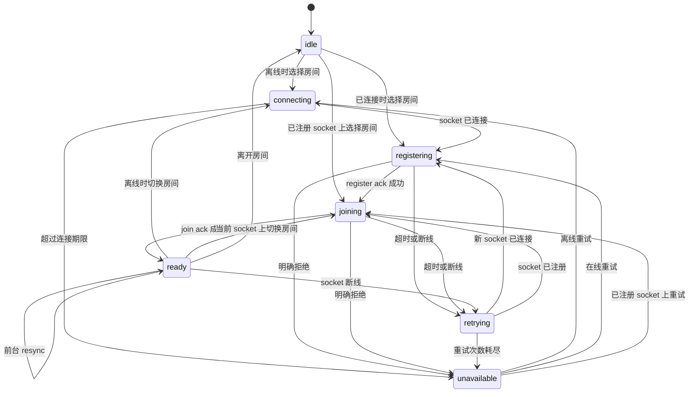

# 房间可靠性架构

[English](room-reliability-architecture.md)

状态：当前架构。更新日期：2026-07-13。

本文描述 RoomTalk 目前的房间恢复与一致性机制，范围包括浏览器、Socket.IO、React、消息缓存和持久化存储。之后调整这条链路时，应以本文作为主要设计入口；文档与实现不一致时，以源码和测试为准。

## 房间何时可用

当前 Socket.IO 连接完成注册，并且服务端已经确认当前 session epoch 所选择房间的 membership 后，房间才进入 `ready`。在此之前，React 可以先显示本地保存的房间外壳和缓存消息，但发送、编辑、媒体读取等成员操作仍处于锁定状态。

恢复过程由四个事实源共同完成：

| 范围 | 事实源 |
| --- | --- |
| 连接、注册与房间 membership | 当前浏览器标签页中的 `RoomSessionController` |
| 房间元数据 | 服务端返回的完整 `Room`，使用 `roomVersion` 排序 |
| 消息历史 | 持久化消息存储，使用 `historyVersion` 排序 |
| 操作权限 | 操作发生时的服务端授权结果 |

它们各自有独立的时钟。`sessionEpoch`、`resyncRevision`、`roomVersion` 和 `historyVersion` 处理的是四种不同的乱序问题，不能互相代替。

## 运行时职责

房间恢复集中在以下模块中：

| 职责 | 实现 |
| --- | --- |
| 房间会话状态机 | [`roomSessionController.ts`](../client-heroui/src/utils/roomSessionController.ts) |
| Socket transport、注册载荷、API helper 和会话日志 | [`socket.ts`](../client-heroui/src/utils/socket.ts) |
| React 状态投影、本地房间恢复、浏览器 lifecycle 和房间收敛 | [`MessagePage.tsx`](../client-heroui/src/pages/MessagePage.tsx) |
| 订阅 controller snapshot | [`useRoomSession.ts`](../client-heroui/src/hooks/useRoomSession.ts) |
| 消息监听与 history reconciliation | [`useRoomMessageEvents.ts`](../client-heroui/src/hooks/useRoomMessageEvents.ts) |
| 消息渲染和成员操作锁定 | [`MessageList.tsx`](../client-heroui/src/components/MessageList.tsx) |
| 行内媒体加载与全屏查看器 lifecycle | [`MessageItem.tsx`](../client-heroui/src/components/MessageItem.tsx)、[`useCachedMedia.ts`](../client-heroui/src/hooks/useCachedMedia.ts) 和 [`MediaViewerModal.tsx`](../client-heroui/src/components/MediaViewerModal.tsx) |
| 消息与媒体缓存 | [`messageHistoryCache.ts`](../client-heroui/src/utils/messageHistoryCache.ts) 和 [`mediaCache.ts`](../client-heroui/src/utils/mediaCache.ts) |
| 房间对象排序 | [`roomState.ts`](../client-heroui/src/utils/roomState.ts) |
| Posting boundary 计时 | [`postingSchedule.ts`](../client-heroui/src/utils/postingSchedule.ts) |
| 注册、加入、离开与 membership 顺序 | [`roomHandlers.ts`](../server/src/socket/roomHandlers.ts) |
| 消息授权与 mutation | [`messageHandlers.ts`](../server/src/socket/messageHandlers.ts) 和 [`roomAuthorization.ts`](../server/src/socket/roomAuthorization.ts) |
| 媒体授权 | [`apiRoutes.ts`](../server/src/routes/apiRoutes.ts) |
| 持久化房间与消息版本 | [`postgresStore.ts`](../server/src/repositories/postgresStore.ts) 和 [`redisStore.ts`](../server/src/repositories/redisStore.ts) |

`MessagePage` 负责提交房间意图，并把 controller 状态投影到页面。所有 join 调度都留在 controller。Lifecycle handler 统一调用 `resume`，普通 socket 操作等待 controller 完成注册，消息层在 session ready 后根据 `resyncRevision` 发起同步。

## 房间会话生命周期

`RoomSessionController` 在一个标签页内只维护一个目标房间。它负责连接 transport、为当前 socket ID 注册、加入目标房间、处理重试，并对外发布不可变 snapshot。



Snapshot 包含 `phase`、目标 `roomId`、`socketId`、`sessionEpoch`、`resyncRevision`、最近一次验证成功的结果、触发来源、当前 attempt 和终止错误。Join ack 返回的完整房间、权限与成员数会保存在验证结果中。

### Epoch 与 revision

| 值 | 何时变化 | 用途 |
| --- | --- | --- |
| `sessionEpoch` | 目标房间变化、离开房间，或房间仍为目标时连接了不同的 socket ID | 拒绝属于旧房间或旧 socket 绑定的 membership 结果 |
| `resyncRevision` | 当前 epoch 首次 ready，或 ready 状态收到合并后的前台恢复事件 | 触发一次消息历史对账，无需再次 join |
| `roomVersion` | 服务端提交一次完整房间写入，包括会影响房间的消息 mutation | 对同一房间的完整 `Room` 对象排序 |
| `historyVersion` | 持久化消息历史发生变化 | 对消息窗口排序，并识别过期 history response |

Register ack、join ack 和同一目标内的重试都会保持 `sessionEpoch` 不变。某个 epoch 第一次成功进入 `ready` 时，`resyncRevision` 推进一步。

Session 已经 ready 时，`visibilitychange`、BFCache `pageshow` 和 `online` 会在 150 ms 内合并成一次 resync revision。Controller 沿用现有 membership，不再发送新的 `join_room`。页面初次加载时触发的普通非 BFCache `pageshow` 会被 `MessagePage` 忽略。

### 请求合并与旧结果清理

同一个 socket ID 的注册请求共享一个 promise。任何需要注册的 socket 操作都会等待这个 promise，避免各自发送 `register`。

注册或 join 尚未结束时再次选择同一个房间，会返回已有 completion promise。房间已经 ready 时再次选择它，会立即返回最近一次验证结果。切换到另一个房间会推进 epoch，并使旧 completion 失效。如果旧房间随后才返回成功 join，controller 会补发 `leave_room`，当前目标仍保持为新房间。

连接到新的 socket ID 后，旧 transport 上的注册和 membership 已经失效，因此 controller 会推进 epoch。用户原本的房间意图会继续等待新 socket 恢复，不会被当成一次导航失败。

生产默认值为：连接等待上限 45 秒，每次 register 或 join ack 等待 15 秒，register 与 join 各最多尝试三次，延迟依次为 0、250 和 1000 ms。超时重试留在当前 epoch；重试耗尽后进入 `unavailable`。

## 服务端 membership 提交

服务端为每个 socket 串行执行注册、join、leave、重新注册和 disconnect cleanup。这样可以保证同一 socket 上较早开始的异步操作不会在较晚操作之后提交。会改变 access 的 membership 操作还会经过 room 级队列，避免另一条 socket 正在删除房间或移除成员时，join 仍依据旧快照成功提交。

一次 join 按以下顺序提交：

1. 读取已经注册的 client identity 和目标房间。
2. 检查 rollout、密码要求和持久 membership。
3. 条件满足且成员尚不存在时创建持久 membership。
4. 临时加入 Socket.IO room，并更新 client 与 browser presence。
5. 在提交边界重新读取持久房间和 membership。
6. Access 已失效时清理临时 presence；确认有效后再离开旧的健康房间，并对目标房间返回 ack。

Join ack 包含完整 `Room`、当前 `RoomPermissions` 和成员数。重复加入当前房间是幂等操作。注册 ack 会先于主动加载 room list 返回，因此慢速列表查询不会拖到客户端注册超时。

持久 membership 与在线 presence 生命周期分开。`leave_room` 和 disconnect cleanup 只移除 socket presence，房间角色仍保留在持久存储中。Presence 在 `clientId` 和 `browserInstanceId` 两个维度都使用 socket set，因此同一身份打开多个标签页或 socket 时，可以独立加入和退出。

### Client 与 browser identity

浏览器分别生成 `clientId` 和 `browserInstanceId`，并将它们写入 localStorage。Google 登录把账号关联到 client ID，browser instance ID 仍由当前可用的 storage partition 独立保存。Chrome、已安装网页 App 或其他浏览器表面只有在共享同一个 origin storage partition 时，才会读到相同的值。

服务端使用唯一 client ID 统计在线成员，同时单独记录活跃 browser instance。同一 client 或 browser ID 下的多个 socket 都保存在各自的 socket set 中，关闭其中一个 socket 不会误删另一个 socket 的 presence。

## 首次恢复与重连

冷启动恢复时，`MessagePage` 从 localStorage 读取保存的房间对象和 view。页面先把这个对象显示为房间外壳，通过 `storage` source 提交给 controller，并锁住成员操作。消息层同时尝试读取内存窗口或 IndexedDB 缓存。

随后 controller 完成连接、注册和 join。成功的 join 会带回完整房间和权限，使 session 进入 `ready`，并推进 `resyncRevision`。消息层根据该 revision 向持久化历史请求权威窗口。本地保存的房间外壳只有在新的完整房间通过版本检查后才会被替换。

Transport 断线时，目标房间、当前外壳、消息、滚动位置和已经加载的媒体都会保留。Controller 为新 socket 重新注册和 join 期间，新的成员操作会保持锁定。重连提示有 400 ms 的宽限时间，快速恢复时不会闪烁；这个计时器只负责 UI 展示，不参与恢复调度。

页面回到前台、BFCache 恢复和网络恢复都会进入 `resume`。Session 已 ready 时，它们安排一次 history reconciliation。Session 仍处于连接、注册、join 或 retry 时，它们共享正在执行的 drive，因而不会重复创建 register 或 join 请求。

## 消息历史对账

消息订阅以 `roomId` 为 key，在 session readiness 变化时保持挂载。再次进入房间会同步显示内存窗口；新标签页则从 IndexedDB 读取最近窗口。缓存每个房间最多保存 100 条近期消息。Room generation 负责防止 clear 或 replacement 期间的旧读写回踩，持久 tombstone 则阻止已失去 access 或已删除的房间被当前标签页或其他标签页的延迟缓存读取复活。

History request 由独立 effect 发出。只有房间 session ready，并且 `resyncRevision` 或 reconciliation retry nonce 变化时才会执行。请求携带本地 `historyVersion` 作为 `baseHistoryVersion`，并读取最近 80 条消息。

实时事件会推进可见窗口及其本地 history boundary。History response 到达后，客户端先比较服务端回传的 `requestedHistoryVersion` 与当前本地值，再检查服务端 `historyVersion` 是否落后。任一条件成立，都说明请求期间本地窗口已经变化。客户端会保留当前内容并重新对账，最多重试三次。

被接受的 replace response 保持服务端 position 顺序。如果消息 ID、更新时间和 status 与页面中已经显示的窗口一致，客户端只更新缓存元数据，不替换列表，也不会再次强制滚动。更早的分页结果按 ID 去重后 prepend，并受到 cache generation 保护。

## 媒体连续性

媒体读取遵守与其他成员操作相同的 readiness 边界。房间 session 验证成功后，消息才能申请新的签名下载 URL。服务端每次签发都会检查 client auth token、当前持久 room access、room ID 与 asset 归属。

短暂恢复期间，页面已经显示的媒体 URL 会继续附着在元素上。`useCachedMedia` 在 access 未验证时暂停缓存和网络操作，同时保留已有 object URL 或 signed URL。只有 asset identity 变化或用户重试失败加载时才会重置媒体状态。点击图片时，查看器直接使用当前实际渲染的 URL，其中也包括缓存得到的 blob URL。

查看器会等到 dialog 和媒体 source 都准备好以后，才把应用根节点设为 inert。媒体 source 尚未解析时，整个应用仍可操作，不会出现查看器没有显示却无法点击页面的状态。

## 房间对象收敛

服务端发送的 room payload 是完整对象。客户端接受后会整体替换旧 `Room`，不会通过 spread 合并字段。关闭 `postingSchedule` 或清除 `hasPassword` 时，新对象中缺少对应字段，整体替换才能真正删除旧值。

同一 room ID 的两个 payload 通过 [`isNewerRoom`](../client-heroui/src/utils/roomState.ts) 按以下规则比较：

```text
两边都有 roomVersion：
  incoming >= current  -> 接受
  incoming < current   -> 忽略

任一侧缺少 roomVersion：
  比较 updatedAt
  任一时间戳缺失或无效时放行
```

相等版本表示同一次服务端写入被重复送达，接受它是幂等的。Legacy fallback 保持宽松，可以避免损坏的 localStorage 时间戳永久阻止后续正常载荷。不同 room ID 之间不比较版本。

`MessagePage` 会先同步推进 `currentRoomRef`，再把带版本守卫的 React state update 入队。Ack 和 broadcast 即使在同一次 React commit 前相继到达，也能看到同一个最新房间。增量房间更新对 active room、owned room list 和 saved room list 使用同一守卫；完整 room list response 目前会作为 snapshot 直接替换对应列表。

PostgreSQL 在房间行的权威 mutation 边界推进 `roomVersion`。Redis 使用 Lua script，从已保存记录计算下一版本并原子写入。消息 mutation 会同时推进 `messageVersion` 和 `roomVersion`，房间元数据 mutation 推进 `roomVersion`。`updatedAt` 继续用于展示和迁移兼容。

## Mutation ack 与 broadcast

`rename`、settings update 等不会删除房间的元数据 mutation，会在 ack 中返回持久化后的完整房间。发起操作的客户端立即应用这份对象，因此即使没有收到自己的 broadcast，也能做到 read-your-write。需要通知其他客户端的操作会发送 `room_updated`。两条路径都经过完整对象替换和同一版本守卫。

服务端只会在持久化成功后 broadcast。失败的写入不会发布 durable store 中不存在的状态。Ack 与 broadcast 重复送达时，相同的 `roomVersion` 会使它们幂等收敛。

权限载荷使用独立 request generation。新的 `room_permissions` 事件会使较早的 fetch 失效，已经离开当前房间后到达的权限结果也会被忽略。

## Posting boundary 与操作授权

服务端在操作发生时重新做权限判断，覆盖消息发送、媒体上传初始化与完成、消息编辑和删除、房间管理以及 code-agent access。客户端早先收到的 permission snapshot 只用于展示当前 UI 状态。

Posting schedule 会随着时间变化，而这个变化本身没有 socket event。客户端按照房间 timezone 计算下一次开启或关闭边界，并在边界刚过时请求最新权限。服务端根据当前时钟计算并返回新的 `canPost`。

客户端和服务端测试使用同一组 schedule 场景，包括 start inclusive、end exclusive、跨夜窗口、房间时区、关闭的 schedule、空窗口和精确边界时刻。

## 失败处理

断线、transport 变化和 ack 超时会在重试预算内继续恢复。房间外壳与缓存内容保持可见，成员操作维持锁定。预算耗尽后进入 `unavailable`，页面提供显式重试，并保留目标房间。

Access rejection、房间不存在、密码错误和 code-agent access 被关闭会结束当前 attempt。切换新房间失败时，`MessagePage` 会重新选择之前验证成功的房间，并可为目标房间再次打开密码输入。服务端成功提交新 join 之前，旧房间仍是健康回退点。

收到 `room_removed` 或确认 access 已被移除后，客户端会使持久 room cache 失效；当前房间受影响时，还会清除页面外壳和 URL room 参数，并返回房间列表。针对已移除目标的延迟 ack 无法重新激活该房间。

目前少量明确失败仍通过服务端错误文本分类。后续协议可以增加共享的机器可读 room error code，以便恢复逻辑直接按 code 判断。

## 生产日志与排障

生产浏览器日志会记录房间恢复状态，不会写入密码、auth token 或消息内容。

- `[room-session]` 记录 transport、register、join、phase、retry、epoch、ready 和 resync。
- `[room-messages]` 记录内存与持久缓存读取、history request、history response、版本决策、reconciliation retry 和实时消息。

一次排查应同时关联 `roomId`、`socketId`、`sessionEpoch`、`resyncRevision`、`requestedHistoryVersion` 和 `historyVersion`。正常的本地房间恢复通常按以下顺序出现：

```text
room-selected
connection-waiting
transport-connected / socket-connected
registration-attempt / registration-ready
join-attempt / join-acknowledged / room-ready
history-request / history-response
```

常见现象可以从以下位置开始检查：

| 现象 | 检查内容 |
| --- | --- |
| `Timed out while registering client` | 确认 transport 已连接；比较 `registration-emitted` 前后的 socket ID；检查 late ack 或 socket replacement |
| `Failed to reconnect to the previously joined room` | 从 disconnect 沿同一 epoch 跟到 register 和 join；查看终止 join error，以及是否有更新的房间意图取代了它 |
| 房间恢复了，但新消息不显示 | 比较 `resyncRevision`、`baseHistoryVersion`、`requestedHistoryVersion` 和 `[room-messages]` 中的 response decision |
| 媒体一直显示 `Loading media` | 确认 session readiness、签名 URL 授权、asset 与 room ID，以及旧缓存 URL 是否仍被保留 |
| 回到前台后再次 join | Ready session 应记录 `resync-requested`，同时没有 `join-attempt`；重复 join 表示 readiness 或 socket identity 确实发生了变化 |
| 已清除的房间设置重新出现 | 对比 ack、broadcast、本地房间外壳和 active room commit 上的 `roomVersion` |

同一个 epoch 第一次成功提交 membership 时应产生一次 `room-ready`。前台 resync 可以产生新的 history request。连接到不同 socket ID 后会创建新 epoch，并重新执行 register 和 join。

## 修改与验证约定

恢复逻辑应改在拥有该状态的层。新的 lifecycle source 进入 controller input；消息竞态进入 versioned reconciliation；元数据竞态进入完整房间收敛。组件内部再增加 join generation、repair timer 或平行 membership state，会重新形成多个事实源。

主要自动化契约包括：

- [`roomSessionController.test.ts`](../client-heroui/src/utils/roomSessionController.test.ts) 覆盖状态转移、同房间请求合并、socket replacement、重试、supersession、resync 和 late ack cleanup。
- [`MessagePage.test.tsx`](../client-heroui/src/pages/MessagePage.test.tsx) 覆盖本地恢复、URL 与手动切房竞态、lifecycle resume、重连锁定、回退、完整对象替换、room version、ack 收敛和 posting refresh。
- [`useRoomMessageEvents.test.tsx`](../client-heroui/src/hooks/useRoomMessageEvents.test.tsx) 与 [`MessageList.test.tsx`](../client-heroui/src/components/MessageList.test.tsx) 覆盖缓存 hydration、实时消息与 history 的竞态、分页、内容连续性和操作锁定。
- [`roomState.test.ts`](../client-heroui/src/utils/roomState.test.ts) 覆盖 `roomVersion` 排序和 legacy timestamp fallback。
- [`postingSchedule.test.ts`](../client-heroui/src/utils/postingSchedule.test.ts) 与 [`roomAuthorization.test.ts`](../server/src/socket/roomAuthorization.test.ts) 保证客户端 boundary timer 和服务端授权语义一致。
- [`roomHandlers.test.ts`](../server/src/socket/roomHandlers.test.ts) 覆盖提前返回 register ack、membership mutation 串行化、幂等 rejoin、access removal、房间删除和 disconnect cleanup。
- [`messageHandlers.test.ts`](../server/src/socket/messageHandlers.test.ts) 覆盖 history 授权，以及消息 mutation 的 ack 和 broadcast。
- [`storeContract.test.ts`](../server/src/repositories/storeContract.test.ts) 与 [`redisStore.test.ts`](../server/src/repositories/redisStore.test.ts) 覆盖单调 room/message version、持久 membership、presence、缓存有效性和媒体历史。

修复新的竞态时，应在拥有该状态的层增加 event sequence 或 convergence test。测试需要还原真实失败顺序；如果问题涉及 late ack 或浏览器 lifecycle，也要把这些事件放进同一条测试序列。
